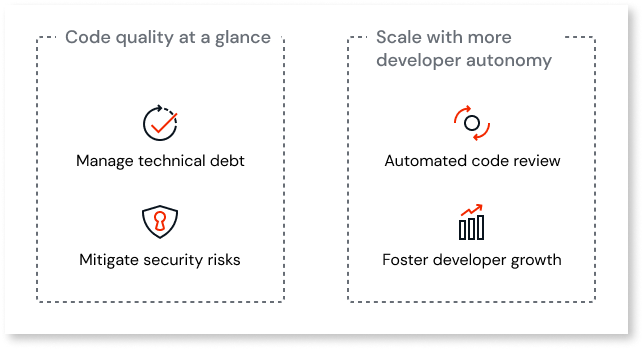
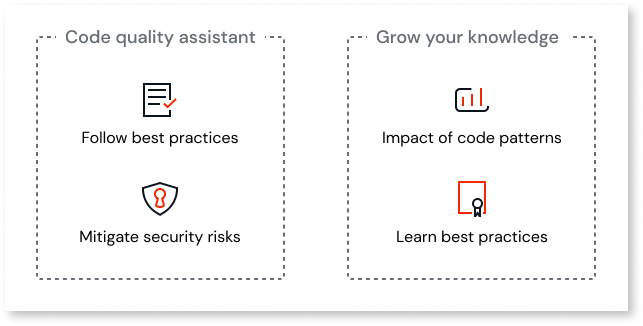

# Manage technical debt in ODC

Code Quality, powered by AI Mentor System (AIMS) is OutSystems Development Cloud (ODC) solution to help you and your teams managing your technical debt.

Managing your technical debt increases your team's agility and productivity while lowering the maintenance costs of the development of your apps.

Code Quality supports you by checking your code and giving you recommendations about your apps architecture, maintainability, performance, and security.

This code check gives your Technical Leads an integrated, bird’s eye view, of your organization’s technical debt. By doing that, AIMS helps in identifying problem areas and prioritize the resolution of those issues.

Also, it's a powerful tool to help your Tech Leads in identifying training needs for your teams. It also helps in fostering coding best practices that allow your teams to prevent future issues and create more performant, scalable, and secure apps.

For developers, AI Mentor System provides an automated code review, providing guidance that helps developers jn delivering quality code that follows best practices and that mitigates security risks.

## Code analysis

The AI Mentor System automatically analyzes your code in the Development stage twice a day. The analysis checks the latest versions of apps that changed since the previous analysis.

During this analysis, AI Mentor Systems looks for code patterns in the following categories:

* Performance
* Architecture
* Maintainability
* Security

After this analysis, you get a code quality report that shows you a list of findings. A finding is an instance of a code pattern present in your code.

Findings include the following information:

* The **code pattern** and **category** (security, performance, maintainability, and architecture) that maps to which the finding relates to.

* The **code path** to the **source element** that has the problem. You also get a direct link which lets you open the element in ODC Studio.

* **How long ago** the finding appeared and who was the **last developer to modify the source element**.

## Code Quality in the software development lifecycle

Both Developers and Technical Leads use Code Quality during the development phase. Developers fix technical debt before apps move to the testing phase. Technical Leads identify improvement areas and common pitfalls, allowing them to grow their teams' proficiency.

### For technical leads

As a technical lead or team lead, you can quickly get an overview of the code quality of your team's apps. This helps you manage technical debt, understand if your team's code is following best practices, and identify possible security risks.

Furthermore, the AI Mentor System can help you scale by providing, via Code Quality, your developers with an automated code review. This promotes autonomy for your developers, by helping them deliver better code before you do a formal code review. AIMS also provides relevant context on the coding issues, that helps them grow their OutSystems knowledge.

If your organization already has access to AI Mentor System, follow the [Getting started in AIMS as a technical lead](getting-started-aims-tl.md) to get hands-on experience on how the tool works.

### For developers

As a developer, you typically use the AI Mentor System for an automated code review. It identifies specific parts of your code that may need changes to reduce technical debt and mitigate security concerns. 

This review includes guidance and best practices for the issues it finds. It helps you grow your OutSystems knowledge as you deliver value to your organization.

If your organization already has access to AI Mentor System, follow the instructions on [Getting started as a developer](getting-started-aims-dev.md) to get hands-on experience on how the tool works.