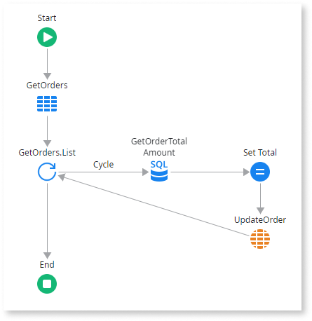

# Aggregate or SQL query inside a cycle

The system executes an Aggregate or SQL query inside a For Each cycle.

## Impact

Executing Aggregates and SQL queries inside a cycle can have a severe performance impact due to database communication overhead repeated at each iteration. The impact can be greatly worsened when iterating through a list with a high number of elements or when having nested cycles.

## Why is this happening?

This issue happens when developers place an Aggregate or SQL query inside a For Each loop, causing repeated database calls for each iteration. This results in significant performance degradation, particularly with large datasets or nested loops.

## How to fix

Avoid executing Aggregates or SQL queries inside a For Each cycle. Instead, replace that Aggregate or SQL query with a more complex one that gets all the related information and executes it before the cycle.

If you have an Aggregate to fetch the master entity before the cycle, followed by another Aggregate inside the cycle to fetch the details, consider eliminating the inner Aggregate. Add a join to the outer Aggregate instead.

For more information, refer to the [logic best practice for not adding aggregates or SQL queries inside a cycle](../../../building-apps/logic/best-practices-logic.md#aggregates-inside-cycle).
