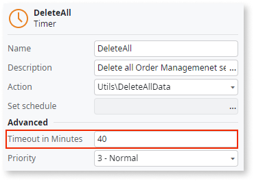

# Avoid long-running Timers

Avoid running Timers for longer than 30 minutes.

## Impact  

A timer that exceeds its **Timeout in Minutes** property may result in the code and data being reprocessed because the automatic retry mechanism for timers reruns the code when errors occur. 

## Why is this happening?

The **Timeout in Minutes** of a timer is too high, for example, more than 30 minutes.

## How to fix

Long execution Timers should follow the wake timer pattern to reschedule themselves to restart and continue the current task at hand. To implement the wake timer pattern, start by adding an explicit logical timeout inside the Timer logic that, when reached, takes the necessary actions to properly terminate the current execution. Store the current progress of the process in such a way that when its execution restarts, it can easily pick up the execution from this stored last point. This pattern ends with a wake timer action for itself at the end of the timer flow. Following the wake timer pattern will decrease the probability of the timer being interrupted by the Scheduler process due to reaching the Timeout in Minutes threshold. Using the wake timer pattern can: 

* Reduce the probability of a timer being interrupted.  
* Avoid cases of data inconsistency.  
* Avoid endless reprocessing of the same data. 

Another good practice for long Timers is to define them with checkpoints so that the Timer can be killed and restarted with no impact on the data. At these checkpoints, consider executing partial commits to ensure that if some error occurs, the processed data is only rolled back until the last commit (and avoid processing the same data all over again on the next execution).
