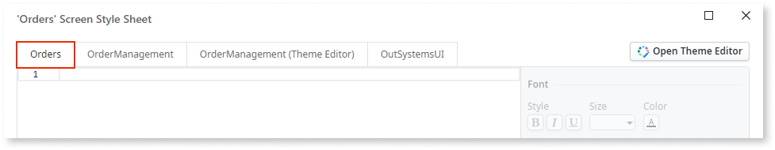

# CSS in the screen's style sheet

CSS in the screen's style sheet.

## Impact

Having CSS spread through different screens may create maintenance issues. Also, defining CSS on mobile screens creates a flicker when navigating through different pages.

## Why is this happening?

The app has CSS specific to one screen instead of having it centralized in the app's Theme.

## How to fix

Centralize CSS in the app's Theme to reduce maintenance costs. If you're only making a small change, define a specific class for it in the app’s Theme (that can then be reused) rather than adding it to a particular page and copying the same class repeatedly.
