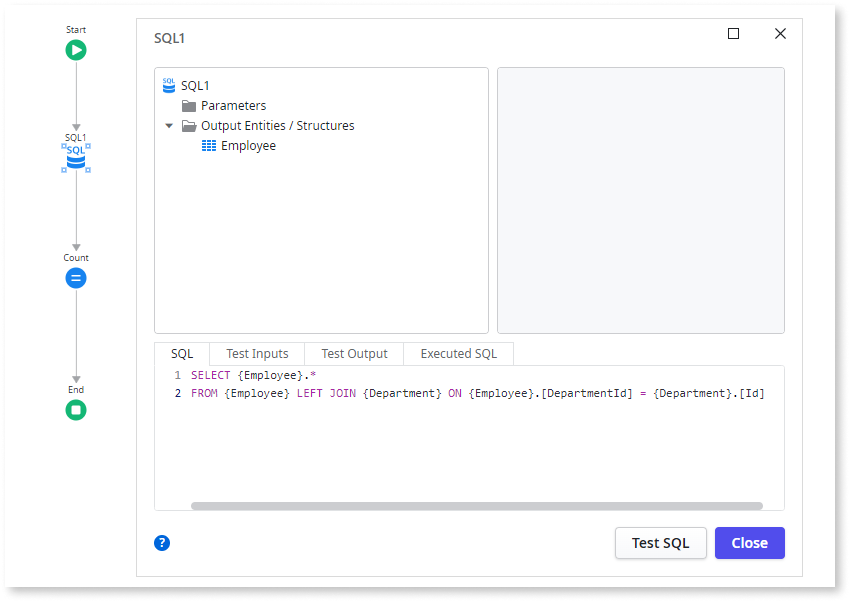

# Inefficient query count

Counting query results using an inefficient query.

## Impact

SQL queries are usually designed for retrieving data. They may perform joins and fetch extra data needed for processing but aren't required to count the query results. When you use the Count property of a query, the system executes the same query to count the results, which is inefficient since it uses the same query definition.

## Why is this happening?

The query retrieves and processes additional data beyond what is needed for the count operation, causing this inefficiency. The joins and conditions increase the query's complexity, resulting in higher processing time and resource usage. The database engine has to perform more operations than necessary, which impacts performance.

## How to fix

Use a simplified SQL query to efficiently count the results, removing unneeded extra data and joins.

For more information, refer to the [best practice for optimizing record counting](../../../building-apps/ui/creating-screens/best-practices-fetch-display-data.md#record-counting).
