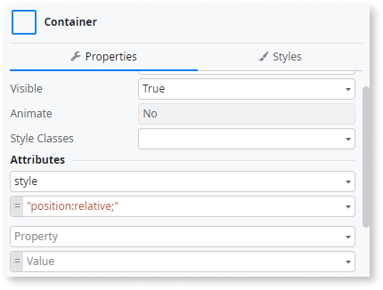

# Inline CSS style

CSS style is defined as an attribute in the properties of a screen element.

## Impact

CSS and HTML should be kept separate. Inline styles are inefficient, harder to maintain, and make your HTML larger.

## Why is this happening?

Inline CSS occurs when styles are directly applied to screen or web block elements via the attributes section of an element's properties.

## How to fix

CSS should be centrally managed in the application style guide to avoid loading a large number of CSS files. If the CSS is specific to one screen or web block, define your CSS at the screen/web block level instead of in an element's properties.

For more information, refer to the [CSS styles best practice](../../../building-apps/ui/creating-screens/best-practices-screens.md#css).
