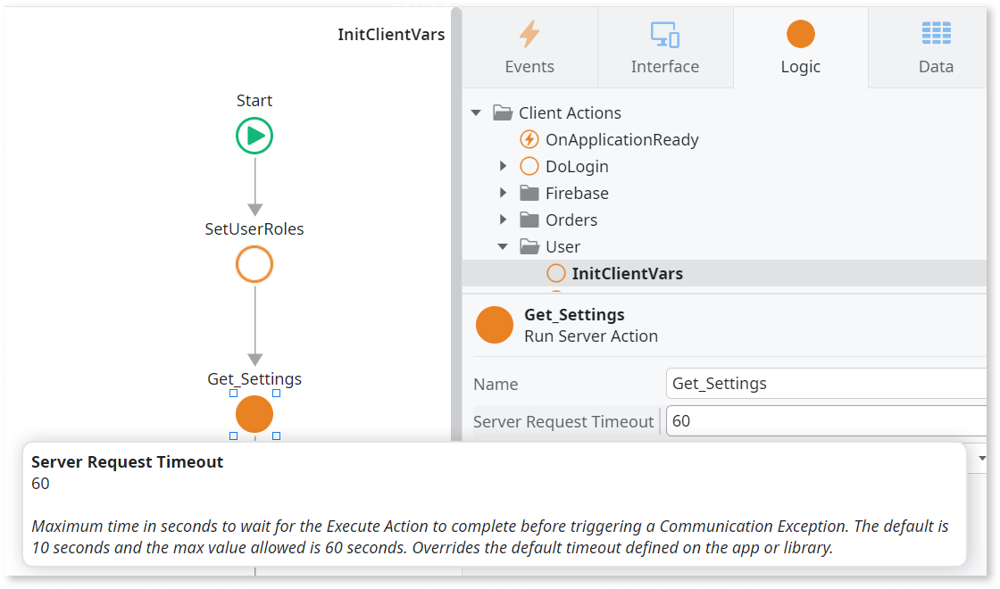

# Long server requests timeout

The default timeout for server action requests is more than 10 seconds, or an explicit timeout in a server call is more than 10 seconds.

## Impact

Server requests should be efficient. 10 seconds is all it takes for a device to go to sleep mode or lose network connectivity. A high timeout can lead to poor user experience. If the server is slow or unresponsive, the user might have to wait indefinitely for the request to complete.

## Why is this happening

The default timeout for server action requests is set to more than 10 seconds, or an explicit timeout in a server call is set to more than 10 seconds.

If your server requests take too long, you might be processing too much data at the same time, or you might be trying to access data that's not prepared on server side.

## How to fix

Instead of increasing the timeout settings, prepare and cache data in advance on the server side so that it's available when required. You can also reduce the server request timeout to fail quickly (with a "retry later" message).  

Ensure that the default timeout has a short time defined (no more than 10 seconds), as this affects all the server action requests in the app. The same principle applies to each server action; if you increase a server action timeout after defining the default timeout to a lower number, a finding will be raised.
