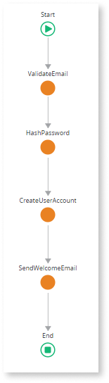
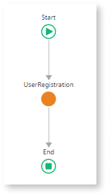

# Multiple server requests (Aggregates or Actions) inside Client Actions

Multiple server Aggregates or multiple Server Action requests inside Client Actions.

## Impact

Each server request or server Aggregate is a different request, generating its overhead on establishing the connection and launching a server-side process. Multiple processes also generate different database transactions.

## Why is this happening?

Server-side logic breaks down into multiple separate Aggregates or Server Actions, each called individually within a Client Action. Each call results in a separate server request, leading to multiple round trips between the client and server, which can increase latency.

## How to fix

Instead of sequencing a set of server requests or server Aggregates on your client-side code, compose all required server logic in a single Server Action. This reduces the number of server requests.

For more information, refer to the [logic best practice for avoiding multiple server calls in a client action flow](../../../building-apps/logic/best-practices-logic.md#multiple-server-calls).
