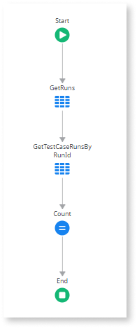

# Sequence of connected Aggregates

Sequence of Aggregates that reference one another.

## Impact

A sequence of Aggregates referencing one another usually leads to unnecessary data fetching. Considering that each Aggregate executes a request to the database, this results in unnecessary database communication overhead.

## Why is this happening?

Aggregates reference one another leading to multiple database queries, causing unnecessary data-fetching and latency. 

## How to fix

Merge the sequence of Aggregates into a single Aggregate using a join to retrieve all the needed data.
