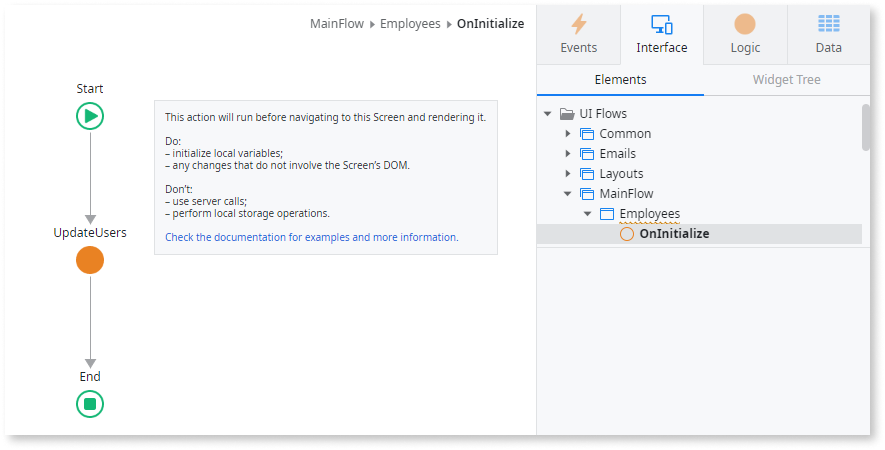

# Server requests in client events

Avoid server calls in client events.

## Impact

Screen and block lifecycle events (On Initialize, Ready, Render, and After Fetch) are serialized in the request, and server calls can take time to get the response, which impacts the screen render time.

## Why is this happening?

You’re making a server call in a client event.

## How to fix

Limit server requests to synchronization requests (typically performed on business events fired in screen actions, session start, or online events) and online transactions (typically performed in screen actions).
