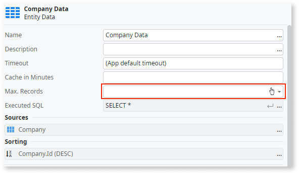

# Unlimited records in Aggregate

The number of records fetched from the database isn't set in Aggregate.

## Impact

More records are fetched from the database than are used by the application, resulting in useless I/O and memory consumption.

## Why is this happening?

The issue occurs because Aggregates fetch all records by default, leading to unnecessary data retrieval and potential performance problems.

## How to fix

Set the **Max. Records** parameter of the Aggregate to the required amount of records.

For more information, refer to [best practices for fetching and displaying data](../../../building-apps/ui/creating-screens/best-practices-fetch-display-data.md#max-records).
