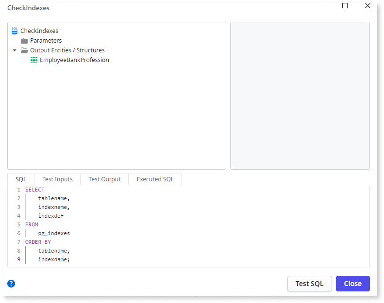

# Unlimited records in SQL query

The number of records fetched from the database isn't set in the SQL query.

## Impact

More records are fetched from the database than are used by the application, resulting in useless I/O and memory consumption.

## Why is this happening?

The issue occurs because the SQL queries fetch all records by default, leading to unnecessary data retrieval and potential performance problems.

## How to fix

Use `ROWNUM` (for Oracle) or `TOP` (for MS SQL Server) in the SQL query to limit the number of records to the required amount. Note that in SQL queries, the Max. Records parameter only limits the number of records displayed and not the number of records fetched.
