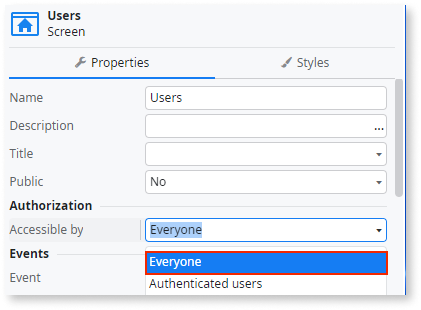

# Avoid setting screens as accessible by everyone

## Impact

The default authorization for screens is accessible only by authenticated users. When you change it to be accessible by **Everyone**, any end-user can log in.

## Why is this happening?

The screen authorization is accessible to **Everyone**. 

## How to fix

Set screens to be accessible by **Authenticated Users** unless you prefer to make them public to everyone. In that case, set them to **Everyone**.

For more information, refer to the [best practice to protect your screens using roles](../../../building-apps/ui/creating-screens/best-practices-screens.md#roles).
