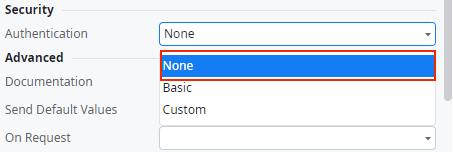

# Exposed REST services without authentication

Exposed REST services should enforce authentication to protect against unauthorized access.

In ODC, SSL/TLS is always enforced for all REST services and you can't disable it, ensuring secure communication by default.

## Impact

Without authentication, REST endpoints are vulnerable to unauthorized access, data breaches, and misuse.

## Why is this happening?

The exposed REST API isn't protected. The authentication is set to **None**.

 

## How to fix

Change the authentication to **Basic** or **Custom** in the REST service.
