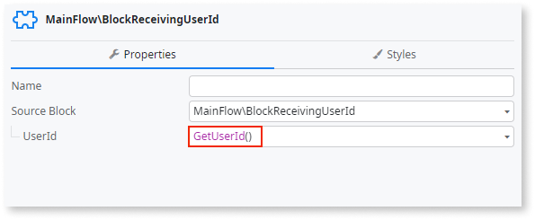

# Insecure usage of GetUserId in client Block parameters

Avoid passing identity information in a Block widget parameter.

## Impact

Passing identity information through a Block widget parameter allows manipulating that identity information on the client side. This creates an insecure identity flow to any existing backend server actions or queries using this parameter, meaning that the authenticated user might be manipulated at any time.

Since the execution of GetUserId on reactive client components depends on client cookies, any user can easily change parameters by manipulating server calls or changing client session ID identifiers. Malicious users can exploit the ability to change identity-related parameters and impersonate other users and access sensitive data. Users can also bypass role checks, which, even though done on the server, become vulnerable due to insecure parameters received from the client.

## Why is this happening?

Passing `GetUserId` as a Block widget parameter exposes your application to security risks. This allows users to manipulate identity information on the client side, potentially leading to impersonation and unauthorized data access.

## How to fix

Get identity information only on server calls, using functions like GetUserId, executed on the server, and never sent as a Block widget parameter. Executing GetUserId on the server ensures the identity flow is secure and prevents manipulation.

Remove any usages of GetUserId in Block widget parameters, and replace them with the same function on the server side. In this way, you avoid passing identity information from the client side to the server side as a Block parameter.

For more information, refer to the [best practice for validating user permissions on server-side logic](../../../building-apps/logic/best-practices-logic.md#validate-permissions-server-side).
