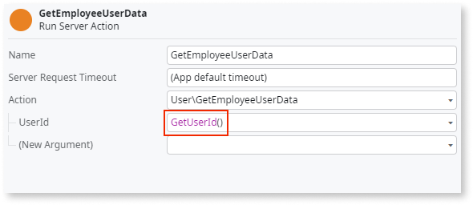

# Insecure usage of GetUserId function on client context

Avoid passing identity information from the client side to the server side as an action parameter.

## Impact

Passing identity information as a server action parameter is extremely insecure. Identity is obtained in the client context and passed to server functions (exposed as REST APIs) as a parameter. Since the execution of `GetUserId` on client components depends on client cookies, parameters can be easily changed by any user, either by manipulating server calls or changing client session ID identifiers. Malicious users can exploit the ability to change identity-related parameters and impersonate other users, access sensitive data, and even bypass role checks which, though done on the server, become vulnerable due to insecure parameters received from the client.

## Why is this happening?

This issue occurs because identity information is retrieved on the client side and sent to the server as a parameter, making it vulnerable to tampering.

## How to fix

Identity information should be obtained on server calls using functions like `GetUserId` and executed on the server, never sent as a regular action parameter. Performing `GetUserId` on the server ensures proper identity flow, is secure, and can’t be manipulated.

Remove any usages of `GetUserId` on the client side and replace them with the same function on the server side. This way, you avoid passing identity information from the client side to the server side as an action parameter.

For more information, refer to [Reactive web security best practices: Securing server calls](https://success.outsystems.com/documentation/best_practices/security/reactive_web_security_best_practices/).

