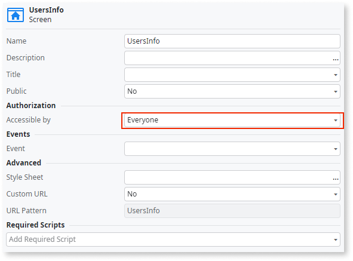

# Screen Aggregates exposing system entities accessible by anyone

A Screen Aggregate exposes System Entity data on a screen accessible by anyone.

## Impact

If anyone can access the screen, any end user, including users who aren't logged in, can access sensitive system data (for example, user data).

## Why is this happening?

The configuration allows the screen to be accessible by **Everyone**.

## How to fix

Remove the exposed information or set the authorization to **Authenticated users**.

For more information, refer to the [best practice to protect your screens using roles](../../../building-apps/ui/creating-screens/best-practices-screens.md#roles).
