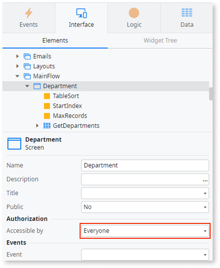

# Server call exposed on a screen accessible to everyone

This finding flags a screen that anyone can access (Anonymous role) that calls server logic (server actions, aggregates, or data actions) directly from the screen's client-side flow. The platform automatically uses HTTP calls, and because the screen is public, these endpoints can be called by anyone without logging in.

Authentication flows (such as Login screens) are the accepted exception to this pattern. A Login screen must be public and must call a server action.

## Impact

The server calls on this screen are open to anyone on the internet, no login needed. A malicious user can:

* See the server requests in their browser's developer tools
* Call the endpoints directly using any HTTP client
* Modify the client-side code (JavaScript) to change what gets sent to the server
* Guess or change input parameters to access data they shouldn't, or perform unauthorized actions, depending on what the supporting server logic executes

Everything the server logic returns is sent to an unauthenticated user, so any sensitive data in those responses is exposed.

## Why is this happening?

Your app exposes a server action, aggregate, or data action for public access without authentication on a screen that has the Anonymous role.

## How to fix

* If the screen doesn't need to be public, restrict the screen's accessibility to authenticated users instead of the Anonymous role.
* If the screen must stay public, add server-side validation for all data sent to the server.
* For sensitive operations, check the user's permissions on the server using `Check<ROLENAME>Role()` and `GetUserId()`.
* Don't return sensitive data to the client.
* For records reachable through anonymous endpoints, don't use guessable sequential identifiers as the lookup key. Use a non-guessable identifier such as a GUID generated on the server side. This recommendation is not a replacement for server-side validation and authorization.
