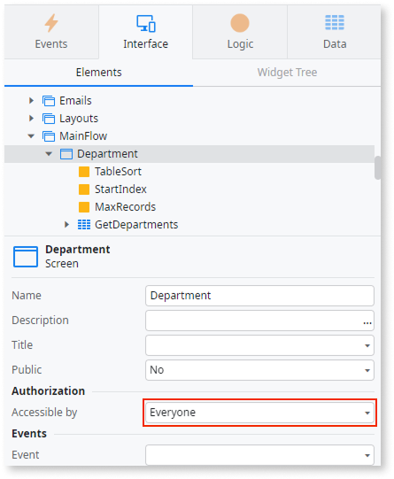

# Server call in the logic of a screen accessible to everyone

This finding flags two situations. The first is a server action or aggregate consumed in the client-side logic of a screen that is accessible to everyone. The second is a database operation run directly in the client side.

Unlike other patterns that are only analyzed in new app revisions, Code Quality performs a full sync for this pattern, searching for the pattern in your whole portfolio. This means you might have findings in apps that haven’t had new revisions in a while.

## Impact

If a screen is available to everyone, server calls in its logic are publicly exposed, inviting malicious users to access the server without any authentication or authorization.

A malicious user might modify client-side logic (JavaScript), check the server requests, and manipulate input parameters to try to access your data or perform unauthorized actions.

When a database operation runs in the client side, the data isn't validated on the server before it reaches the database. A malicious user can manipulate that data, which can corrupt your data or bypass your business rules.

## Why is this happening?

This finding is raised in two cases:

* Your app exposes a server action for public access, without authentication, on a screen that has the Anonymous role.
* Your app runs a database operation directly in the client-side logic instead of inside a server action.

## How to fix

For a server action exposed on a screen accessible to everyone:

* If you don't need the screen to be accessed by everyone, change it to be accessible only to authenticated users.
* If you need the screen to be accessed by everyone, validate all data sent to the server on the server side to prevent unauthorized read or edit operations.
* Make sure the business information the server returns to the screen isn't sensitive or private.

For a database operation run in the client side:

* Move the database operation into a server action.
* Validate the data in that server action before changing the database.
