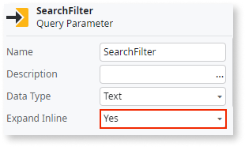

# SQL injection

Avoid enabling the Expand Inline property of a SQL Query Parameter since it could make your application vulnerable to SQL injection.

## Impact

OutSystems uses prepared statements by default to execute the SQL queries that you define in SQL elements. These prepared statements contain SQL parameters or placeholders for which you define values before executing the SQL statement. These parameters can only store a value of a given type and not arbitrary SQL fragments.

If you enable the Expand Inline property for a Query Parameter, the system no longer handles its value as an SQL parameter value. Instead, the SQL engine includes the Query Parameter value in the SQL statement without evaluating and turning it into a literal. You can use the Query Parameter to insert SQL fragments in the full SQL statement dynamically. However, your end-users may exploit this if you don't take the necessary precautions.

Using expanded inline parameters that change too often also increases your technical debt, as it doesn't allow the database to optimize execution plans. The database keeps generating new queries, bringing the performance down.

## Why is this happening?

Enabling the Expand Inline property allows SQL fragments to be directly inserted into queries.

## How to fix

OutSystems uses an SQL parameter for every Query Parameter that has the Expand Inline property disabled. The system disables this property by default, providing you with default protection against SQL injection attacks. It's difficult to use properly expanded parameters inline since you need to make sure that any user input is properly escaped before using it in an SQL statement. If you can, avoid enabling this property altogether.

OutSystems provides ways of implementing common use cases without enabling the Expand Inline property and provides recommendations when using the Expand Inline.

If you must enable Expand Inline, take the following recommendations into account:

* Do not perform manual string encoding using the **Replace** function. String literals should only be encoded using the **EncodeSql** function. Manually using the **Replace** function is prone to errors and can introduce bugs into your application that end-users can later exploit.

* Use **EncodeSql()** to encode string literals. The **EncodeSql** function encodes string literals for use in SQL statements when the **Expand Inline** property is enabled. Make sure you avoid the following bad practices when using **EncodeSql()**:

    * Do not use **EncodeSql()** to encode the full contents of an SQL parameter. For example: `myparameter = EncodeSql(""WHERE surname = "" + @myVariable1 + "" OR name = "" + @myVariable2).
    `This pattern is often wrong, so you get a warning if you use it.

    * Use **EncodeSql** only to encode string literals, not complete fragments of an SQL statement.

* Do not build `""WHERE column IN (@values)""` clauses by wrapping all the values in an EncodeSql call: `values = EncodeSql(name1 + "","" + name2 + "","" + name).`

This approach doesn't protect you from SQL injection.
