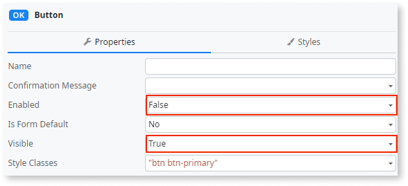

# Visible disabled Button

Disabled button that's still visible.

## Impact

A disabled button doesn't prevent an experienced person from re-enabling the button at runtime by using, for example, the development tools on a browser. This allows the user to enable the functionality and press the button, even without permission or if they were originally unable to press it.

## Why is this happening?

A disabled button remains visible when the **Enabled** property is set to False, and the **Visible** property is set to True. 

## How to fix

Instead of setting the **Enable** property to False, consider setting the **Visible** property instead, or use both properties together. This prevents the button from rendering completely on the client browser and prevents an experienced user from hacking the button and enabling the functionality.
