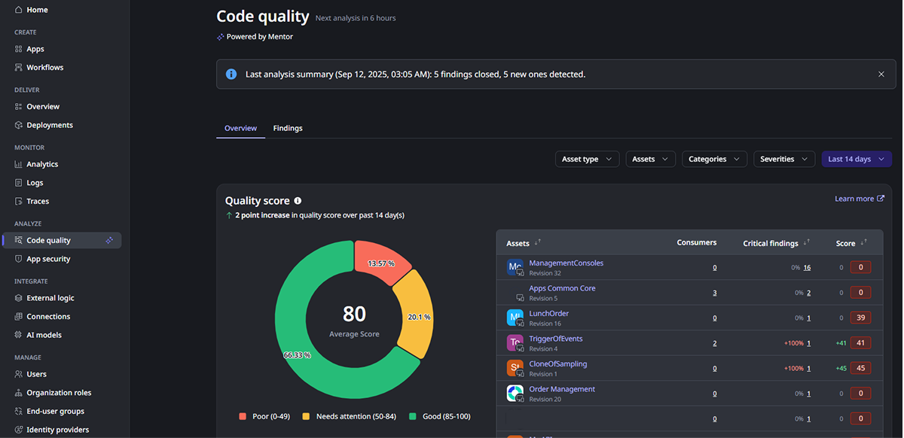
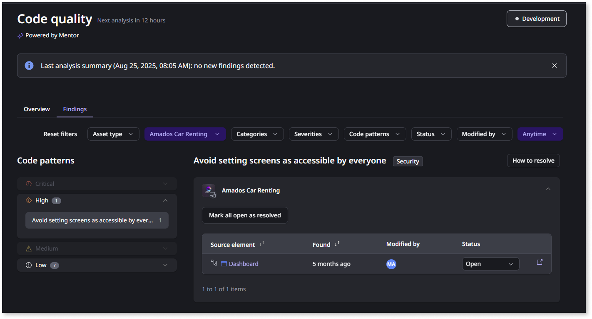

# Working with Code quality

The **Code quality** dashboard provides insights into code quality patterns and specific findings across your apps, giving developers and technical leads the visibility they need to maintain high code quality standards. You can access the dashboard from **ODC Portal > Code Quality**. The **Overview** tab gives you a bird's-eye view of technical debt distribution across your organization, and the **Findings** tab provides detailed information to help solve specific code quality problems.

### Technical debt distribution

From the **Overview** tab in the **Code quality** dashboard, you can:

* **Monitor overall code quality trends** and make strategic decisions about resource allocation.

* **Track team progress** and identify training opportunities through clear metrics

* **Get comprehensive organizational visibility** to prioritize which apps need immediate attention.

* **Measure the effectiveness** of technical debt reduction initiatives over time

* **Investigate specific quality issues** with comprehensive details before making strategic decisions.

For more information about how **Code quality** works, refer to [Getting started with Code quality as a technical lead](getting-started-aims-tl.md).

### Investigate specific findings

From the **Findings** tab of the  **Code quality** dashboard, you can:

* Quickly identify which apps in your organization have the **most quality issues.**

* **Understand overall code quality trends** to see how your work contributes to improvement goals.

* **Get context about technical debt distribution** across different categories.

* **Address specific technical debt issues** with detailed guidance and recommendations.

* **Navigate directly to problem areas** in ODC Studio for immediate remediation.

* **Monitor the status of findings** over time, including when they were first detected and any recent changes.

When you need to dive deeper into specific issues, the **Findings tab** provides detailed information about individual code quality problems. Each finding includes:

* The **code pattern** and **category** (security, performance, maintainability, and architecture) to which the finding relates.

* The **code path** to the **source element** with the problem, with a direct link to open the element in ODC Studio.

* **How long ago** did the finding appear, and who was the last developer to **modify the source element**.

For more information about how **Code quality** works, refer to [Getting started with Code quality as a developer](getting-started-aims-dev.md) to get hands-on experience on how the tool works.
