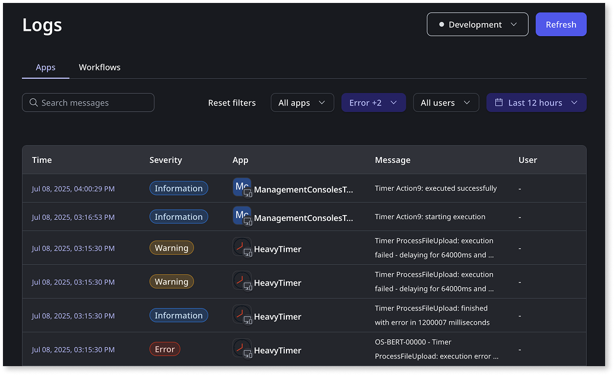
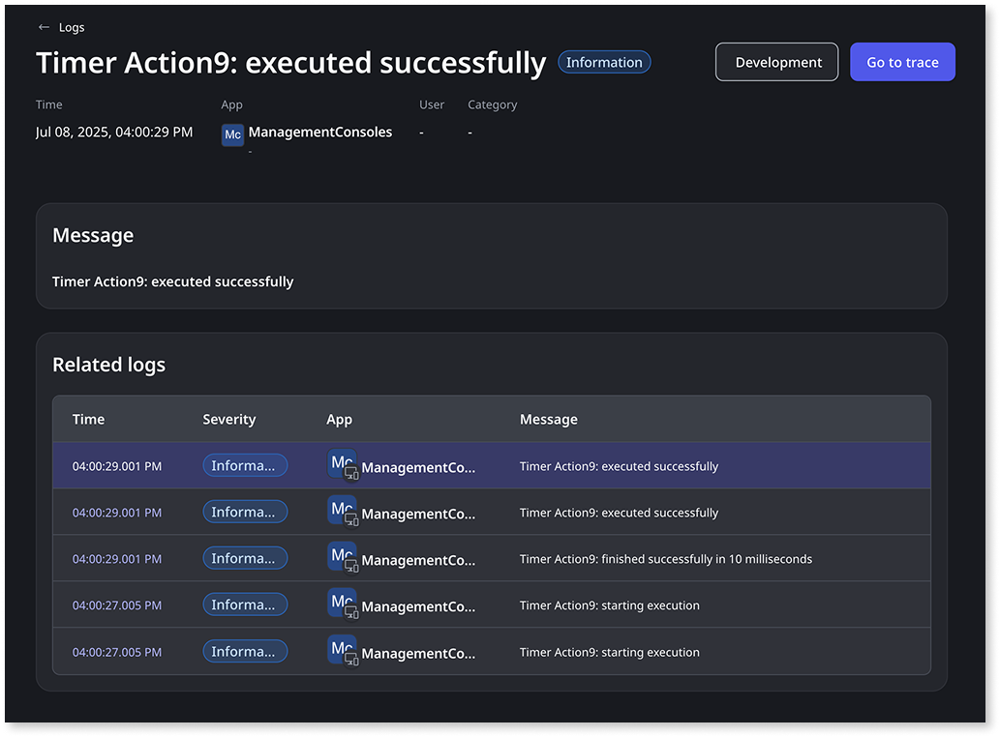
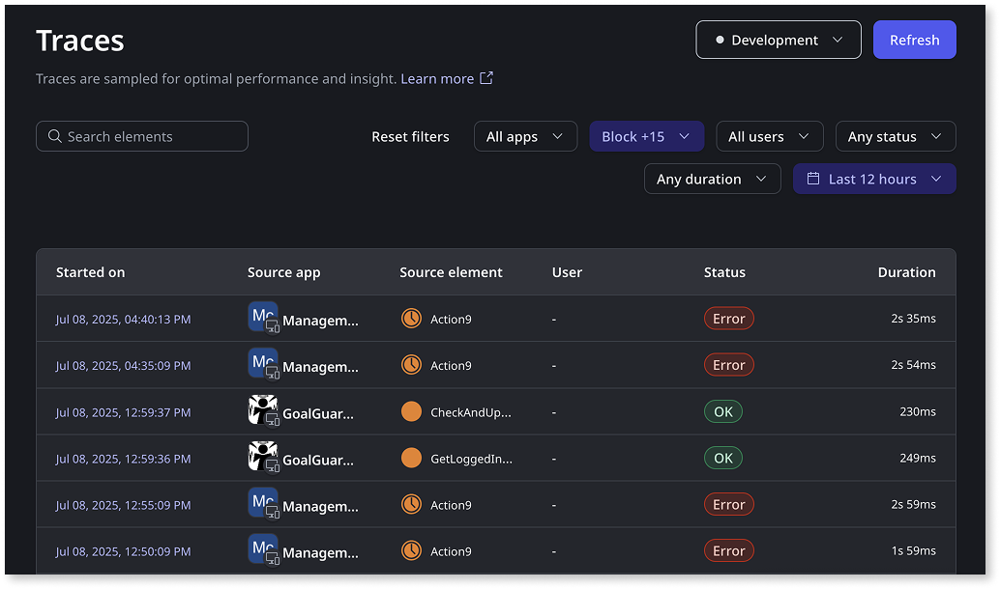
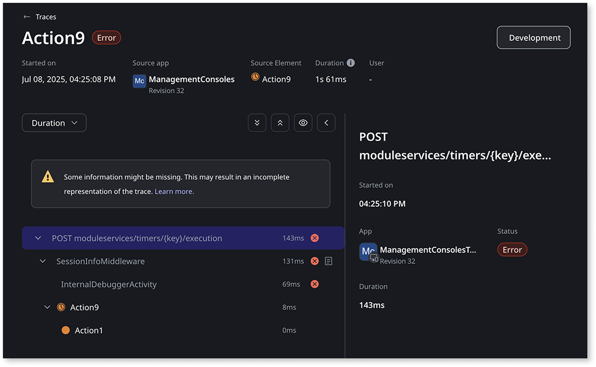

# Monitoring and troubleshooting apps

OutSystems Developer Cloud (ODC) provides a unified experience for monitoring and troubleshooting your apps. The [Logs](#logs),[Traces](#traces) and [Analytics](#analytics) screens are available in ODC Portal under the **Monitoring** section.

Logs and traces are complementary for getting to the root cause of a problem with an app. While a log helps you identify the problem, the associated trace helps you locate the problem. You can then use this information to help resolve the problem. Traces are also helpful for troubleshooting a performance issue with an app.

Complementing logs and traces, metrics provide a quantitative view of your app's performance and resource consumption over time. These aggregated data points allow you to identify trends, establish baselines, and proactively detect potential issues before they impact end-users. ODC automatically collects a range of metrics, offering insights into, for example, your app's health score, apps by usage, requests, and errors.

This functionality uses the Data platform, which may process data outside your ODC organization region to provide its capabilities. For more information, refer to [Data platform](../manage-platform-app-lifecycle/platform-architecture/intro.md#data-platform).

## Logs

Apps have associated logs. Logs are either automatically generated (a log generated when a timer fails to execute, for example) or triggered by app logic built by a developer (an [exception](../building-apps/handling-exceptions/handle-exceptions.md#exception-logs) triggered by the failure of an end-user to provide a required input, for example). Developers can also use the LogMessage system action.

Each log has a level of severity: **Error**, **Warning**, and **Information**.

By default, when you open the **Logs** screen you see error logs from the development stage ordered by time in descending order. Use the filter inputs to filter logs by stage, app, severity, date/time, user, and message. You can filter logs by date back up to four weeks in an interval of up to two weeks.

When you click the embedded link of a log's date/time, you open the detail page for that unique log. You see the log message, stack trace, and any logs related to the same request. Go to the log's associated trace by clicking the **Go to trace** button. When a log doesn't have an associated trace, the button is disabled. Currently, you only see traces for requests using server-side elements.

## Traces

When an app makes a request using a server-side element, it generates a trace. A trace is an end-to-end view of a request comprised of a series of intervals known as spans. Each span is a logical unit of work and has a duration. You review a trace to:

* Identify which span threw an error to get to the root cause.

* Understand the performance of each span in the app and dependent apps.

For example, you could quickly identify that the issue with a Service Action request as an SQL query (a span of the trace) has invalid syntax.

Traces take a few minutes to generate and display. It takes time for ODC to aggregate all the spans within the request.

By default, when you open the **Traces** screen, you see traces from the development stage ordered by time in descending order. The stage filter of the Logs and Traces screens are synchronized. This means if you were viewing production logs in the Logs screen, you see production logs in the Traces screen.

Use the filter inputs to filter traces by stage, app, element type, trace status, total duration, date/time, and user. You can filter traces by date back up to four weeks in an interval of up to two weeks.

When you click the embedded link of a trace's date/time, you open the detail page for that unique trace. On the left side of the screen you see each span of the trace in order of execution alongside its duration. A red circle with X next to a span indicates an error. If any span of a trace has an error then the status of the trace is **Error**. Otherwise the trace status is **OK**.

You use the **Show details** toggle to show ODC internal spans. This may provide additional context for your troubleshooting, but you can't action a problem with an ODC internal span.

When you click a span you see its attributes and any related logs on the right side of the screen.

## Analytics

ODC provides valuable metrics to help you understand your app's activity and performance. These metrics offer an aggregated view of key indicators, allowing you to identify trends and potential areas for optimization.

The **Analytics** screen monitors apps based on performance, usage, and errors, displaying insights such as health score, apps by usage, requests, errors, response time, and AI models by request.

## Sharing data

Each log and each trace has a unique ID contained in the URL (`...?id=x...`). If you need to share a log or trace with a team member, share the URL. You must have organization role permissions.

## Retaining data

You can access logs, traces, and metrics data up to four weeks old within the ODC Portal. You can also stream logs, traces, and metrics to external destinations. This enables extended retention periods and seamless integration with other APM tools. For more information about streaming observability data, refer to [Streaming observability data](../monitor-and-troubleshoot/stream-app-analytics/stream-app-analytics-overview.md).

## Related resources

* [Streaming observability data](../monitor-and-troubleshoot/stream-app-analytics/stream-app-analytics-overview.md)
* [Monitor assets with ODC Analytics](app-health.md)
* [Manage technical debt in ODC](../monitor-and-troubleshoot/manage-technical-debt/managing-tech-debt.md)
* [Traces](../monitor-and-troubleshoot/traces/intro.md)
* [Platform limits](../getting-started/system-requirements.md#platform-limits)
