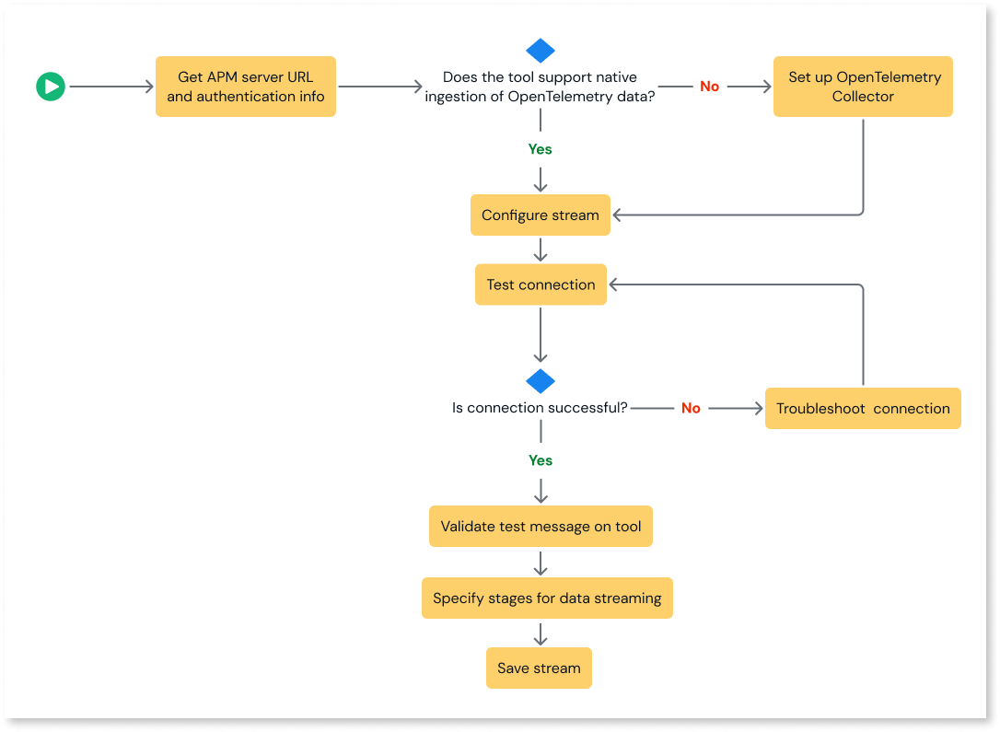

# Streaming observability data to APM tools

With ODC's App Analytics Stream, you can stream your observability data in an OpenTelemetry Protocol (OTLP) format to different Application Performance Monitoring (APM) tools so that you can analyze, monitor, and proactively troubleshoot your system. You can easily integrate your app with any APM tool, as most monitoring tools support data ingestion in OpenTelemetry (OTel) format.

# Set up observability data streams

Here is the overview of the process for streaming observability data to different APM tools:

For information about the prerequisites for streaming observability data, refer to the [prerequisites for streaming observability data](stream-app-analytics-overview.md#prerequisites).

1. Retrieve the APM tool's server URL and authentication credentials. To establish a secure connection between your app and the APM tool, you require the APM tool's server URL and authentication credentials. The steps to retrieve the server URL and authentication information vary for each tool.

    For detailed information, refer to the corresponding APM tool documentation in the [What's next section](#whats-next).

1. (Optional) [Set up OpenTelemetry collector](stream-app-analytics-opentelemetry.md). If your tool does not support native ingestion of OpenTelemetry data, you must install and deploy the OpenTelemetry collector.

1. To enable streaming from an ODC app to the corresponding APM tool, you must configure the APM server URL or OpenTelemetry collector URL and authentication credentials. For more information, refer to [Configure streams in the ODC Portal](stream-app-analytics-configure.md).

1. Test and validate the connection. In the ODC Portal, test if your app has established a connection with the APM tool and if the test data is sent to the destination tool. For more information, refer to [Configure streams in the ODC Portal](stream-app-analytics-configure.md). If the connection fails, refer to the [troubleshooting guide](https://success.outsystems.com/support/errors/log_streaming_errors/) to understand why and how to resolve the errors and retest the connection.

1. Add the stages you want to stream data from and save your stream.

## What's next {#whats-next}

For detailed information on streaming observability data to different APM tools, refer to:

* [Stream observability data to New Relic](stream-app-analytics-new-relic.md)

* [Stream observability data to Dynatrace](stream-app-analytics-dynatrace.md)

* [Stream observability data to Elastic Cloud](stream-app-analytics-elastic.md)

* [Stream observability data to Amazon S3](stream-app-analytics-amazon-s3.md)

* [Stream observability data to Splunk](stream-app-analytics-splunk.md)

* [Stream observability data to Datadog](stream-app-analytics-datadog.md)

## Related resources

* [Streaming observability data ](stream-app-analytics-overview.md)

* [Set up the OpenTelemetry Collector](stream-app-analytics-opentelemetry.md)

* [Configuring streams in the ODC Portal](stream-app-analytics-configure.md)
