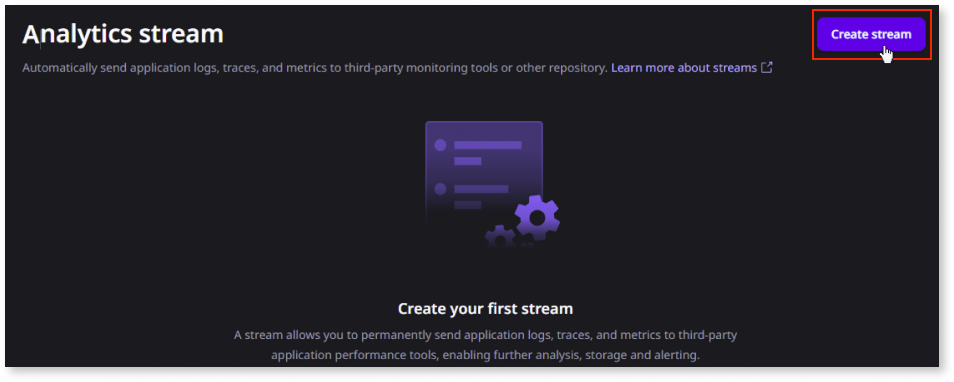
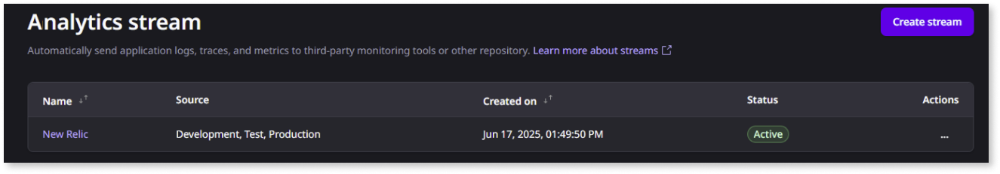

# Configure streams in the ODC Portal

To stream observability data from your app to the corresponding APM tool, you must create a stream and configure the APM server details and authentication credentials. This article explains how to create streams in the ODC Portal for a specific APM tool.

## Prerequisites

Before creating a stream, refer to the [prerequisites for streaming observability data](stream-app-analytics-overview.md#prerequisites).

## Create a stream 

This example demonstrates the process of creating a stream using **New Relic** as the destination APM tool. The steps might vary slightly depending on the APM tool you select.

1. In the ODC Portal, go to **Configure** > **Streams.**  

1. Click **Create Stream**.

   

1. Select the destination tool and click **Choose**.  

    

    For Amazon S3, Splunk, and Datadog, you must choose Other as the destination tool.

    

     

1. Enter the destination details and click **Test stream.**

    ODC attempts to establish a connection with the specified APM server.

    

    * **Successful connection:** If the connection is established successfully, a success message is displayed. The system also sends test data to your destination  tool. You must validate that this test data has arrived and is visible in the APM tool.

        

    * **Unsuccessful connection:** If the connection fails, a warning message is displayed. 
        
        

        In this case:  

        * Retry the test connection.  
        * Review the destination information you entered to ensure its accuracy.  
        * If the issue persists, consult the relevant troubleshooting documentation for the recommended action. 

    

    
    If a connection can't be established due to changes in the destination URL, authentication credentials, or temporary unavailability of the APM destination tool, the streaming service automatically retries sending the same batch of observability data for a certain period.

    

1. Enter the source details and click **Save**.

    

Your new stream is created, and observability data can now be sent to the configured APM tool.

A stream can have one of the following statuses:

* **Active:** The stream is currently running and successfully sending observability data to the configured APM tool.  

* **Active with errors:** The stream is currently running and attempting to send data, but encountering some errors. You should investigate these errors to ensure all data is being delivered correctly. Check the stream details or logs for more information on the specific errors.  

* **Inactive:**  When you manually deactivate a stream, it transitions to an inactive state, and no data is sent to the APM tool. You can reactivate an inactive stream. Once the stream is successfully reactivated, its status will change to **Active**.

## Next steps

For detailed information on streaming observability data to different APM tools, refer to:

* [Stream observability data to New Relic](stream-app-analytics-new-relic.md)

* [Stream observability data to Dynatrace](stream-app-analytics-dynatrace.md)

* [Stream observability data to Elastic Cloud](stream-app-analytics-elastic.md)

* [Stream observability data to Amazon S3](stream-app-analytics-amazon-s3.md)

* [Stream observability data to Splunk](stream-app-analytics-splunk.md)

* [Stream observability data to Datadog](stream-app-analytics-datadog.md)

