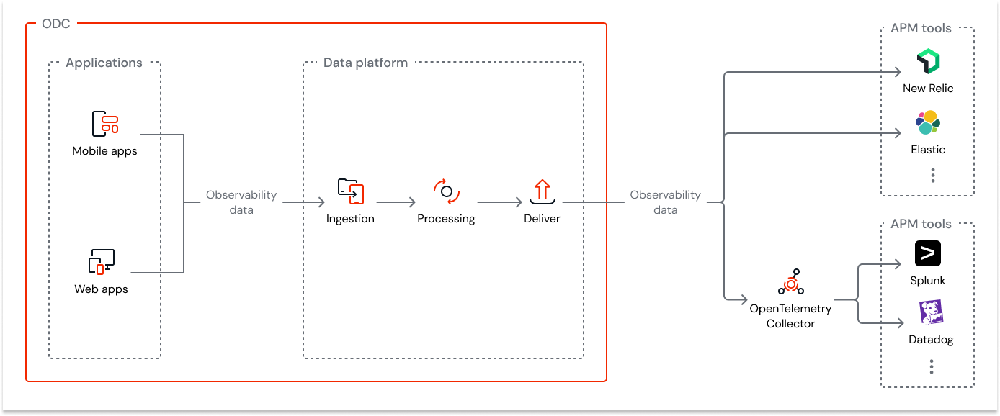

# Streaming observability data

App Analytics Stream may require an add-on to your current subscription.

Streaming observability data is the process of continuously collecting and sending metric, log, and trace data to analysis and monitoring tools in near real-time. This gives you immediate insights into how your apps and systems are working. By streaming log data in near real-time, you can proactively monitor, analyze, and respond to potential issues, ultimately enhancing app reliability and performance.

With ODC's App Analytics Stream enabled, you can stream app logs from ODC apps to various third-party application performance monitoring (APM) tools, including Elastic Cloud, Datadog, Dynatrace, Splunk, New Relic, and Amazon S3. This real-time flow provides you with dynamic insights into app performance and behavior. 

ODC adopts the [OpenTelemetry](https://opentelemetry.io/) standard to stream log data to various APM tools. OpenTelemetry is an [open-source](https://github.com/open-telemetry) observability framework comprising a collection of tools, APIs, and SDKs that you can use to instrument, generate, collect, and export log data to help analyze your apps' performance and behavior. OpenTelemetry is tool-agnostic, meaning it can be used with various commercial and open-source APM tools without significant configuration changes.

## Prerequisites

Before you start streaming observability data, ensure you have:

* A subscription to App Analytics Stream. Contact your account manager for provisioning.

* The Manage App Analytics Stream permission.

## Benefits of streaming observability data

Streaming observability data supports monitoring both app availability and performance by providing real-time visibility into system behavior, errors, and resource usage. It ensures both **reliability** and **efficiency**, helping you maintain high availability and optimal app performance.

Streaming observability data is essential for:

* **Centralized monitoring**: Enables centralized monitoring across your systems, allowing you to monitor OutSystems apps along with other services in your ecosystem.

* **Compliance support**: Supports different compliance needs through flexible log retention policies.

* **Extensibility**: Allows you to extend to your own needs, such as creating different monitoring dashboard views.

* **Performance optimization:** By continuously analyzing logs, you can identify bottlenecks or inefficient resource usage, leading to real-time adjustments and improved system performance.

* **Availability optimization**: Continuously analyzing error, request, and cyclic job logs enables the immediate detection of outages, crashes, or failed service dependencies, facilitating swift resolution and improved reliability.

* **Enhanced debugging:** Real-time insights into app behavior make it easier to trace errors, analyze failures, and quickly identify the root cause of issues during debugging.

* **Proactive monitoring and automated alerting:** By continuously analyzing logs, systems can detect anomalies, performance drops, or failures early and trigger automated alerts, enabling swift action before issues impact users.

* **Rapid issue detection:** Real-time monitoring allows you to instantly detect and respond to errors, failures, or security breaches before they escalate into critical issues.  

## Streaming observability data with OpenTelemetry

ODC uses the [OpenTelemetry Protocol (OTLP)](https://opentelemetry.io/docs/specs/otel/protocol/), which defines the encoding, transport, and delivery mechanism of log data generated by ODC apps and the ODC platform. Here's an overview of the process of collecting and streaming observability data.

1. The apps generate observability data.

1. The OTLP messages are then exported in the binary format [Protobuf](https://protobuf.dev/) over HTTP or gRPC, depending on the transport protocol supported by the APM tool. The messages are sent to the APM tools in batches with multiple records every 100 ms and aren't compressed. The size of these messages varies between 1100 bytes and 1700 bytes.

* For a scenario of temporary unavailability from the APM tool destination, failed batches are queued and retried for up to 48 hours in order to avoid data loss during this period. Such scenarios may delay the delivery of logs.
* HTTP 500/gRPC Internal Error and HTTP 413 Payload Too Large responses from the APM tool ingestion will cause the current batch to be dropped.
* APM tools may implement rules and limits to the ingestion, which are followed by App Analytics Stream when adherent to the OpenTelemetry protocol, but unexpected changes and other restrictive limits may impact the streaming service and prevent data from being ingested in the APM tool.

## Supported APM tools

ODC supports the following tools:

* New Relic
* Dynatrace
* Elastic Cloud
* Amazon S3 (Requires setup with the OpenTelemetry collector)
* Splunk (Requires setup with the OpenTelemetry collector)
* Datadog (Requires setup with the OpenTelemetry collector)

Other tools compatible with the OpenTelemetry protocol and OTLP-formatted data are typically capable of interpreting ODC's observability data, but you need to evaluate them. Also, many APM tools are not native-compatible. For example, Splunk, Datadog, and Amazon S3 have implemented and distributed a public exporter library with the OpenTelemetry collector. 

The OpenTelemetry collector is an app that runs separately and must be launched/supported by customers. For more information, refer to [Set up an OpenTelemetry collector.](stream-app-analytics-opentelemetry.md)

IP allowlisting is not supported as the OutSystems origin IPs might change.

## Understanding your streamed data

**Log data** provides detailed information about events within your app. Examples include:

* Error logs
* Information logs

For detailed information, refer to [Streamed log data](stream-app-analytics-log-ref.md).

**Trace data** offers insights into the performance and flow of requests within your app. Examples include:

* Request processing time
* Database query duration
* External API call duration

For detailed information, refer to [Streamed trace data](stream-app-analytics-traces-ref.md).

**Metrics data** presents numerical measurements of your app's performance and resource usage. Key metrics include:

*  **Total requests**: The total number of requests made to any asset originating from elements such as screens, client actions, REST/service actions, timers, and global event handlers. 

    One trace typically corresponds to one request. However, in some cases, for example, when a failed timer is retried multiple times, each retry is counted as a separate request, but all the retries are part of a single trace.

* **Request duration**: The distribution of request processing times, categorized into millisecond buckets.

* **Total invocations**:  The total number of times a server-side action (for example, data action, or consumed REST/SOAP method) is called during a request. 

* **Invocation duration**: The distribution of processing times for the server-side action invocations, categorized into millisecond buckets.

For detailed information, refer to [Streamed metrics data](stream-app-analytics-metrics-ref.md).

## Related resources

* [Streaming observability data to APM tools](stream-app-analytics-overview.md)

* [Set up the OpenTelemetry collector](stream-app-analytics-opentelemetry.md)

* [Configuring streams in the ODC Portal](stream-app-analytics-configure.md)

* [Monitoring and troubleshooting apps](../monitor-apps.md)
