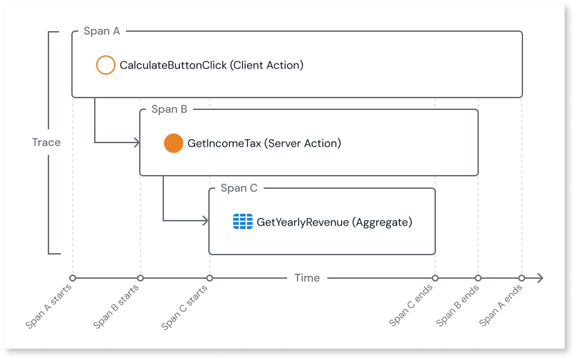
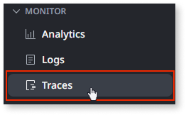
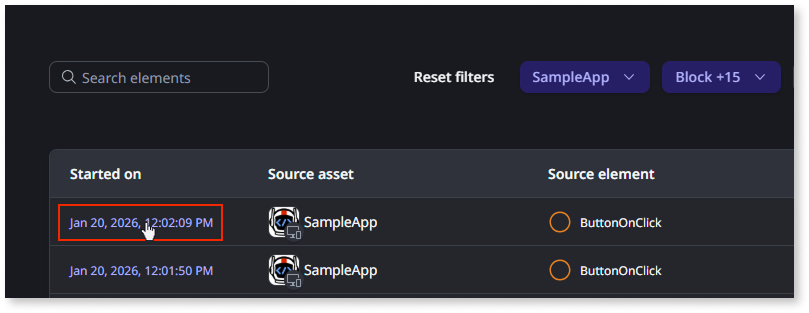
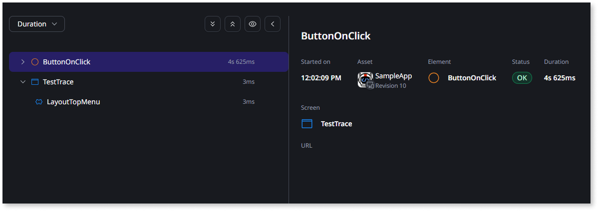
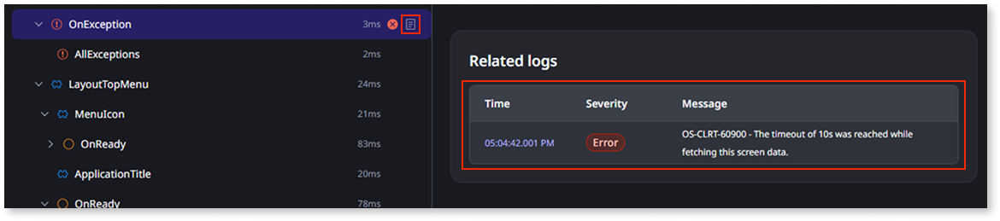

# Traces

OutSystems Developer Cloud (ODC) uses distributed tracing to capture the complete lifecycle of an application request. A single user action, such as clicking a button, often triggers a cascade of events across multiple components. A trace is a record that groups every related event for a specific request.

While logs record **what** happened, traces provide the context of **when** and **where** it happened. This context allows you to visualize the request's full lifecycle, helping you troubleshoot issues faster and pinpoint performance bottlenecks.

## Spans {#spans}

The events contained by the trace that represent individual units of work, such as a database query, an API call, or a server action are called spans. Each span includes timing information such as its start time and duration.

Spans are organized hierarchically. For example, a client action (span A) may call a server action (span B), which then executes an aggregate (span C). In this chain, span C is a child of span B, which is a child of span A.

Due to issues like network failures or incomplete data collection, spans can end up without a clear parent. These are called orphan spans, and can be found at the root of the trace.

ODC calculates the total duration of a trace from the start time of the first span to the end time of the last span. However, the following scenarios may cause the trace duration to deviate from this standard calculation:

* Keep-alive elements such as carousels.
* Asynchronous operations, where the parent span does not wait for the child span to complete.

## Trace retention and sampling {#retention-sampling}

In order to prevent information overload from too much data, traces are retained or discarded according to various criteria.

All traces matching the following criteria are retained:

* Traces with error spans.
* Traces with timers lasting more than 5 seconds.
* Traces with Aggregates lasting more than 200 ms.
* Traces with REST APIs (Consume, Expose) lasting more than 200 ms.
* Traces with a duration of more than 1 second.

ODC further retains 2 percent of the total traces that do not meet any of the negative criteria. These traces demonstrate correct execution flows.

Consider an example of an app that had 110 traces captured. These included 5 traces with errors, 5 slow traces (>1 second duration), and 100 healthy traces (<1 second duration, no errors). In this scenario, ODC retains all 10 of the error and slow traces, and a sample of 2 out of the 100 healthy traces.

## Set up traces {#set-up-traces}

ODC supports capture of [server-side traces](server-side-traces.md) and [client-side traces](client-side-traces.md). To turn this functionality on and off, make sure you have the **Edit asset configurations** permission.

Server-side traces are enabled by default, you [can switch them on or off](server-side-traces.md#turn-on-off) in your app configuration section in the ODC Portal. If you have server-side traces enabled, you can also [enable capture of client-side traces](client-side-traces.md#enable-client-side) in the app configuration section in the ODC Portal.

Turning on client-side traces requires server-side being on first. Disabling server-side traces, disables client-side traces too.

## Access traces {#access-traces}

You can access trace data in the ODC Portal. Ensure that as an IT user you have the **Access app logs and traces** and **Access user information** permissions.

1. From the ODC Portal menu, go to **Monitor** > **Traces**.

    

1. The traces page displays the most recent traces. Select the desired stage and use the filters to help locate a specific trace. Traces are not available instantly and may be in a processing state. To fetch newly processed traces, select **Refresh**.

1. Select the timestamp in the **Started on** column to open the trace details page.

    

1. In the trace details page, you can browse the list of spans of the current trace. The spans are displayed in a nested structure to visualize the parent-child relationships between spans. By clicking any row on the list pane, you can see attributes and details for the chosen span on the details pane.

    

1. Spans linked to logs are marked with a **document icon**. Select the span and navigate to the **Related logs** section in the details pane to view the entries.

    

1. To view internal ODC spans, toggle **Show details** (eye icon).
  
    

## Considerations and constraints {#considerations-constraints}

As you work with traces, keep in mind that traces may cause performance degradation in complex apps. OutSystems recommends turning off client-side traces to mitigate the issue.

Find more about limits and retention policies of traces in [System requirements](../../getting-started/system-requirements.md#logs-and-traces).

For information on how to stream traces from ODC to third-party application performance monitoring tools, refer to [Streaming observability data](../stream-app-analytics/stream-app-analytics-overview.md).

## Related resources

[Streamed trace data](../stream-app-analytics/stream-app-analytics-traces-ref.md)
