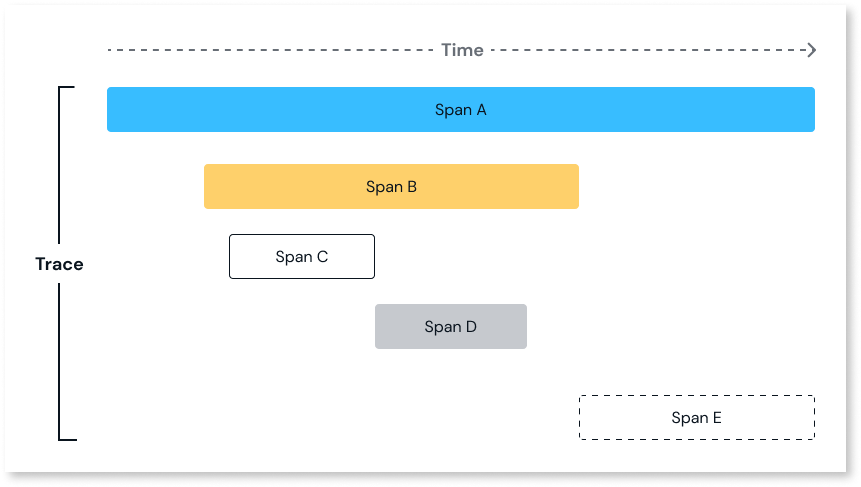

# Traces

A trace is a record that captures the sequence of events when an app executes logic in OutSystems Developer Cloud(ODC). ODC uses distributed traces to monitor requests in multiple components of the architecture. Each component, referred to as a span, is associated with a single request.

Traces provide information and pinpoint issues in ODC Studio. They are linked with logs to identify problems enabling you to easily debug apps.

For example, examining a trace linked to a REST API request reveals the request method, duration, URL, and flow across system components. This allows you to assess the performance of each span and identify errors.

Ensure you have the following permissions:

* Access app logs and traces.
* Access user information.

You can analyze client-side execution with [client-side traces](client-side-traces.md). This provides insights into elements such as Blocks or Client actions. 

## Spans

Spans are a series of time intervals tagged within a trace. They allow insights into processing requests across different components. Each span includes details such as its start and end time and duration.

For example, a trace that triggers spans A through E, with each span representing a distinct part of the process. The execution begins with span A, triggering subsequent spans:

1. Span A (parent span) triggers span B (child span). After triggering span B and span A triggers span E(child span)
1. Span B (parent span) triggers span C (child span), span D (child span), and span E (child span)
1. Span B finishes only after span D
1. Span A finishes only after span E

Orphan spans are spans without a clear parent span, as the orphan span could have a parent span. For example, if span E becomes an orphan, the association between span E and B becomes unclear. This indicates a connectivity problem, where there is an error in the expected sequence of spans. Such issues can arise from network failures or incomplete data collection.

## Sampling in traces

In ODC, sampling involves selecting traces that match any of the following criteria:

* Traces with error spans.
* Traces with timers lasting more than 5 seconds.
* Traces with Aggregates lasting more than 200 ms.
* Traces with REST APIs (Consume, Expose) lasting more than 200 ms.
* Traces with a duration of more than 1 second.

ODC samples 2 percent of the total traces that do not meet any of the above criteria. These good traces provide insights into execution flows. For example, if your app generates 15 traces in ODC:

* 2 have error spans.
* 3 have trace duration more tha 1 sec.
* 10 have no errors & duration is 5 ms.

ODC stores the 2 error traces and the 3 slow traces. ODC samples 2 percent of the 10 good traces with a duration of 5 ms for reporting.

Sampling occurs at the trace level rather than the span level. This helps prevent information overload from noisy traces by displaying only relevant information.

To access the latest traces, click the **Refresh** button on the **Traces** screen, as some traces may be in a processing state. ODC displays traces from the development stage, ordered by time in descending order. You can filter the options to narrow traces by parent span or date. You can view traces from the previous 30 days to the current date in 14-day intervals.

ODC calculates the total duration of a trace from the start time of the first span to the end time of the last span. This represents the overall time taken to execute all spans within the trace. However, there are situations where total duration differs, such as:

* Keep-alive elements such as carousels.
* Asynchronous operations, where the parent span does not wait for the child span to complete.

## Using traces

The following steps describe how to use traces to debug your apps.

1. To display the details of the traces from the ODC Portal, select **Monitoring** > **Traces** and click the trace's date/time under the **Started on** column. On the left side of the screen, each span of the trace is displayed in order of execution alongside its duration.

1. To display the ODC internal spans for additional context and troubleshooting, click **Show details**(Eye).
  
    

1. To display related logs, click the document icon next to the error.

1. To display its attributes and any related logs, go to the right side of the screen and click a span.

1. To further debug the element causing the error, open ODC Studio to debug the specific element further.

## Considerations working with traces

 As you work with traces, keep the following in mind:

* Traces exceeding the size of 15 MB are automatically dropped.
* ODC displays traces up to 5000 spans for a single trace.
* In complex apps, traces may cause performance degradation.
    * OutSystems recommends turning off the client-side traces to mitigate the issue.
