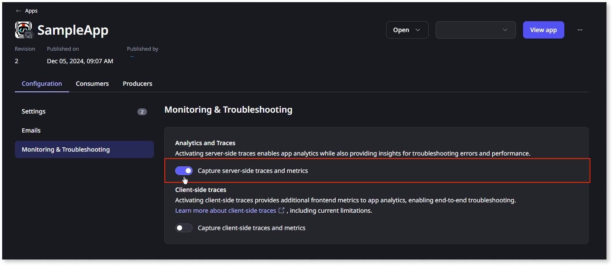

# Server-side traces

Server-side traces help you analyze server-side execution. This provides insights into elements such as events or service actions. Use server-side traces to:

* Identify which [span](intro.md#spans) contains an error. Use the ODC Portal to find the root cause, then go to ODC Studio to fix it.
* Get detailed information about user interactions by monitoring requests.
* Understand the performance of each span in the app and its dependencies. Modify the elements associated with slower spans to improve the app's performance.

The following are different types of server-side traces:

* Consume REST API: Track request methods, durations, and URLs to identify performance issues or errors in API consumption.
* Entity Action: Track entity actions, such as create, read, update, and delete (CRUD) operations.
* Event: Track the sequence and duration of custom and system events.
* Expose REST API: Track performance and errors in exposed REST APIs, including request handling and response times.
* Screen Aggregate: Track the execution of aggregates on screens to identify slow queries or data retrieval issues affecting performance.
* Screen Data Action: Track the execution of data actions on screens to debug and optimize data fetching and manipulation.
* Service Action: Monitor the execution, performance, and errors in service actions.
* System Event: Monitor system events such as ApplicationReady and ApplicationResume.
* Timer: Track scheduled tasks, including execution duration and errors, to ensure timers run as expected.

For more information about backend traces, refer to [Traces](intro.md).

## Turn server-side traces on or off

All apps have their server-side traces on by default. Follow these steps to turn server-side traces off or on:

1. In the ODC portal, select Apps and choose the app for which you want to turn server-side traces on or off.\

1. Under the **Configuration** tab, go to **Monitoring & Troubleshooting**. Then, toggle **Capture server-side traces and metrics** to turn server-side traces on or off.

    
