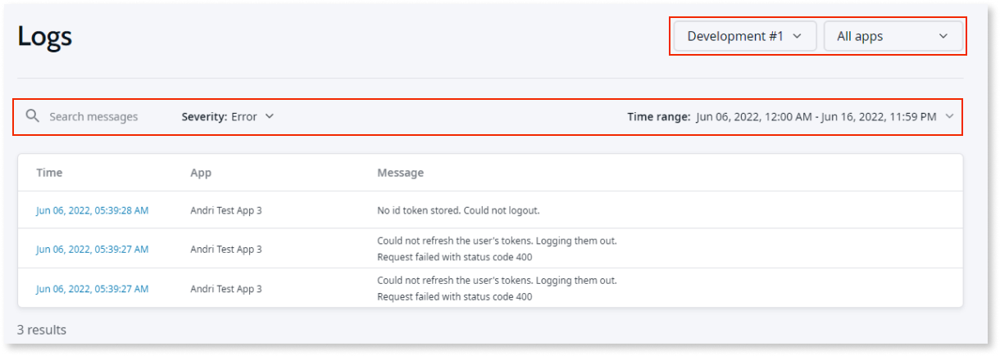
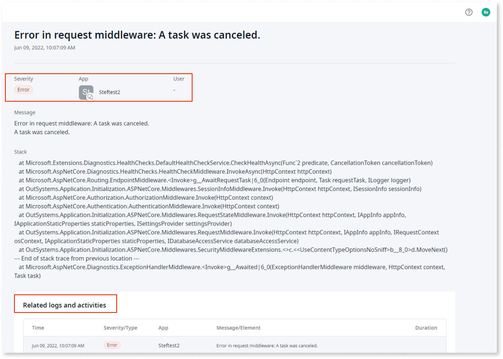
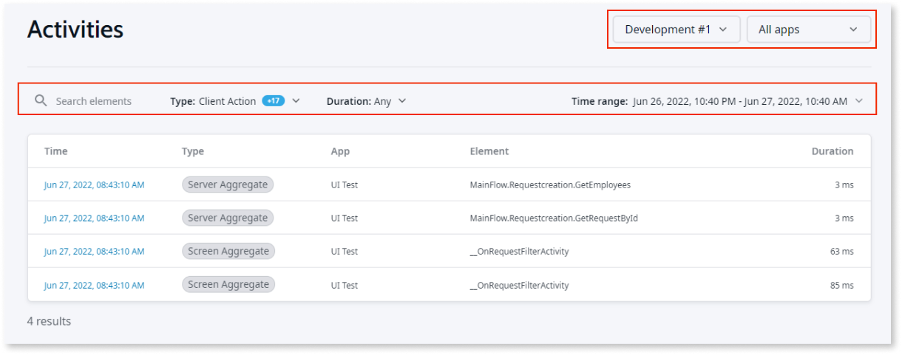
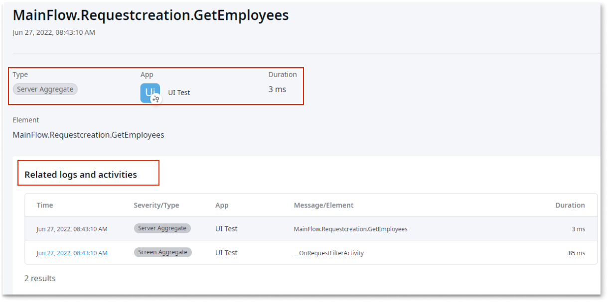

# Monitor apps

Project Neo documentation is under construction. It's frequently updated and expanded.

OutSystems provides a unified experience for monitoring your systems and apps and identifying unexpected behaviors. As a best practice, you should monitor systems and apps during all stages. The **Activities** and **Logs** screens are available in Project Neo Portal.

This document provides an overview of using log files and activities to ensure your apps are working correctly.

## Logs

By default, you see the logs from the development stage. Apps generate logs to help you identify issues and determine the root cause of the problem. The list displays a maximum of 100 logs in descending order sorted by start date/time.

At the top of the log list, you can set filters to narrow the scope of your results. You can filter by stage, app, severity, date/time, and free text. The logs include a detail page that shows the user, stack trace information if there is an error and the logs and activities related to the same request. 

Access the logs screen from **Portal** > **Logs**.

The following screenshot shows Log entries for the current settings. 

The following shows the stack trace error along with the related logs and activities for an error. 

## Activities

Apps generate activities to ensure your apps are working as expected. Reviewing the activities, enables you to troubleshoot:
 
* Issues by reviewing the activities that run
* The performance of the app and any issues by checking for slow queries, screens, and integrations
* Tracing related to the user requests

By default, you see activities that ran in the development stage during the past 12 hours. The lists show the app, the type of activity, the action that ran, when the action started, and how long it took to run. The list displays a maximum of 100 activities in descending order sorted by start date/time. You can set filters to narrow the scope of your results. You can filter by stage, apps, free text, date/time, activity type, and duration. You can also access a detailed page that shows logs and activities related to the same request.

In addition, you can sort the list by the type of activity, such as:

* Consumed REST integration
* Exposed REST integration
* Screen action
* Server action
* Client action
* SQL
* Timer

Access the activities screen from **Portal** > **Activities**.

The following shows the Activities for the current settings. 

The following shows related logs and activities for an activity.

