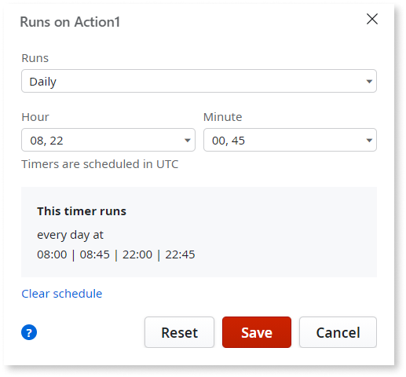

# Onboarding for OutSystems developers
 

Project Neo documentation is under construction. It's frequently updated and expanded. Leave your feedback and help us build the most useful content.

This article summarizes behavior that developers familiar with OutSystems 11 may find helpful when learning about Project Neo.
 
## Overview
 
Project Neo is a cloud-native, application development platform that provides a modular, scalable environment in which to develop and deploy your applications. Project Neo lets you build and deploy enterprise-grade, mission-critical apps in weeks. With Project Neo, you can build web apps, web portals, mobile apps, and business workflows faster than with traditional development tools. You can then deploy your apps in a scalable, secure, and high-performance environment.
 
Project Neo delivers a modern architecture based on best practices in cloud-native infrastructure, management, and operations. Benefits include:
 
* Scalable and reliable apps, built and deployed in a modern infrastructure that includes Linux containers and Kubernetes
* Built-in security with end-to-end encryption  
* Disaster recovery, with app-level high availability configuration  
* The ability to take advantage of the latest Project Neo versions with pain-free upgrades
 
## Unified experience
 
Portal for Project Neo consolidates your app and user management experience in one place. It consolidates functionality that previously existed across LifeTime, Service Center, and the Users application.
 

 
 
## Build once, deploy many times
 
Project Neo uses the term **stage** instead of **environment**. A stage (Development, Test or Production) is a step within your continuous delivery pipeline that includes Runtime resources. Project Neo separates Platform and Runtime resources, allowing development to scale independently of apps deployed to different stages.
 
Project Neo has a centralized code repository, which enables you to build your app once, and then deploy it to multiple stages. In Project Neo, when you click the 1-Click Publish button in Service Studio, your code builds and your app is deployed to the Development stage. A container image is also saved in a registry. When you're ready to promote your app to the next stage (for example, from Development to Test), the version that exists in the registry is promoted without the need to recompile any code. In Project Neo, Service Studio connects to the Platform, which pushes content to the Development stage. Service Studio doesn't connect to the Test or Production stage.
 
In contrast, OutSystems 11 has a code repository per environment (Development, Test, and Production), which requires rebuilding each time you deploy to a new environment. Additionally, in OutSystems 11, Service Studio connects to each environment where you build and deploy your apps.  
 
## App-level development
 
Project Neo removes the concept of modules. You don't break apps into separate modules, as recommended in OutSystems 11. This change is part of a longer-term strategy that aims to simplify dependencies, minimize code conflicts, and streamline collaboration. This change cascades through the Service Studio interface in numerous ways, such as when searching within an app.
 
## Libraries
 
Project Neo elevates Libraries to a top-level concept. Libraries exist at the same level as Web Apps and Mobile Apps, and they have their own lifecycle. At this point, developers can choose whether to use the latest version of a Library or an earlier version.  
 
In a later Project Neo version, apps will be able to consume different versions of a Library, and developers will be able to choose which version an app uses. For example, you can make a branding change by updating the style guide in a Library. Then, you can roll out that change one app at a time, rather than updating all apps at once. Deployed apps can coexist with old and new branding, based on the Library version each app consumes.
 
## Element reuse
 
In Project Neo, the way you reuse elements across apps differs from OutSystems 11. Apps can reuse elements from other apps, but only when they're loosely coupled. Apps can reuse elements that are tightly coupled from Libraries only. Project Neo prevents you from creating strong dependencies between apps (Web Apps or Mobile Apps). You can only have strong dependencies between an app (Web App or Mobile App) and a Library.
 
Note the following regarding reuse in Project Neo:
 
* Dependencies between apps (Web Apps or Mobile Apps) are always weak, which means that Entities shared between apps are always read-only; in Project Neo, to write to Entities, you must create a Service Action
* Relationships between Entities in different apps work differently. In Project Neo:
    * The delete rule is always set to **ignore**
    * A database constraint isn't created in the database, as is done with OutSystems 11
* Apps (Web or Mobile) can have strong dependencies to Libraries only; See [Reuse elements across apps](reuse-elements.md) for more information
* Apps (Web or Mobile) consume a specific Library version. For example, app A can consume Library v1 and app B can consume Library v2
* Many elements that could be public in OutSystems 11 can't be public in Project Neo; See [Reuse elements across apps](reuse-elements.md) for more information.
 
The following screen capture shows options when creating an app in Service Studio.
 

 
## Debugging changes in Service Studio
 
In Project Neo, note the following differences when debugging applications in Service Studio:
 
* The debug entry point refers to the Entry app, not to the Entry module. Modules don't exist in Project Neo.
* When debugging an app, the Entry app only shows the current app
* When debugging a Library, the Entry app lists the apps that consume the Library you're debugging
 
## Timers in Service Studio
 
Currently you can set timers in Service Studio. The format of timers in Project Neo differs from OutSystems 11. The UI for setting timers in Service Studio walks you through the valid values and formats.
 
The following screen capture shows an example of setting a timer in Service Studio to run four times daily.

 
 
Note the following related to timers in Project Neo:
 
* Currently, you can set timers in Service Studio, but not in the Portal.
* Timers are set in UTC (Coordinated Universal Time).
* The "Weekday of month" option doesn't exist in Project Neo.
 
  
## Project Neo differences by task
 
The following table lists tasks you can complete in the Portal, as well as the interface used for the same task in OutSystems 11.
 
| Task | In O11 | In Project Neo |
| ----------- | ----------- | ----------- |
| Deploy an application to another stage.| LifeTime, where you deploy apps to the Test or Production environment. | **Portal** > **Delivery** > **Deployments**. In Project Neo, you deploy to the Test or Production stage. |
| Configure apps when deploying. Includes timers and email | LifeTime | **Portal** > **Apps** |
| View apps and app details. Delete and deactivate apps | LifeTime | **Portal** > **Apps** |
| Manage IT users, roles, and permissions | LifeTime | **Portal** > **Users & access**. |
| Manage end users | Users console | **Portal** > **Users & access** |
| View logs and audit information | LifeTime | **Portal** > **Monitoring** |
| Access Forge components | Forge URL | **Portal** > **Forge** |
 
## Terminology mapping
 
The following table summarizes terminology differences between OutSystems 11 and Project Neo.
 
| OutSystems 11 name | Project Neo name | Notes |
| ----------- | ----------- | ----------- |
| environment | stage | In Project Neo, the infrastructure where you develop and run your apps is fundamentally different. However, these terms (environment and stage), both represent the place where you deploy your apps to Development, Test, and Production. See [Deploy apps](deploy-apps.md) for more information about deploying apps in Project Neo. |
| Reactive Web App | Web App | All Web Apps are reactive in Project Neo. Traditional Web Apps aren't supported. |
| Module | N/A | Modules don't exist in Project Neo. |
