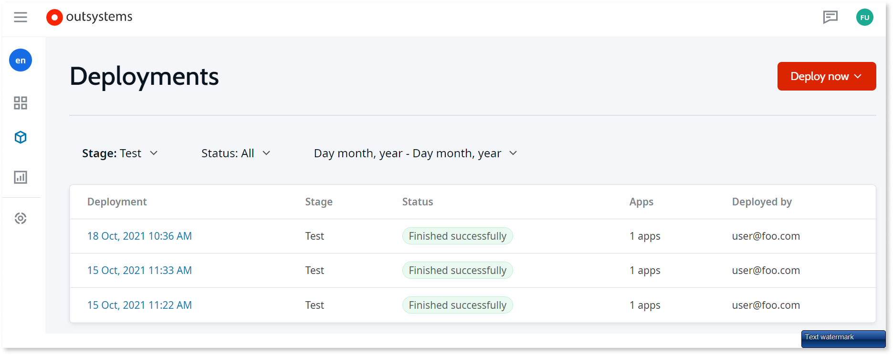

# Neo onboarding for OutSystems developers   

This article summarizes behavior that developers familiar with OutSystems 11 may find helpful when learning Neo.

## Overview

Neo is a cloud-native, application development platform that provides a modular, scalable environment in which to develop and deploy your applications. OutSystems allows you to build and deploy enterprise-grade, mission-critical applications in weeks instead of months. With OutSystems, you can build web applications, web portals, mobile apps, and business workflows faster. You can then deploy your apps in a scalable, secure, and high performance environment. 

Neo delivers a modern architecture based on best practices in cloud-native infrastructure, management, and operations. Benefits include:

* Scalable and reliable apps that run on containers
* Modern, industry-standard technologies that allow you to quickly deploy and maintain your apps
* The ability to take advantage of the latest Neo versions without disruption

## Consolidated portal

The new Neo Portal consolidates your app and user management experience in one place. The Portal will consolidate functionality that previously existed across consoles, including LifeTime, Service Center, and Users. 

 

## Build once, deploy many times

The Neo architecture changes the way your apps are deployed. Instead of deploying to environments, you deploy your apps to stages. A stage (Dev, QA or Prod) is a tenant namespace within a cluster where your apps run. Each stage resides in a separate cluster, and the Platform Service resides in its own cluster. 

Service Studio connects to the Platform Service, where you develop and build your apps. When you publish an app in Service Studio, the target deployment stage is always Dev. You can no longer connect Service Studio to other stages (QA or Prod). When you publish (1CP) in Service Studio, your app is built and deployed to Dev, and a portable app pod is created. This app pod contains everything needed to run your app. When you’re ready to promote the app to another stage (QA or Prod), you promote the app pod, without any need to rebuild code. Staging always follows the sequence: Dev to QA to Prod. 

See  for more information. 
 

## Projects, libraries, and element reuse  

**Projects and libraries** -- Neo introduces the term project to the Service Studio hierarchy. When you begin development in Service Studio, you create a project. Your project holds your web or mobile app, and, optionally, any libraries associated with it. In later Neo versions, projects can include services. Apps always reuse elements from a specific library version, and once deployed to the QA or Prod stage, are locked to that version. Any updates made in Dev do not impact apps deployed to the QA or Prod stage. 

**No more modules** -- Neo doesn't include the concept of modules. An app is no longer broken into separate modules, as recommended in OutSystems 11. This change is part of a longer-term strategy that aims to simplify dependencies, minimize code conflicts, and streamline collaboration. 

**Element reuse**--In Neo, the way you reuse elements across apps and projects differs from OutSystems 11. Neo prevents you from creating strong dependencies between apps. You can only have strong dependencies between an app and a library. 

Note the following behavior when developing your apps in Neo:

* Dependencies between apps are always weak, which means:
    * Entities shared between apps are read-only; in Neo, create a Service Action to share an entity as read/write
    * The delete rule for foreign keys is always set to ignore when sharing entities between apps
* Web or mobile apps can only have strong dependencies to libraries 
* Web or mobile apps consume a specific library version; for example, app A can consume library v1 and app B can consume library v2 
* Libraries aren't staged or deployed
* Many elements that could be public in OutSystems 11 can't be public in Neo; See [Reuse elements across apps](reuse-elements.md) for more information.
* Modules don't exist in Neo 

The following screen capture shows your options when creating a project in Service Studio.

 

## Debugging changes in Service Studio

In Neo, when you debug an app in Service Studio, you see an Entry app field instead of an Entry module one. Because modules no longer exist, your debugging entry point is at the app level. For an app that doesn't consume any library elements, you only see the current app as an entry point option. When an app reuses elements in a library, the producer library appears in the Entry app list. When debugging a library, the **Start debugging** option is only available when the library is consumed by an app. 

## Timers in Service Studio

In Neo at this point, you can only set timers in Service Studio. You can't set timers in the Portal, as you could in LifeTime in OutSystems 11. Additionally, the format of timers has changed. 

## Neo differences by task

The following table lists tasks you can complete in the Neo portal, as well as the interface used for the same task in OutSystems 11. 

| Task | In O11 | In Neo | 
| ----------- | ----------- | ----------- |
| Deploy an application to QA or Production | LifeTime, where you deploy apps to the QA or Production environment. | **Portal** > **Delivery** > **Deployments**. In Neo, you deploy to the QA or Prod stage. | 
| Configure apps when deploying. Includes timers, site properties, email | LifeTime | **Portal** > **Apps** | 
| View apps and app details. Delete and deactivate apps | LifeTime | **Portal** > **Apps** |
| Manage app dependencies | LifeTime | In Neo, you see errors in Service Studio when dependencies break. |
| Manage IT users, roles, and permissions | LifeTime | **Portal** > **Users & access**. |
| Manage end users | Users console | **Portal** > **Users & access** | 
| View logs and audit information; set logging levels | LifeTime | **Portal** > **Monitoring** | 
| Access Forge components | Forge URL | **Portal** > **Forge** |

## Terminology mapping

The following table summarizes terminology differences between OutSystems 11 and Neo. 

| OutSystems 11 name | Project Neo name | Notes | 
| ----------- | ----------- | ----------- |
| environment | stage | In Neo, the infrastructure where you develop and run your apps is fundamentally different. However, these terms (environment and stage), both represent the place where you deploy your apps to Dev, QA, and Prod. See [Deploy apps](deploy-apps.md) for more information about deploying apps in Neo. | 
| reactive web app | web app | All web apps are reactive in Neo. Neo doesn't support traditional web apps. | 
| app | project | In Neo, projects contain your web app, and, optionally, a library or libraries. In future Neo versions, projects will also include services. |
| site properties | settings | Eventually, you'll configure Neo settings in the Portal | 
| N/A | organization | In Neo, an organization maps to a tenant, and can represent a company or a unit or group within a company. | 
| module | N/A | Modules don't exist in Neo. | 

