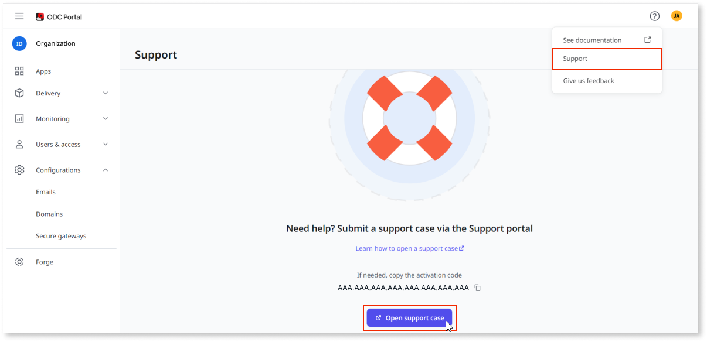

# Open a support case during Project Neo EAP

Project Neo documentation is under construction. It's frequently updated and expanded. Leave your feedback and help us building the most useful content.

During your participation on the Project Neo Early Access Program (EAP), we encourage you to submit any bugs and contribute to our product's continuous improvement.

Project Neo Portal provides an interface that guides you:

1. Under help, click **Contact support**, your activation code is displayed.
1. Click **Open support case**.

    
    
1. Ensure you're logged in, preferably using the same email that you're using in Project Neo. If necessary, sign up for a new account.
1. Select **Report an incident**.
1. When selecting the Infrastructure / Environment choose the activation code displayed in step 1. If the activation code isn't listed, type it at **Other Infrastructure**.
1. Fill in the rest form.
