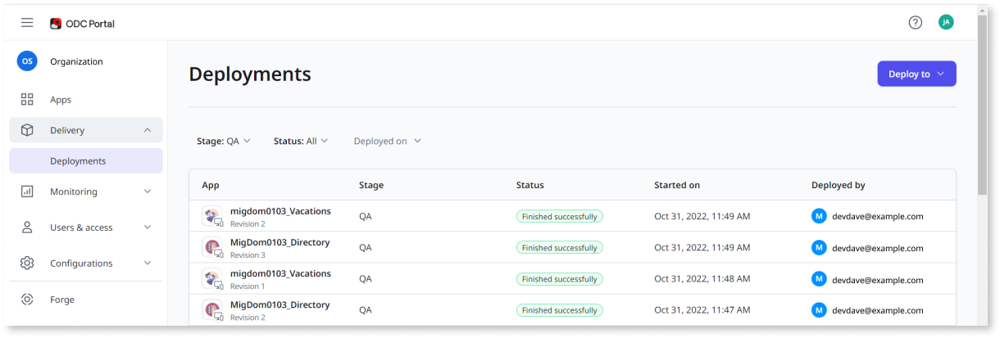
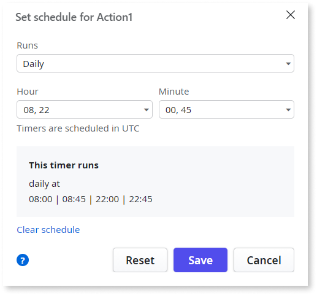

# Onboarding developers

This article summarizes behavior that developers familiar with OutSystems 11 may find helpful when learning about OutSystems Developer Cloud (ODC).

## Overview

ODC is a cloud-native, app development platform that provides a modular, scalable environment in which to develop and deploy your apps. ODC lets you build and deploy enterprise-grade, mission-critical apps in weeks. With ODC, you can build web apps, web portals, mobile apps, and business workflows faster than with traditional development tools. You can then deploy your apps in a scalable, secure, and high-performance environment.

ODC delivers a modern architecture based on best practices in cloud-native infrastructure, management, and operations. Benefits include:

* Scalable and reliable apps, built and deployed in a [modern container infrastructure](../manage-platform-app-lifecycle/platform-architecture/intro.md).
* Built-in security with end-to-end encryption.
* Disaster recovery.  
* The ability to take advantage of the latest ODC releases with pain-free upgrades.

## Unified experience  { #ODC-portal }

The ODC Portal consolidates your app and user management experience in one place. It consolidates functionality that previously existed across LifeTime, Service Center, and the Users application.

## Build once, deploy many times

ODC uses the term **stage** instead of **environment**. A stage is a step within your continuous delivery pipeline that includes Runtime resources. By default ODC comes with two stages, but you can create as many as you want. For example, you might use three stages such as Development, Test, and Production. ODC separates Platform and Runtime resources, allowing development to scale independently of apps deployed to different stages.

ODC has a centralized code repository, which enables you to build your app once, and then deploy it to multiple stages. In ODC, when you click the **1-Click Publish** button in ODC Studio, your code builds and your app is deployed to the Development stage. A container image is also saved in a registry. When you promote your app to the next stage, for example, from Development to Test, ODC promotes the version in the registry without any recompilation. ODC Studio connects to the Platform, which pushes content to the Development stage. ODC Studio only connects to the Development stage. ODCdoesn't connect to higher stages such as Test or Production.

In contrast, OutSystems 11 has a code repository per environment (Development, Test, and Production), which requires rebuilding each time you deploy to a new environment. Additionally, in OutSystems 11, Service Studio connects to each environment where you build and deploy your apps.  

## App-level development

ODC removes the concept of modules. You don't break apps into separate modules, as recommended in OutSystems 11. This change is part of a longer-term strategy that aims to simplify dependencies, minimize code conflicts, and streamline collaboration. This change cascades through the ODC Studio interface in numerous ways, such as when searching within an app.

## Libraries

ODC elevates Libraries to a top-level concept. Libraries exist at the same level as Web Apps and Mobile Apps, and they have their own lifecycle.

## Element reuse

In ODC, the way you reuse elements across apps differs from OutSystems 11. Apps can reuse elements from other apps, but only when they're loosely coupled. Apps can reuse elements that are tightly coupled, but only from Libraries. ODC prevents you from creating strong dependencies between apps (Web Apps or Mobile Apps). You can only have strong dependencies between an app (Web App or Mobile App) and a Library.

Note the following regarding reuse in ODC:

* Dependencies between apps (Web Apps or Mobile Apps) are always weak, which means that entities shared between apps are always read-only. To write to a shared entity from another app, you must create a service action.
* Relationships between entities in different apps work differently.
    * The delete rule is always set to **ignore**.
    * A database constraint isn't created in the database, as is done with OutSystems 11.
* Apps (Web or Mobile) can have strong dependencies only to Libraries. For more information, see [Reuse elements across apps](../app-architecture/reuse-elements.md).
* Apps (Web or Mobile) consume a specific Library revision. For example, app A can consume Library v1 and app B can consume Library v2.
* Many elements that could be public in OutSystems 11 can't be public in ODC. For more information, see [Reuse elements across apps](../app-architecture/reuse-elements.md).

## Debugging changes in ODC Studio

Note the following differences when debugging apps in ODC Studio:

* The debug entry point refers to the Entry app, not to the Entry module. Modules don't exist in ODC.
* When debugging an app, the Entry app only shows the current app.
* When debugging a Library, the Entry app lists the apps that consume the Library you're debugging.

## Timers in ODC Studio

Currently you can set timers in ODC Studio. The format of timers in ODC differs from OutSystems 11. The UI for setting timers in ODC Studio walks you through the valid values and formats.

The following screen shows an example of setting a timer in ODC Studio to run four times daily.

Note the following related to timers in ODC:

* Timers are set in UTC (Coordinated Universal Time).
* The "Weekday of month" option doesn't exist in ODC.

## Time

In ODC, users can work with three different data types for date and time:

* Date: Represents a specific calendar date.
* Time: Represents a specific time of day.
* DateTime: Represents both a date and a time.

The Date and Time data types are stored and displayed exactly as defined by the user.

For DateTime, the data is stored in UTC but displayed using the device's time zone. For example:

* If a user opens the app on their computer in Boston, MA (UTC-4), they see the time as 5:00 am.
* If the same app is opened on a computer in Lisbon, Portugal (UTC+1), the time is shown as 10:00 am.

This adjustment accounts for Daylight Saving Time (DST). For instance, if a user saves a DateTime value in the database as April 18, 2022, 5:00 am in Boston, MA, it will consistently display as:

* April 18, 2022, 5:00 am in Boston, MA.
* April 18, 2022, 10:00 am in Lisbon, Portugal.

When built-in functions are called, the server returns the data to the devices. The DateTime displays on both devices in the local time.

The following guidelines provide additional details on handling date and time data:

* Client-side calls: Return the device's local DateTime.
* Server-side calls: Return the current DateTime in UTC.
* SQL query calls: Return the current DateTime in UTC.
* DateTime types: Stored and calculated in the UTC time zone, with no adjustments for Daylight Saving Time (DST).
* Displaying DateTime: Displayed in the device's time zone, including adjustments for DST.
* Date and Time types: Stored in the database and displayed exactly as entered, without any conversions.

## Previewing data in Entities

When you preview data of an Entity, the value of the Date Time is in UTC.

## Inserting date and time with SQL queries

When inserting date and time with a SQL query, ODC interprets the value as UTC.

## ODC differences by task

The following table lists tasks in the ODC compared to OutSystems 11.

| Task | In OutSystems 11 | In ODC |
| ----------- | ----------- | ----------- |
| [Apps configuration management](../manage-platform-app-lifecycle/configuration-management.md) | LifeTime | **ODC Portal** > **Apps** |
| Create a mobile package | Service Studio, Service Center | **ODC Portal** > **(app details)** > **Mobile distribution** |
| Deploy an app to a stage.| LifeTime | **ODC Portal** > **Delivery** > **Deployments**.|
| Manage users, roles, and permissions | LifeTime | **ODC Portal** > **Users & access** |
| Manage end-users | Users console | **ODC Portal** > **Users & access** |
| Set access to end-user with specific roles to a screen in ODC Studio | screen > **Roles** | screen > **Authorization** > **Accessible by** |
| View apps and app details. Delete and deactivate apps | LifeTime | **ODC Portal** > **Apps** |
| View logs and audit information | LifeTime | **ODC Portal** > **Monitoring** |

## Terminology mapping

The following table summarizes terminology differences between OutSystems 11 and ODC.

| OutSystems 11 name | ODC name | Notes |
| ----------- | ----------- | ----------- |
| environment | stage | In ODC, the infrastructure where you develop and run your apps is fundamentally different. However, these terms (environment and stage), both represent the place where you deploy your apps such as to Development and Production. See [Deploy apps](../deploying-apps/deploy-apps.md) for more information about deploying apps in ODC. |
| Reactive Web App | Web App | All Web Apps are reactive in ODC. Traditional Web Apps aren't supported. |
| Module | N/A | Modules don't exist in ODC. |
| Site Properties | Settings | Site Properties is Settings in ODC. |

## Related resources

* [From O11 to OutSystems Developer Cloud](https://learn.outsystems.com/training/journeys/from-o11-to-odc-569) online course
