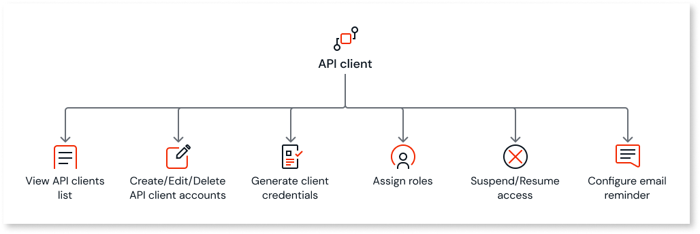

# About the API client

As an administrator, you can use the API client in the ODC portal to govern and manage who can access the ODC REST APIs. The API client allows you to create an API client account and generate client credentials that you can use in exchange for the access token.

With API client, you can:

* View a list of all API clients configured in the system

* Create individual API client accounts and generate client credentials that you can use to request an access token

* Edit and delete the client account

* Suspend and resume access to the client's account

* Duplicate an API client

* Configure to send a reminder email to the administrator 14 days before the expiration of the client secret

The API client account transitions through the following different statuses depending on the status of the client credentials.

**Available:**  The API client account enters this status once the client account is successfully created. The client credentials can now be used to request an access token.

**Needs attention:** The client account enters this status when any client secret is about to expire or when one has already expired. It can also occur if the API client has not yet been assigned any permissions.  

**Expired:** The client account enters this status when its secrets have expired. However, the access tokens associated with the client credentials will remain valid for up to 12 hours from the time the token was generated regardless of the secret's expiration. After this period, for continued API access:

1. You must generate a new client secret for the API client. The client ID remains unchanged.

1. Set the new credentials in the app.

1. Use the new client credentials to generate a new access token.

 Now you can use the new access token to access your APIs.

**Revoked:** The client account enters this status when it has been suspended and can no longer be used to request an access token. You can activate the account at any time On activating, If the secret has expired, then the status of the client account moves to **Expired**. If the secret is still valid, then the status of the client account moves to **Available**.

## Next steps

[Configuring API access using an API client](create-api-client.md)
