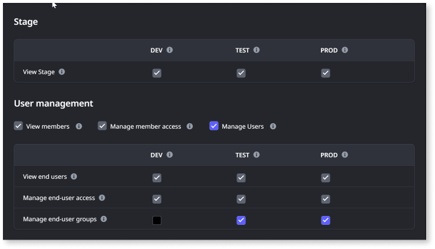
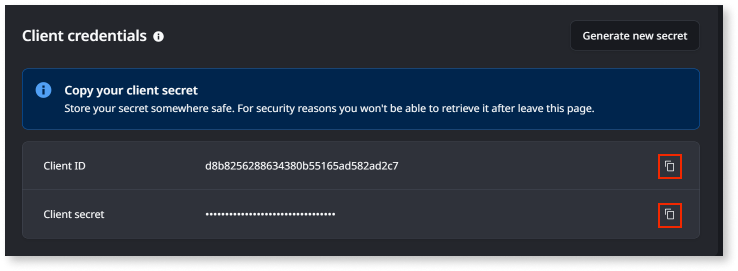

# Configure API access using an API client

Using the ODC portal, you can create a new [API client](about-api-client.md) to access the REST APIs. When a new API client is created with the necessary permissions, OAuth 2.0 client credentials comprising the client ID and client secret are generated. These credentials can then be configured in the ODC app to request an access token from the authorization server, enabling secure access to the API.

This article is intended for administrators who govern and manage who can access to ODC APIs and data.

Configuring API access using an API client involves the following steps:

1. [Create a new API client](#create-a-new-api-client)
1. [Copy client credentials](#copy-client-credentials)

## Prerequisites

Before creating a new API client, ensure you have:

* Access to the ODC portal

* **Manage API Client** permissions in the ODC portal

## Create a new API client

To create a new API client, follow these steps:

1. Log into the ODC portal.

1. Under **Manage**, click **API clients**.

A list of API Clients is displayed.

1. Click **Create API Client**.

1. Enter the following details:

   * **Client name**: Name of the API client.

   * **Description**: (Optional) A short description of the API Client.

1. Select an **Expiration date** for the API client secret. The default value is 90 days from the current date, and the maximum duration you can set for the expiration is 24 months.

    **Note:** The client secret becomes invalid after expiration at 11: 59 PM UTC. However, access tokens stay valid for up to 72 hrs from when the access token was issued, regardless of the client secret’s expiration.

1. To receive a reminder email about generating a new client secret 14 days before the expiration date, select **Send a reminder email 14 days before expiration to anyone with Manage API client permission.**

    **Note**: The reminder emails are only sent for the most recently generated client secret and to all users with **Manage Client** permission.

1. Configure permissions for the API client at each ODC stage. This allows you to use the client credentials to generate an access token with the necessary permissions to access ODC REST APIs and data.

    Select the corresponding permissions. For details about what permissions are needed for the API, refer to the [API reference](../../identity-v1.md) document.

    

    If you do not configure permissions for the API client when created, its status will be set to **Needs attention**. You must [configure the necessary permissions](#edit-permissions-of-api-client) later.

1. Click **Create API Client**.

    On successfully creating the API client, the client credentials page displays the **client ID**,  **client secret**, and the expiration date of the client secret. Now, you must [copy the the client credentials](#copy-client-credentials).

    To create a copy of an API client, go to the API Client details page, click the ellipsis menu, and select **Duplicate API client**. This opens the Create API client page with all fields pre-filled. You can modify any details as needed before creating a new API client.

    To edit the API client, on the API Client details page, click the ellipsis menu and select **Edit details**. You can only edit the name and description of the API client.

### Copy client credentials

You must copy the client secret immediately and store it securely, as you won't be able to retrieve it once you leave the client credentials page. If you don’t copy the client secret, you can regenerate it anytime. For detailed information, refer to [Generate new secret](generate-new-secret.md).

To copy the client credentials, click the copy icon beside the client credentials.

### Edit permissions of API client

Once the API client is created, you can edit the permissions of the API client.

To edit the permissions, do the following:

1. On the API Client details page, click **API Access < Edit permissions**.

1. Modify the permissions of the API client.

1. Click **Save**.

Any changes to the permissions of an API client affects access to APIs.

## Next step

[Get access token using client credentials flow](get-access-token.md)
