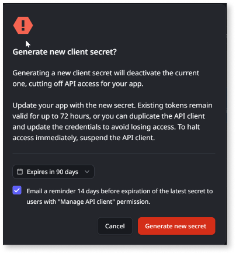

# Generate client secret

You can generate a new client secret for an API client if:

* You didn’t copy the client secret initially.

* The current secret is nearing expiration or has expired.

The client ID however, remains unchanged.

Once a new client secret is generated:

1. You must update the ODC app with the new secret.

1. Use the new credentials to generate a fresh access token.

The old access token remains valid for only up to 72 hrs after it was issued, regardless of the client secret’s expiration date.

Each API client can have only one client secret at a time.

##  Prerequisites

Before generating a new secret for a client ID, ensure the API client has already been created in the ODC portal.

## Generate secret

To generate a new secret, follow these steps:

1. Select the API client for which you need to generate a new secret.

1. Under Credentials, click **Generate new secret**.

1. Click **Generate new secret** on the pop-up.

    

Now, [copy the client secret](./create-api-client.md#copy-client-credentials) immediately and store it securely, as you won't be able to retrieve it once you leave the client credentials page.

## Next step

[Get access token using client credentials flow](get-access-token.md)
