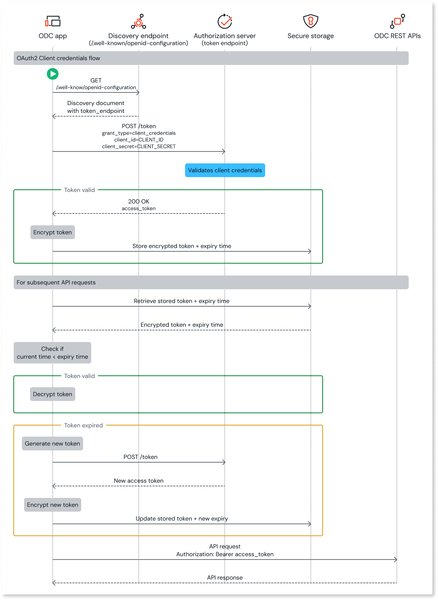

# Get access token

Once you have the client credentials, you can use the client ID and client secret to generate an access token from the authorization server. This article explains how to get the access token to access the public REST APIs. It is intended for developers who want to access the OutSystems public APIs.

Here's the diagram that represents OAuth 2.0 client credentials flow for authenticating REST APIs. It illustrates the entire lifecycle of an access token, from its initial generation and storage to its use in API calls.



## Prerequisites

Before requesting an access token, ensure you obtain the client ID and client secret. For more information, refer to [Copy client credentials](create-api-client.md#copy-client-credentials).

## Get access token

To get an access token, follow these steps:

1. Obtain the [Discovery](about-oidc-discovery-document.md) document and the information it contains by calling the `.well-known` endpoint:

    ```bash
    curl -X GET "https://ODC_PORTAL_DOMAIN/identity/.well-known/openid-configuration" -H "accept: application/json"
    ```

    Where `ODC_PORTAL_DOMAIN` is the domain of your organization.

1. Retrieve the `token_endpoint` metadata value from the Discovery document.

### Using curl

1. Send a POST request to the `token_endpoint` retrieved from the Discovery document.

    ```bash
    curl -ssl -X POST TOKEN_ENDPOINT -H "Content-Type: application/x-www-form-urlencoded" -d "grant_type=client_credentials&client_id=CLIENT_ID&client_secret=CLIENT_SECRET"
    ```

    Where:
    * `TOKEN_ENDPOINT` is the `token_endpoint` retrieved from the Discovery document.
    * `CLIENT_ID` is the client ID configured in the ODC app.
    * `CLIENT_SECRET` is the client secret configured in the ODC app.

### Using OutSystems language

OutSystems recommends implementing the logic for generating the access token using client credentials in a library to be reused across different apps.

1. [Consume a single REST API](../../../../integration-with-systems/consume_rest/consume-a-rest-api.md#add-a-single-rest-api-method--single-method-) with the following details:

    * **HTTP method**: POST
    * **URL**: `token_endpoint` retrieved from the previous step
    * **Request body**: `grant_type=client_credentials&client_id=clientID&client_secret=secret`

1. Pass the following details to the API:

    ```plaintext
    grant_type = client_credentials
    client_id = Settings.ClientId
    client_secret = Settings.ClientSecret
    ```

    In this implementation, the client ID and client secret are stored in the app settings.

    **Sample Response:**

    ```json
    {
      "access_token": "ACCESS_TOKEN",
      "expires_in": 43200,
      "token_type": "Bearer"
    }
    ```

    The authorization server validates the client credentials received in the request. If the validation is successful, the authorization server returns an access token. Otherwise, an error message is returned.

    <div class="info" markdown="1">

    The validity of the access token is 12 hours, irrespective of the expiration date of the client credentials. You must ensure that you request a new token before or after the previous token's expiration, as needed. Keep the access token safe while it is still valid.

    </div>

### Encrypt and store the access token

To prevent unauthorized access and enable token reuse, store the access token in an encrypted format in a secure storage and reuse it as long as it has not expired.

OutSystems recommends that you store the access token in an entity in an encrypted format. You can use the in-built security server action [**AES\_Encrypt**](../../../libraries/security.md#aes_encrypt) to encrypt the token using binary cipher text.

### Reuse of token

For each subsequent API call:

1. Retrieve the stored access token from the entity and its expiry time.

1. Check token validity by comparing the `expires_in` timestamp with the current time.

   * If the token has expired, mark the existing token as invalid and generate a new access token.
   * If the token has not expired and is valid, then decrypt the access token. You can use the in-built security server action [**AES\_Decrypt**](../../../libraries/security.md#aes_decrypt) to decrypt the token using binary cipher text.  
  
1. Use the decrypted token in your API request.

1. You can now [call APIs](call-api.md) from the ODC app with a valid access token.

## Next step

[Call API using the access token](call-api.md)
