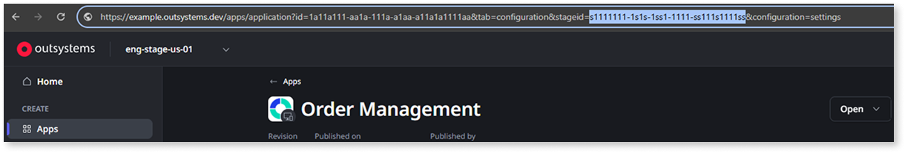

# Applying asset configurations

This article explains how to use OutSystems APIs to apply pending asset configurations to a running app without performing a full code deployment. This is useful when you need to update settings such as REST base URLs or secret variables across different stages without redeploying the app code.

In ODC, managing configurations is a two-step process:

1. [Update the configuration values for a specific environment.](#update-asset-configurations)
1. [Apply the configurations to the running app revision.](#apply-the-configurations)

## Prerequisites

Before using the APIs to apply asset configurations, ensure that you have:

* [Generated an access token](../authentication/get-access-token.md) from an API client with this [permission](../authentication/create-api-client.md#edit-permissions-of-api-client):

    * [Configuration management > Edit configurations](https://success.outsystems.com/documentation/outsystems_developer_cloud/odc_rest_apis/asset_configurations_api/#patch-/environments/-environmentKey-/applications/-applicationKey-/configurations)

* The environment key of the target stage

* The asset key of the app or library

    <div class="info" markdown="1">

    To get the environment key and asset key, go to **Portal** > **Apps**, and select an asset. Select the stage to which you want to apply configurations. In the URL, copy the environment (stage) key after `stageid=` and the asset key as shown in this example:

    

    You can also retrieve these keys programmatically using `GET /api/portfolios/v2/environments` and `GET /api/portfolios/v2/applications`.

    </div>

## Update asset configurations

To apply configurations to your asset, you must first update the configuration values.

### Retrieve available configuration keys

Before updating configurations, retrieve the available configuration keys for your app:

`GET /api/asset-configurations/v1/environments/{environmentKey}/applications/{applicationKey}/revisions/deployed/configurations`

As an optional filter, you can pass the `fields` attribute as a query parameter. You can set it with these values:

* `baseProperties`
* `settings`
* `timers`
* `integrations`
* `libraries`

### Update the values

Use the following endpoint:

`PATCH /api/asset-configurations/v1/environments/{environmentKey}/applications/{applicationKey}/configurations`

In the request body, provide the list of configurations you want to change. For example, to update a setting:

```json
{
  "settings": [
    {
      "key": "31e6ec05-e7a5-41a3-939f-82223a716df1",
      "value": "hello world"
    }
  ]
}
```

To update a setting belonging to a library:

```json
{
  "libraries": [
    {
      "key": "028f0137-f4ea-4df3-a095-5b8e3b61430c",
      "revision": 5,
      "settings": [
        {
          "key": "9ee1d9ef-5333-4532-ade9-58b71bf9fc1a",
          "value": "my new value"
        }
      ]
    }
  ]
}
```

You can join multiple configurations in a single request. They all become pending status until the `ApplyConfigs` operation is triggered.

<div class="info" markdown="1">

A similar endpoint exists for agents. Replace `applications/{applicationKey}` with `agents/{agentKey}` in the endpoint paths.

</div>

## Apply the configurations

Updating configuration values does not immediately change the behavior of a running app. To make the changes effective, you must trigger an `ApplyConfigs` operation. This approach is particularly useful when you want to update settings without performing a full code deployment. To apply the configurations, follow these steps:

1. To trigger the ApplyConfigs operation, use:

    `POST /api/deployments/v1/deployment-operations`

1. In the request body, set the operation to `ApplyConfigs` and specify the asset and environment:

    ```json
    {
      "operation": "ApplyConfigs",
      "assetKey": "a111a111-1aa1-1aa1-111a-a1111a1a1a11",
      "environmentKey": "e222e222-2ee2-2ee2-222e-e2222e2e2e22"
    }
    ```

1. Capture the `operationKey` from the response. You'll use this key to monitor the operation status.

1. To monitor the operation status, use:

    `GET /api/deployments/v1/deployment-operations/{operationKey}`

    Because applying configurations updates the container runtime, this process is asynchronous. Review the status field in the response:

    * **Running**: The platform is currently updating the asset's settings.

    * **Finished**: The configurations are now live in the target environment.

    * **FinishedWithError**: The operation failed (for example, due to an invalid configuration value). Check the `errors` array for details.

    Use these guidelines for polling:

    * Poll the API to get the deployment status using a consistent wait time (for example, every 5 seconds).

    * Define a period after which you increase the wait time to reduce unnecessary calls (for example, poll every 5 seconds during the first 30 seconds, then switch to every 30 seconds).

<div class="info" markdown="1">

If you are performing a full deployment using the `Deploy` operation, the platform automatically applies any pending configurations. You only need to call `ApplyConfigs` explicitly if you are changing settings for an app that is already deployed and running.

</div>

## Related resources

Refer to the following resources for more information about asset configurations and deployments:

* [Asset Configurations API reference](../../asset-config-v1.md) — Details about configuration types and endpoints.

* [Deployments API reference](https://www.outsystems.com/tk/redirect?g=acf7cd06-3fe1-4bd3-85e8-06cd11aa0a7d) — Complete deployments API documentation.

* [Reviewing asset configurations](asset-configurations.md) — Check available configurations before updating them.

* [Deploying your asset to the target stage](deploy-asset.md) — Deploy code changes with automatic configuration updates.
