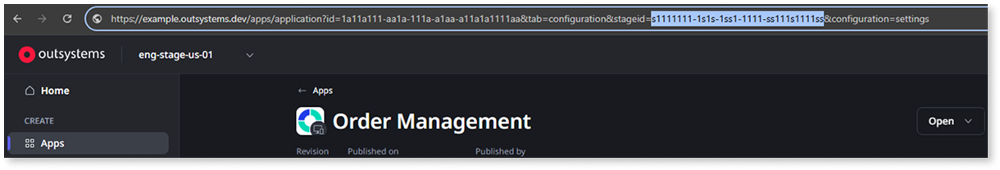

# Deploying your asset to the target stage

This article explains how to use OutSystems APIs to programmatically deploy an asset to a target stage and monitor the deployment status to confirm the process is complete. This is useful for automating deployments while reducing manual intervention.

## Prerequisites

Before using the APIs to deploy your asset to a target stage, ensure that you have:

* [Generated an access token](../authentication/get-access-token.md) with the necessary permissions.  
* The [key of the build](select-revision-build.md) to be deployed.  
* The environment key of the target stage

    

    
    To get the environment key, go to **Portal** > **Apps**, and select an asset. Select the stage to which you want to deploy. In the URL, copy the environment (stage) key after “stageid=”, as shown in this example:

        

    You can also retrieve the environment key programmatically, using `GET /api/portfolios/v1/environments`.
    
    

## Deploy your asset to the target stage

To deploy your asset to a target stage in your CI/CD pipeline, follow these steps:

1. To trigger the execution of the deployment, use:  
     
    `POST /api/deployments/v1/deployment-operations` 
     
    In the body, pass the operation you want to trigger. In this case, the operation is `Deploy`. Pass also the environment key, asset key, build key, and revision number. Example:  
        
        {
        "operation": "Deploy",  
        "assetKey": "a111a111-1aa1-1aa1-111a-a1111a1a1a11",  
        "buildKey": "b111b111-1bb1-1bb1-111b-b1111b1b1b11",  
        "revision": 1,  
        "environmentKey": "1ee11e11-1111-1111-e1ee-1e111e11eee1"  
        }
        
    If this API call is successful, the response should show the status as "Running". If this is not the case, check the [Deployments API reference](https://www.outsystems.com/tk/redirect?g=acf7cd06-3fe1-4bd3-85e8-06cd11aa0a7d) for more information on other statuses.
     
    The response also contains the operation key, necessary for the next step.  
     
1. To get the list of deployment operations and check if your deployment finished successfully, use:  
     
    `GET /deployments/v1/deployment-operations/{operationKey}` 
     
    A successful deployment shows the status as “Finished”. For more information on other statuses, refer to the [Deployments API reference](https://www.outsystems.com/tk/redirect?g=acf7cd06-3fe1-4bd3-85e8-06cd11aa0a7d).  
     
    These are the recommended guidelines for monitoring the deployment status until it changes to "Finished" or "FinishedWithError":  

    * Poll the API to get the deployment status using a consistent wait time (for example, every 5 seconds).  
    * Define a period after which you increase the wait time to reduce unnecessary calls (for example, poll every 5 seconds during the first 30 seconds, then switch to every 30 seconds).  