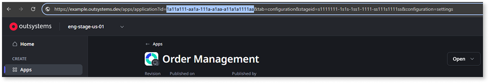

# Selecting the revision and build of your asset

This article explains how to use OutSystems APIs to programmatically retrieve the correct revision and build of your asset and prepare it for deployment. This is useful for ensuring consistent, traceable builds across your delivery pipeline.

A **build** is the process of compiling your code and creating a deployable package. When you create or modify an asset in ODC Studio, OutSystems generates a new revision. To deploy this revision to an environment, you must first build it (either by clicking 1-Click Publish in ODC Studio, or programmatically by using the [Build Operations API](../../build-v1.md)). Each successful build generates a build key, which uniquely identifies the build for deployment and traceability.

## Prerequisites

Before using the APIs to get the revision and build of your asset, ensure that you have:

* [Generated an access token](../authentication/get-access-token.md) from an API client with this [permission](../authentication/create-api-client.md#edit-permissions-of-api-client):
    * [Asset management > Open](https://success.outsystems.com/documentation/outsystems_developer_cloud/odc_rest_apis/build_operations_api/#get-/build-operations)
* The key of the asset to be deployed

    

    To get the asset key, go to **Portal** > **Apps**, and select the asset you want to deploy. In the URL, copy the asset key after "application?id=", as shown in this example:

    

    You can also retrieve the asset key programmatically, using `GET /api/asset-repository/v1/assets` with the necessary filters.

    

## Select the revision and build of the asset to be deployed {#select}

To get the revision and build of the asset in your CI/CD pipeline, follow these steps:

1. To get the list of all revisions for an asset, use:  

    `GET /api/asset-repository/v1/assets/{assetKey}/revisions`

    Pass the asset key.  

    From the list of revisions in the response, select the asset revision you want to deploy. The revision number is used in the next step.

1. To get the build key associated with the selected revision, use:  

    `GET /api/builds/v1/build-operations?assetKey={assetKey}&assetRevision={assetRevision}&byBuildType=Release`

    You can only deploy builds of type **Release**, so in this scenario, you filter the results to get only builds of that type.

    The response contains the build key, which you can then use to [deploy the asset](deploy-asset.md).

## Next steps

* [Retrieving generated code for SAST analysis](generated-code-sast.md)
* [Setting the release version and release notes](set-version-release-notes.md)
* [Reviewing asset configurations](asset-configurations.md)
* [Deploying your asset to the target stage](deploy-asset.md)
