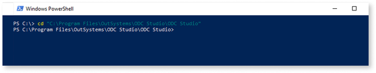
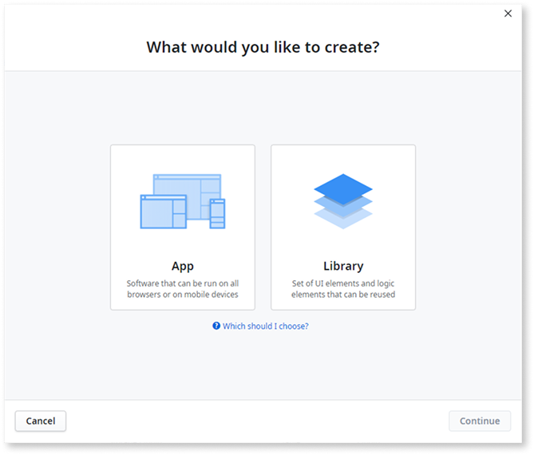

# ODC Studio command line

Only applies to Windows-only ODC Studio.

OutSystems visual development environment, ODC Studio, makes available a set of commands that can be used in the command line interface (CLI) of your choice such as Windows command prompt or Powershell.

These commands can be used to execute common development tasks such as opening or merging apps, and creating new apps.

## Before using the commands

To use the commands, on the CLI first navigate to your ODC Studio installation directory:

And precede any command by `.\odcstudio.exe` and a space, for example: `.\odcstudio.exe -merge`.

The syntax is composed of a **command** and it’s **arguments**. The command defines the functionality such as merging two apps. The arguments represent inputs necessary to each switch such as the version of the apps to be merged.

## Summary of available commands

Command| Description
---|--- 
[-create](#create) | Opens the ODC Studio dialog to create a new application.
[-diff](#diff) | Opens the [**Compare and Merge**](../../building-apps/merge/merge-example.md) window using the 2 apps passed as parameters.
[-merge](#merge) | Attempts to merge two locally saved apps. The  [**Compare and Merge**](../../building-apps/merge/merge-example.md) window opens and the elements that can be merged will be selected.
[-openModuleFromUrl](#open-module-from-url) | Opens an app stored in a remote location accessible via an url.
[-refresh](#refresh) | Refreshes the references of a locally saved app against a given stage and generates a log file with any errors of the process.
[-recover](#recover) | Recovers app meta-information from corrupted .oml files. 

## Commands

### -create { #create }

Opens the ODC Studio dialog to create a new application.

If the login information isn't provided the login screen shows up before proceeding to the dialog to create an app.

Syntax
: `-create NewApplication [-url <hostName>] [-userName <user>] [-password <password>]`
 Example: `odcstudio.exe -create NewApplication -url dev.example.com -userName DevDave --password mypassword`

Argument | Type | Description | Example
---|---|---|---
`-url <hostName>`| Optional | Address of the stage to create the app in. | dev.example.com
`-userName <user>` | Optional | The username used to connect to ODC Studio | DevDave
`-password <password>` | Optional | The password that corresponds to the provided username | mypassword

### -diff { #diff }

Opens two locally saved apps at the [**Compare and Merge**](../../building-apps/merge/merge-example.md) window. This command won't attempt to merge the apps and you'll have to select each element to merge . To attempt to merge the apps automatically, use [-merge](#merge) instead.

Syntax
:   `-diff "<localApp.oml>" "<foreignApp.oml>"`
:   Example: `odcstudio.exe -diff "C:\Program Files\OutSystems\ComponentsCore.oml" "C:\Program Files\OutSystems\ComponentsCore2.oml"`

Argument | Type | Description | Example
---|---|---|---
`localApp.oml` | Mandatory | Source app to use in the comparison. This is the app that appears on the left side of the **Compare and Merge** dialog, labeled as **Your version**. | C:\Program Files\OutSystems\ComponentsCore.oml
`foreignApp.oml` | Mandatory | Target app to use in the comparison. This is the app that appears on the right side of the **Compare and Merge** dialog, labeled as **The other version**. | C:\Program Files\OutSystems\ComponentsCore2.oml

### -merge { #merge }

Attempts to merge two locally saved apps. The  [**Compare and Merge**](https://success.outsystems.com/Documentation/11/Developing_an_Application/Merge_the_Work/Compare_and_merge_example_with_conflicts) window will open and the elements that can be merged will be selected.

Syntax
:   `-merge "<localApp.oml>" "<foreignApp.oml>"`
:   Example: `odcstudio.exe -merge "C:\Program Files\OutSystems\ComponentsCore.oml" "C:\Program Files\OutSystems\ComponentsCore2.oml"`

Argument | Type | Description | Example
---|---|---|---
`localApp.oml` | Mandatory | Source app to use in the comparison. This is the app that appears on the left side of the **Compare and Merge** dialog, labeled as **Your version**. | C:\Program Files\OutSystems\ComponentsCore.oml
`foreignApp.oml` | Mandatory | Target app to use in the comparison. This is the app that appears on the right side of the **Compare and Merge** dialog, labeled as **The other version**. | C:\Program Files\OutSystems\ComponentsCore2.oml 

### -openModuleFromUrl { #open-module-from-url }

Opens a app stored in a remote location accessible via a url. ODC Studio launches, downloads the app from the url provided, and opens it locally.

Syntax
:   `-openModuleFromUrl (<url.oml>)`
:   Example: `odcstudio.exe -openModuleFromUrl (https://www.example.com/MyApp.oml)`

Argument | Type | Description | Example
---|---|---|---
`url.oml` | Mandatory | The path to the remote location of the app. | https://www.example.com/MyApp.oml

### -refresh { #refresh }

Refreshes the references of a locally saved app against a given stage and generates a log file with any errors of the process.

Syntax
:   `-refresh "<myApp.oml>" "<verify.xml>" <hostName> <userName> <password>`
:   Example: `odcstudio.exe -refresh "C:\Program Files\MyApp.oml" "C:\Program Files\verify.xml" dev.example.com admin AdminPassword`

Argument | Type | Description | Example
---|---|---|---
`myApp.oml` | Mandatory | The path to a locally saved app. | C:\Program Files\MyApp.oml
`verify.xml` | Mandatory | The path in which to save the log file "verify.xml". | C:\Program Files\verify.xml
`hostName` | Mandatory | The hostname of the stage to compare the references of the local app. | dev.example.com
`userName` | Mandatory | The username used to connect to the stage. | admin
`password` | Mandatory | The password of the given userName. | AdminPassword

### -recover { #recover }

Recovers app meta-information from corrupted .oml files. This command can be used as a mitigation measure to address strange behaviors that are only occurring on specific apps, for example:

* ODC Studio throws errors or crashes when performing operations such as refreshing references, opening a specific screen, or opening an action. 

* Issues publishing a single app.

Syntax
:   `odcstudio.exe -recover "<myApp.oml>"`
:   Example: `odcstudio.exe -recover "C:\Program Files\OutSystems\ComponentsCore.oml"`

Argument | Type | Description | Example
---|---|---|---
`myApp.oml` | Mandatory | The path to a locally saved app. | "C:\Program Files\OutSystems\ComponentsCore.oml"
