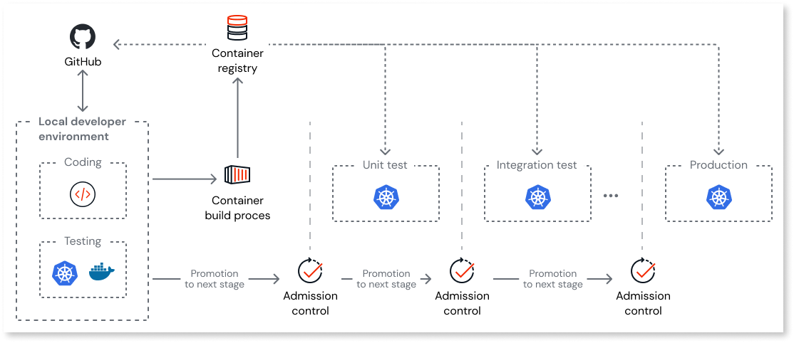

# Security of OutSystems Developer Cloud

OutSystems Developer Cloud (ODC) is secure-by-design.

Secure-by-design thinking covers the entire product: from the Software Development Life Cycle to encryption at-rest, and from identity management to network architecture.

The Open Web Application Security Project (OWASP) defines the principles underpinning secure-by-design in their [Developer Guide](https://github.com/OWASP/DevGuide/blob/master/02-Design/01-Principles%20of%20Security%20Engineering.md). These include, in brief:

* **Defense in depth**: Use multiple layers of security safeguards to prevent a full breach.
* **Least privilege**: Only grant the minimum access rights necessary to complete an operation for the shortest possible time.
* **Separation of duties**: Completion of a task should require two or more conditions, preventing one person or process from completing it alone.
* **Complete mediation**: Check for authorization upon every request for an object to prevent authority circumvention.

## Secure code and processes

OutSystems engineers plan and deploy the [infrastructure of the Platform and independent Runtime of ODC](architecture/intro.md) using Infrastructure-as-Code (IaC). This means the infrastructure can be automatically tested and versioned rather than relying on error-prone manual test processes. A policy enforcement tool ensures consistency and security by checking for:

* Potential misconfigurations that may result in a weak security posture.
* Policy issues in the infrastructure that may cause the environment to be out of compliance with OutSystems or regulatory requirements.

The OutSystems Security Office routinely reviews policies to ensure they remain in-line with security industry best-practice.

Infrastructure-as-Code, as all ODC product code, follows the ODC Software Development Life Cycle (SDLC): guidelines that define the planning, creating, testing, and releasing of the product.

OutSystems provides all its engineers training in cloud security and secure development. The specific guidelines OutSystems use are the [OWASP Developer Guide](https://owasp.org/www-project-developer-guide/), [SANS CWE Top 25](https://www.sans.org/top25-software-errors/), and [CERT Secure Coding Standards](https://wiki.sei.cmu.edu/confluence/display/seccode/SEI+CERT+Coding+Standards). Additionally, OutSystems applies the [CIS benchmarks](https://www.cisecurity.org/cis-benchmarks) for all systems.

Specialist engineers from the Application Security Team routinely review architectural blueprints and undertake code inspections. Static code analysis tooling is also used to detect and resolve bugs and vulnerabilities.

## Network layer

The network layer of ODC uses encryption, a WAF (Web Application Firewall), intrusion detection, and stage isolation for robust security and data protection.

### Encryption in transit

All incoming requests to the Platform services and Runtime terminate at an HTTPS endpoint and are end-to-end encrypted. ODC supports TLS 1.3.

### Web Application Firewall

A Web Application Firewall (WAF) runs on the Content Delivery Network (CDN), protecting the Platform and the Runtime against common web exploits and bots. It has policies in place to protect against, for example:

* Denial-of-Service (DoS) and Distributed-Denial-of-Service (DDoS) attacks.
* Brute-force attacks.
* SQL injection attacks.
* Known malicious accesses or patterns.

The OutSystems Security Office periodically reviews the WAF rules. The firewall automatically enforces them, and the system treats any unauthorized manipulation as a potential security incident.

### Event-based architecture

The ODC Platform uses an event-driven architecture, enabling real-time event processing and clear service responsibilities.

There are several benefits, including:

* **Loose coupling**: The Platform services aren't directly dependent on each other, reducing complexity and making them easier to maintain and update.
* **Real-time processing**: Near-instantaneous processing of events as they occur, allowing for faster response time of the Platform services.
* **Resilience**: Asynchronous event processing helps to ensure that the Platform remains functional even if some services fail or become unresponsive.

#### Intrusion detection

The event-driven architecture facilitates the detection of anomalous patterns and activities that might indicate potential security threats. As events are processed and analyzed, the system can identify deviations from normal behavior and trigger alerts for further investigation.

ODC has advanced intrusion detection, safeguarding your apps and data against known, unknown, and undisclosed threats.

OutSystems staff actively monitor all systems and the appropriate teams follow up alerts. See [Monitoring and support](#monitoring-and-support) for more detail.

### Runtime independence

The independence of the Platform and Runtime reduces the attack surface of the deployed apps as they're isolated from other ODC components.

The Platform services can't connect directly to any deployed app or Runtime database. They conduct all communication (for example, to deploy an app or change an app setting) through secure messaging using NATS (Neural Autonomic Transport System).

NATS is a highly reliable messaging system that's designed to deliver messages quickly and efficiently, even when there are network disruptions or failures. This design ensures reliable handling of internal requests between the Platform and Runtime stages, minimizing downtime and potential system disruptions.

Each customer's ODC organization has a standard Runtime setup of three isolated and independent stages: Development, Test, and Production.

#### Isolation of stages

A network namespace isolates each stage within each organization's Runtime. It follows that internal traffic within each stage is ring-fenced.

Each stage has its own relational database, and network policy defines the connection between the namespace and the database.

This means no app or user from one organization can connect to the database of another organization. The databases aren't directly exposed to the internet, reducing attack vectors. The below diagram illustrates this.

### Identity for authentication and authorization

You can use an external, self-managed OpenID Connect (OIDC) IdP as the authentication provider for the Platform services and your apps. There are several benefits of this approach. You can use a:

* Centralized authentication method (ODC and non-ODC) across your organization.
* Custom password policy for the Platform services and your apps that aligns with your organization's security policy.
* Multi-factor authentication (MFA) process for the Platform services and your apps.

For more information see [Architecture of authentication and authorization mechanism](architecture/identity.md).

### Secure gateways

Secure Gateways is an ODC feature that lets you connect your apps to private data and private services ("endpoints") that aren't accessible by the internet.

For more information see [Configure a secure gateway to your private network](configuration-management/secure-gateway.md).

## Containers

Each Platform service is built as a .NET core, Linux-based container image. All the functionality a service provides is available as a microservice through an API, and each API is versioned to allow for seamless evergreen upgrades. When a developer publishes an app, it's built using the latest version of each Platform service, each of which incorporates the latest security updates.

Each app is also built as a .NET Core, Linux-based container image. OutSystems security engineers work to continuously harden the container's base image to minimize the attack surface.

When a developer publishes an app, ODC stores the image in a container registry. The container image is then reused when deployed from Development to the other stages. This reduces deployment time and eliminates any doubt that there are subtle differences in deployments between stages.

### Software supply chain integrity

The secure supply chain outlines the steps a code change in a Platform service must follow before deployment to production. This process ensures quality, security, and auditability in the product.

At each stage of the deployment pipeline admission control verifies:

* Successful completion of the steps defined for the previous stage.
* The container image admitted to the new stage remains unmodified from when it first entered the deployment pipeline.

The below diagram illustrates this.

The process ensures the container image released to production is identical to the one built. This helps minimize the risk of errors or security vulnerabilities.

#### Vulnerability patching

A static code analysis tool scans Platform service code for vulnerabilities and weak security practices. The tool does this before the system builds the code as a container image and covers both first and third-party code.

A key acceptance criterion for production code is the elimination of all critical, high, and medium vulnerabilities. When a fix isn't immediately available, developers must find an alternative solution (high, critical) or secure code using best practice (medium).

Daily vulnerability scanning of the container registry covers the current version of the Platform service container images and all the deployed apps across all customer Runtime stages. When a vulnerability is detected, OutSystems security engineers fix it and release a new version of the affected Platform service(s) or app base container.

##### Malware scanning

Scanning also includes malware detection capabilities with policies managed by the OutSystems Security Office.

## Data

For information about each database and data store used in the Platform and Runtime, see [Cloud-native architecture of OutSystems Developer Cloud](architecture/intro.md#databases-and-data-stores).

All customer data:

* Is encrypted at rest with a per-customer encryption key managed by OutSystems.
* Resides in the region specified during the creation of the customer's ODC organization.

A network namespace isolates each stage [within each organization's Runtime.](#isolation-of-stages).

### File Integrity Monitoring

File Integrity Monitoring performs automated scans and alerts the [Computer Security Incident Response Team](#computer-security-incident-response-team-csirt) to unauthorized activity or file changes.

### High-availability in-region

Each Runtime stage has an isolated Amazon Aurora Serverless database. The database for the Production stage is high-availability by default.

For more information see [Cloud-native architecture of OutSystems Developer Cloud](architecture/intro.md#runtime-data).

### Backup policy

Each database and data store used in the Platform and Runtime is continuously and incrementally backed up. This enables you to restore data at any point within a 30-day backup retention period.

### Encryption at-rest

OutSystems uses a Key Management Service (KMS) to store and manage the keys used to secure customer data.

ODC encrypts data at rest, including all backup instances, using the industry standard AES-256 algorithm.

## User management

ODC provides a permission model that enables you to create roles following the least privilege principle. You can assign roles to users according to their job functions.

For more information see [User management](user-management/intro.md).

## Monitoring and support

OutSystems maintains formal policies and procedures for managing security incidents. This ensures appropriate and prompt handling of any incident. The Security Incident Management Procedures outline the response to vulnerabilities in ODC infrastructure, security breaches, and incidents. The procedure explains the identification, reporting, and action taken for incidents.

### Computer Security Incident Response Team

OutSystems proactively monitors ODC infrastructure, events, and availability 24 hours a day, seven days a week. Any unexpected alert, including privacy breaches, either automatically detected or resulting from a human log review, triggers a Security Incident Response. 

Customers can report suspected privacy or security incidents through the Support Portal at `https://<customername>.outsystems.dev/support/`.

### Log Retention

Developers can view logs and traces up to four weeks old within ODC Portal. They can retrieve logs and traces between four and seven weeks old by opening a support ticket. The system deletes logs and traces after seven weeks.

For more information see [Monitor and troubleshoot apps](monitor-apps.md).

## Additional links

### Vulnerability policy

OutSystems created a public vulnerability policy to provide customers with guidance and information in the event of a vulnerability reported in an OutSystems product.

For more information see [OutSystems public vulnerability policy](https://success.outsystems.com/support/security/vulnerabilities/).
