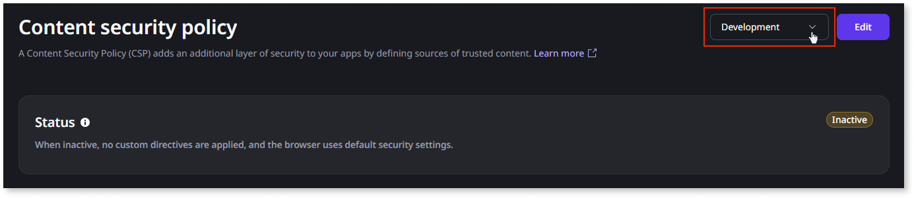
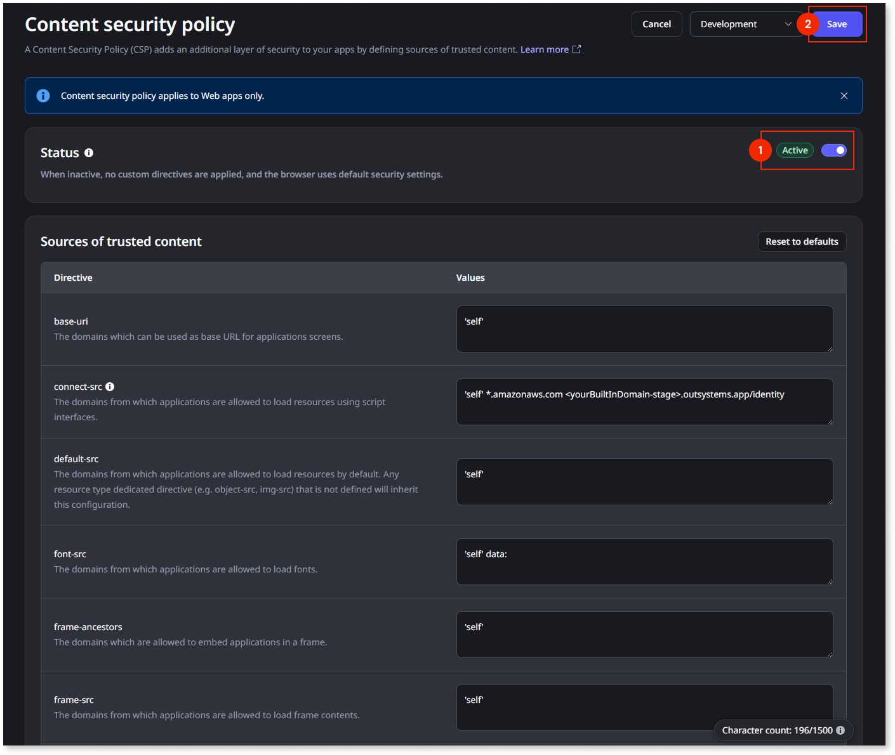
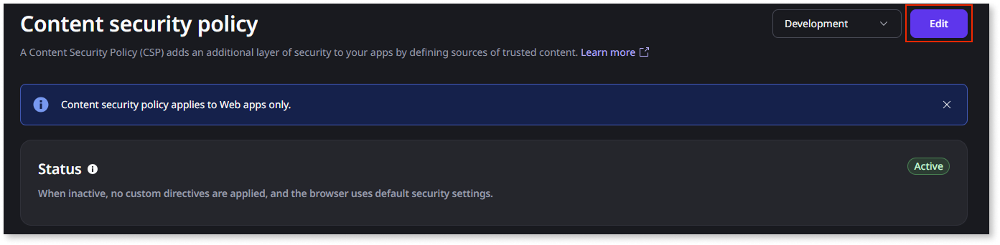

# Content security policy

 Applies to Web Apps and Mobile Apps distributed as Progressive Web Apps only.

A content security policy (CSP) is a web security standard that helps protect your apps from various security threats, such as malicious code execution or the loading of untrusted content. By controlling which content sources browsers can load, CSP shields your app from malicious scripts, unapproved resources, and other security threats, ensuring its integrity and safety.

To implement a CSP, you define a policy in HTTP headers, set explicit content rules that browsers enforce, and reduce points of vulnerability. For example, the `script-src` directive controls where JavaScript can load from, and browsers block any content that doesn't comply with the policy.

The benefits of a CSP include:

* **Prevents XSS attacks**: Stops unauthorized scripts from running and executing malicious actions.

* **Blocks malicious resources**: Restricts the loading of unapproved images, plugins, or frames, reducing exposure to harmful content.

* **Strengthens app security**: Reduces vulnerabilities and protects your app's integrity by enforcing stricter content loading policies.

## Activate a CSP

The ODC Portal allows you to activate CSP per stage. By default, CSP directives are not activated, meaning that no security settings are configured. For example, no content or iframes will be blocked by default.

Once you activate your CSP, you can configure it as an **allow list**, permitting only the specified content in your apps while blocking all other sources by default.

### Prerequisites

You must have **CSP Management** permissions.  

### Activating a CSP {#activating-a-csp}

To activate a CSP for a stage, follow these steps:

1. From the ODC Portal, navigate to **Configure** > **Content security policy**.

1. Select the stage you want to apply the CSP to.

    

1. Click **Edit**.

1. Toggle the **Status** to **Active** and click **Save**.

    The default directives are applied to all apps in the selected stage.

    

    

    The total character limit for directive values per stage is 1500.

    

## Configure a CSP

The ODC Portal allows you to configure a CSP's directive values. Customizing a CSP's default values is important because the default configuration may not align with your app's specific security needs, functionality, and architecture. For example, you can enable trusted third-party services such as YouTube or allow iframes for embedded content.

### Prerequisites

* You must have **CSP Management** permissions.

* You must have a [CSP activated.](#activating-a-csp)

### Configuring a CSP {#configuring-a-csp}

To configure the CSP, follow these steps:

1. From the ODC Portal, navigate to **Configure** > **Content security policy**

1. Click **Edit**.

    

1. Edit the directive values.

    

1. Click **Save**.

    The configured directive values are applied to all the apps in that stage. 

    

    Some image file content configurations may take up to 24 hours to be applied or removed.

    

    
You can reset the CSP's directive values to their default values at any time by clicking **Reset to defaults** and then **Save**. 

## Default directives

The table below describes the list of default directives for OutSystem's content security policy. The [Default values](#default-values) column indicates the values that OutSystems automatically applies when you activate a content security policy. These defaults are set to be as restrictive as possible, maximizing security configuration while also enabling full app runtime functionality. You can customize these default values to suit your needs. For more details, refer to [Configure a CSP](#configuring-a-csp). Some default values cannot be removed; for more information, refer to the [required values](#required-values) section.

|   Directive |              Description             | Default values |
|-------------| ------------------------------------ | -------------- |
|base-uri     | The domains that can be used as base URLs for app screens. The source expression ``'self'`` refers to the origin from which the protected document is being served, including the same URL scheme and port number. You must include the single quotes. Example: ``base-uri 'self';``  |``'self'``|
|connect-src | The domains from which apps are allowed to load resources using script interfaces.  The ``*.amazonaws.com`` value is required when using ODC's built-in identity provider.   The ``<yourBuiltInDomain-stage>.outsystems.app/identity`` value is required when using ODC's built-in identity provider and a custom domain.| ``'self'``   ``*.amazonaws.com``   ``<yourBuiltInDomain-stage>.outsystems.app/identity``|
|default-src | The domains from which apps are allowed to load resources by default. Any resource type dedicated directive (such as ``object-src`` or ``img-src``) that's not defined will inherit this configuration.|``'self'``|
|font-src|The domains from which apps are allowed to load fonts.|``'self'`` ``data:``|
|frame-ancestors|The domains that are allowed to embed apps in a frame.|``'self'``|
|frame-src|The domains that are allowed to embed apps in a frame.|``'self'``|
|img-src|The domains from which apps are allowed to load images.|``'self'``  ``data:``   ``blob:``|
|media-src|The domains from which apps are allowed to load media files.|``'self'``|
|object-src|The domains from which apps are allowed to load objects (for ``<object>``, ``<embed>`` and ``<applet>`` elements).|``'self'``|
|script-src|The domains from which apps are allowed to load scripts.|``'self'``  ``'unsafe-inline' `` ``'unsafe-eval'``|
|style-src|The domains from which apps are allowed to load styles.|``'self'``  ``'unsafe-inline'``|

## Default values {#default-values}

OutSystems recommends default values to ensure the platform works as expected. If these values are removed, OutSystems recommends you test your apps to ensure they work as expected.

* ``'self'``: Allows content to be loaded only from the same origin as the app. This helps prevent unauthorized content from being loaded.

* ``data``: Allows resources to be loaded, such as images and fonts, using data: URLs. This is often required for inline assets.

* ``blob``: Enables support for binary large object (blob) URLs, which are often used for dynamically generated media content and file downloads.

* ``*.amazonaws.com``: Allows access to AWS-hosted services, including the managed identity service necessary for authentication.

* ``<yourBuiltInDomain-stage>.outsystems.app/identity``: Ensures compatibility with the built-in identity service when using a custom domain. Only the built-in domain is preconfigured and does not require additional setup. All other domains, including custom domains or the built-in domain, must be explicitly configured.

## Required values {#required-values}

The **Required values** are the values that ODC automatically applies to the directive for the applications to work correctly. These values can't be removed.

* ``unsafe-inline``: The unsafe-inline directive allows the use of inline resources such as inline ``<script> ``and ``<style>`` elements, ``javascript: URLs``, and inline event handlers that are currently used by the platform.

* ``unsafe-eval``: The unsafe-eval directive allows the web pages to evaluate strings as code. This directive consists of the eval function, the function constructor, and some usages of the setTimeout and setInterval functions that are currently used by the platform.

## Operational and security considerations

Operational and security considerations are crucial when implementing a CSP. A poorly configured CSP can break functionality, while a weak one provides inadequate protection. Therefore, careful planning and testing are essential. When configuring a CSP, take the following risks of misconfiguration into account:

* **Missing policies**: Ensure you configure policies that allow all sources used in your apps. Otherwise, users may have issues such as videos not showing or CSS not being applied.

* **Too permissive policies**: Be cautious when allowing resources to be loaded from everywhere (by using ``\*`` in the domain list). Hackers may use links, scripts, or other resources in your apps to redirect users to malicious pages.
