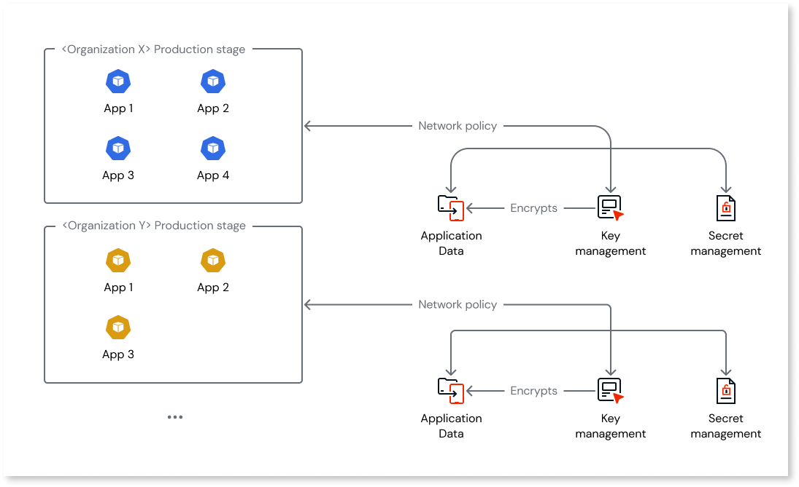
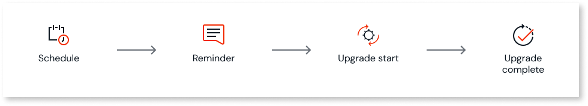

# Security of OutSystems Developer Cloud

OutSystems Developer Cloud (ODC) is secure-by-design.

Secure-by-design thinking covers the entire product: from the Software Development Life Cycle to encryption at-rest, and from identity management to network architecture.

The Open Web Application Security Project (OWASP) defines the principles underpinning secure-by-design in their [Developer Guide](https://github.com/OWASP/DevGuide/blob/master/02-Design/01-Principles%20of%20Security%20Engineering.md). These include, in brief:

* **Defense in depth**: Use multiple layers of security safeguards to prevent a full breach.
* **Least privilege**: Only grant the minimum access rights necessary to complete an operation for the shortest possible time.
* **Separation of duties**: Completion of a task should require two or more conditions, preventing one person or process from completing it alone.
* **Complete mediation**: Check for authorization upon every request for an object to prevent authority circumvention.

## Secure code and processes

OutSystems engineers plan and deploy the [infrastructure of the Platform and independent Runtime of ODC](../manage-platform-app-lifecycle/platform-architecture/identity.md) using Infrastructure-as-Code (IaC). This means the infrastructure can be automatically tested and versioned rather than relying on error-prone manual test processes. A policy enforcement tool ensures consistency and security by checking for:

* Potential misconfigurations that may result in a weak security posture.
* Policy issues in the infrastructure that may cause the environment to be out of compliance with OutSystems or regulatory requirements.

The OutSystems Security Office routinely reviews policies to ensure they remain in-line with security industry best-practice.

Infrastructure-as-Code, as all ODC product code, follows the ODC Software Development Life Cycle (SDLC): guidelines that define the planning, creating, testing, and releasing of the product.

OutSystems provides all its engineers training in cloud security and secure development. The specific guidelines OutSystems use are the [OWASP Developer Guide](https://owasp.org/www-project-developer-guide/), [SANS CWE Top 25](https://www.sans.org/top25-software-errors/), and [CERT Secure Coding Standards](https://wiki.sei.cmu.edu/confluence/display/seccode/SEI+CERT+Coding+Standards). Additionally, OutSystems applies the [CIS benchmarks](https://www.cisecurity.org/cis-benchmarks) for all systems.

Specialist engineers from the Application Security Team routinely review architectural blueprints and undertake code inspections. Static code analysis tooling is also used to detect and resolve bugs and vulnerabilities.

## Network layer

The network layer of ODC uses encryption, a WAF (Web Application Firewall), intrusion detection, and stage isolation for robust security and data protection.

### Encryption in transit

All incoming requests to the [Platform services and Runtime](../manage-platform-app-lifecycle/platform-architecture/identity.md#Platform) terminate at an HTTPS endpoint via [Strict-Transport-Security](https://developer.mozilla.org/en-US/docs/Web/HTTP/Reference/Headers/Strict-Transport-Security) and are end-to-end encrypted. ODC supports TLS 1.3.

### Web Application Firewall

A Web Application Firewall (WAF) runs on the Content Delivery Network (CDN), protecting the Platform and the Runtime against common web exploits and bots. It has policies in place to protect against, for example:

* Denial-of-Service (DoS) and Distributed-Denial-of-Service (DDoS) attacks.
* Brute-force attacks.
* SQL injection attacks.
* Known malicious accesses or patterns.

The OutSystems Security Office periodically reviews the WAF rules. The firewall automatically enforces them, and the system treats any unauthorized manipulation as a potential security incident.

### Event-based architecture

The ODC Platform uses an event-driven architecture, enabling real-time event processing and clear service responsibilities.

There are several benefits, including:

* **Loose coupling**: The Platform services aren't directly dependent on each other, reducing complexity and making them easier to maintain and update.
* **Real-time processing**: Near-instantaneous processing of events as they occur, allowing for faster response time of the Platform services.
* **Resilience**: Asynchronous event processing helps to ensure that the Platform remains functional even if some services fail or become unresponsive.

#### Intrusion detection

The event-driven architecture facilitates the detection of anomalous patterns and activities that might indicate potential security threats. As events are processed and analyzed, the system can identify deviations from normal behavior and trigger alerts for further investigation.

For example, when you click 1CP, several services work behind the scenes to transform the app you're developing in the ODC Studio into a container deployed in Kubernetes. Many of these interactions between services use events. Decoupling services in this way improves resilience and helps locate potential security threats.

ODC has advanced intrusion detection, safeguarding your apps and data against known, unknown, and undisclosed threats.

OutSystems staff actively monitor all systems and the appropriate teams follow up alerts. See [Monitoring and support](#monitoring-and-support) for more detail.

### Runtime independence

The independence of the Platform and Runtime reduces the attack surface of the deployed apps as they're isolated from other ODC components.

The Platform services can't connect directly to any deployed app or Runtime database. They conduct all communication (for example, to deploy an app or change an app setting) through secure messaging.

Each customer's ODC organization has a standard Runtime setup of isolated and independent stages such as Development and Production.

#### Isolation of stages

A network namespace isolates each stage within each organization's Runtime. It follows that internal traffic within each stage is ring-fenced.

Each stage has its own relational database, and network policy defines the connection between the namespace and the database.

This means no app or user from one organization can connect to the database of another organization. The databases aren't directly exposed to the internet, reducing attack vectors. The below diagram illustrates this.

### Identity for authentication and authorization

You can use an external, self-managed OpenID Connect (OIDC) IdP as the authentication provider for the Platform services and your apps. There are several benefits of this approach. You can use a:

* Centralized authentication method (ODC and non-ODC) across your organization.
* Custom password policy for the Platform services and your apps that aligns with your organization's security policy.
* Multi-factor authentication (MFA) process for the Platform services and your apps.

For more information see [Architecture of authentication and authorization mechanism](../manage-platform-app-lifecycle/platform-architecture/identity.md).

### Private gateways

Private Gateways is an ODC feature that lets you connect your apps to private data and private services ("endpoints") that aren't accessible by the internet.

For more information see [Configure a private gateway to your network](../manage-platform-app-lifecycle/private-gateway.md).

## Containers

Each Platform service is built as a .NET, Linux-based container image. All the functionality a service provides is available as a microservice through an API, and each API is versioned to allow for seamless evergreen upgrades. When a developer publishes an app, it's built using the latest version of each Platform service, each of which incorporates the latest security updates.

Each app is also built as a .NET, Linux-based container image. OutSystems security engineers work to continuously harden the container's base image to minimize the attack surface. The base container image contains the necessary frameworks, libraries, and dependencies required to run ODC apps.

When a developer publishes an app, ODC stores the image in the container registry, a centralized repository for storing container images. The container image is then reused when deployed from Development to the other stages. This reduces deployment time and eliminates any doubt that there are subtle differences in deployments between stages.

### Software supply chain integrity

The secure supply chain outlines the steps a code change in a Platform service must follow before deployment to production. This process ensures quality, security, and auditability in the product.

At each stage of the deployment pipeline admission control verifies:

* Successful completion of the steps defined for the previous stage.
* The container image admitted to the new stage remains unmodified from when it first entered the deployment pipeline.

The below diagram illustrates this.

The process ensures the container image released to production is identical to the one built. This helps minimize the risk of errors or security vulnerabilities.

#### Vulnerability patching

A static code analysis tool scans [Platform service](../manage-platform-app-lifecycle/platform-architecture/identity.md#platform--platform) code for vulnerabilities and weak security practices. The tool does this before the system builds the code as a container image and covers both first and third-party code.

Daily vulnerability scanning of the container registry covers the current version of the Platform service container images and all the deployed app images across all customer Runtime stages. When a vulnerability is detected, OutSystems security engineers fix it and release a new version of the affected Platform service(s) or app base container image.

For the list of patches for known vulnerabilities, see **Portal** > **App security**. The app security screen shows the following:

* The list of apps with known vulnerabilities
* Classification of the vulnerabilities
* Scheduled fixing of the critical vulnerabilities

The patching process upgrades your apps, and the process is:

* Automatic. OutSystems patches the critical vulnerabilities automatically.
* Manual. Developers can patch non-critical vulnerabilities manually during the regular SDLC process.

##### Automatic patching

To reinforce security and ensure that applications are free from vulnerabilities, runtime applications will be patched automatically for known vulnerabilities. You can choose to patch applications manually by performing a 1-click publish, which will automatically deploy the application using the latest patches. You can choose to instead allow the platform to do it automatically, without any downtime or disruption to running applications. Automatic patching will be scheduled based on severity. If an app is not manually patched (by performing a 1-click publish), ODC will ensure that all vulnerabilities are automatically patched. The timeframe varies according to the vulnerability's severity.

To assess the severity of vulnerabilities, we use Common Vulnerability Scoring System (CVSS), an open industry standard. You can read more information about CVSS on the [Incident Response and Security Teams website](https://www.first.org/cvss/).

All the users with the Administrator built-in role in your ODC organization receive updates about the automatic patching process from the following four emails:

1. **Schedule email**: Provides details about the affected stages, the upgrade schedule, and links to more information about each vulnerability.
1. **48-hour reminder email**: Reminder of the upcoming scheduled upgrade for the first stage to be patched
1. **Upgrade started email:** Marks the commencement of the automatic upgrade process for the first stage to be patched. During the automatic upgrade process, no downtime for your apps is expected. Apps in your non-development stages are patched without creating new revisions. Apps in your development stages are patched by republishing with the same revision. [Libraries are packaged with apps](../app-architecture/intro.md#libraries) when an app is published, so their resulting code is patched as a part of the app, and no new revisions are created for libraries as a part of automatic patching.
1. **Upgrade completed email**: Confirms the successful completion of the automatic upgrade process for the last stage to be patched. A report detailing which apps were upgraded for each stage is attached to this email.

##### Manual patching

Republish the app to trigger an upgrade process for an affected app manually. Open the app in ODC Studio and press the 1-Click Publish button. This patches the app in the development stage. Promote the app to all other stages to ensure that the most secure version of the app is running in all stages. 

##### Malware scanning

Scanning also includes malware detection capabilities with policies managed by the OutSystems Security Office.

## Data

For information about each database and data store used in the Platform and Runtime, see [Cloud-native architecture of OutSystems Developer Cloud](../manage-platform-app-lifecycle/platform-architecture/identity.md#databases-and-data-stores).

All customer production runtime application data:

* Is encrypted at rest with a per-customer encryption key managed by OutSystems.
* Resides in the region specified during the creation of the customer's ODC organization.
* Is continuously and incrementally backed up for up to 30 days.
* For Disaster Recovery purposes only, this backup can be used to restore production data and:
    * Doesn't recover deleted apps or users,
    * May cause timers to re-run depending on the logic referenced in the database,
    * Doesn't reprocess events that have already been processed.

A network namespace isolates each stage [within each organization's Runtime](#isolation-of-stages).

### High-availability in-region

Each Runtime stage has an isolated Amazon Aurora Serverless database. The database for the Production stage is designed to support high availability, with the ability to add a read replica in a different Availability Zone (AZ) to ensure immediate failover in the event of an AZ outage or failure.

For more information see [Cloud-native architecture of OutSystems Developer Cloud](../manage-platform-app-lifecycle/platform-architecture/identity.md#runtime-data).

### Encryption at-rest

OutSystems uses a Key Management Service (KMS) to store and manage the keys used to secure customer data.

ODC encrypts data at rest, including all backup instances, using the industry standard AES-256-GCM algorithm.

## Log security and retention

ODC ensures the privacy and availability of your application logs and traces. 

Application logs and traces are encrypted in transit with TLS, and at rest using the industry-standard AES-256 algorithm. ODC utilizes role-based permissions to ensure that only you can view your data. Other ODC tenants can't access your logs or traces. OutSystems Support requires documented permission before accessing your data. 

Developers can view logs and traces up to four weeks old within ODC Portal. They can retrieve logs and traces between four and seven weeks old by opening a support ticket. The system deletes logs and traces after seven weeks.

For more information on logs and traces, see [Monitor and troubleshoot apps](../monitor-and-troubleshoot/monitor-apps.md).

## User management

ODC provides a permission model that enables you to create roles following the least privilege principle. You can assign roles to users according to their job functions.

For more information, see the [User management article](../user-management/intro.md).

## Monitoring and support

OutSystems maintains formal policies and procedures for managing security incidents. This ensures appropriate and prompt handling of any incident. The Security Incident Management Procedures outline the response to vulnerabilities in ODC infrastructure, security breaches, and incidents. The procedure explains the identification, reporting, and action taken for incidents.

### OutSystems Security Operations Center

OutSystems proactively monitors ODC infrastructure, events, and availability 24 hours a day, seven days a week. Any unexpected alert, including privacy breaches, either automatically detected or resulting from a human log review, triggers a Security Incident Response.

Customers can report suspected privacy or security incidents through the Support Portal at `https://<customername>.outsystems.dev/support/`.

## Additional links

### Vulnerability policy

OutSystems created a public vulnerability policy to provide customers with guidance and information in the event of a vulnerability reported in an OutSystems product.

For more information see [ODC vulnerability policy](https://success.outsystems.com/support/security/vulnerabilities/).

---

Some features mentioned in this article may require an add-on [subscription](../manage-platform-app-lifecycle/subscription-console.md). Please contact your OutSystems account team for more information.

