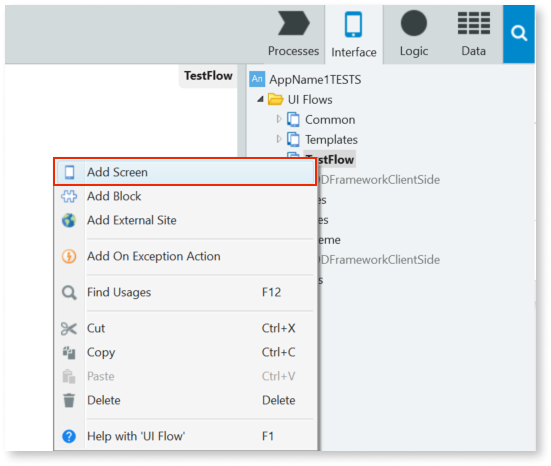
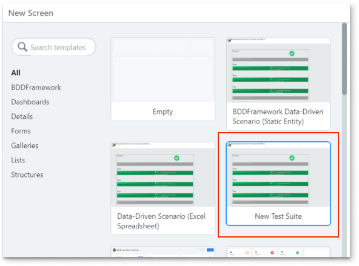

# Component testing with BDDFramework tools

This article describes how to install and start using the BDDFramework tools to implement automated and structured component testing. Component testing in OutSystems covers testing **Actions** and exposed **Services** that make up an application's logic.

Component testing in OutSystems includes the following standard test types:

* Unit Tests, which developers maintain, focus on individual units of code or components that a single team owns.
* Integration Tests, which test whether two or more components work together; these touch a broader application scope than unit testing and the tested code usually belongs to two or more teams.
* API Tests, which verify the contract between consumer and provider and the behavior of your application's existing API endpoints.

To start using the BDDFramework tool, install it from the Forge:

* [BDDFramework](https://www.outsystems.com/forge/component-overview/15745/bdd-framework-odc) - The component allows you to test public Server Actions

The tool provide the following features:

* Tests use Gherkin-like syntax and offer a visual representation of test execution.
* You create the test structure using UI Blocks that the tool provides.
* Test code is implemented through actions that are bound to each Block.
* Test Blocks are organized into screens called Test Suites.

## Installing the BDDFramework

You can install BDDFramework tool in your OutSystems infrastructure, just as you would other Forge components. You can also install them directly through ODC Studio or from the online [Forge portal](https://www.outsystems.com/forge/).

1. To install the BDDFramework, log in to **ODC Studio**.
2. Click in **Install from Forge** in your App list screen, you'll be redirected to the ODC Portal.
3. In the ODC Portal Forge screen, type BDDFramework, in the search box.
5. Click **Install**. You'll be prompted a Terms of Use warning, Accept it to carry on with the installation.

Once the installation is complete, it's time to start implementing tests.

## Getting started 

The following steps walk through creating a test application.

### Create a test application

1. In ODC Studio on the Development tab, click **Create**.
1. Select **App**, and click **Continue**.
1. Select **BDD Framework** as the application type, and click **Continue**.
1. Type the app name, for example, **App-Name-1** and click **Create App**.
1. The app imports all the building blocks you need to the app you created.

## Add a test to your test module

1. On the **Interface** tab menu on the right, go to **AppName1TESTS** > **UI Flows** > **TestFlow**.  

1. Right-click **TestFlow** and select **Add Screen**.

     

    You may see a message that new templates are loading.

1. Select **New Test Suite**, type **MyFirst_TestSuite** in the name field, and click **Create Screen.**
 
    

    The screen contains a test structure that's added to the UI Flow.

1. Start implementing the code for your test. See [Your Complete Guide to BDD Testing in OutSystems](https://www.outsystems.com/blog/posts/bdd-testing/) for more information on creating specific tests.