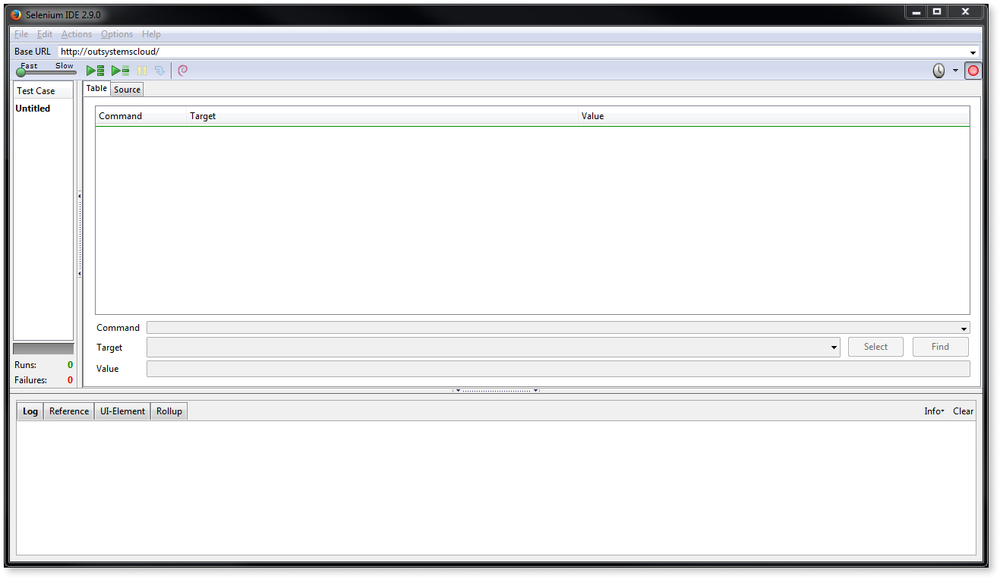
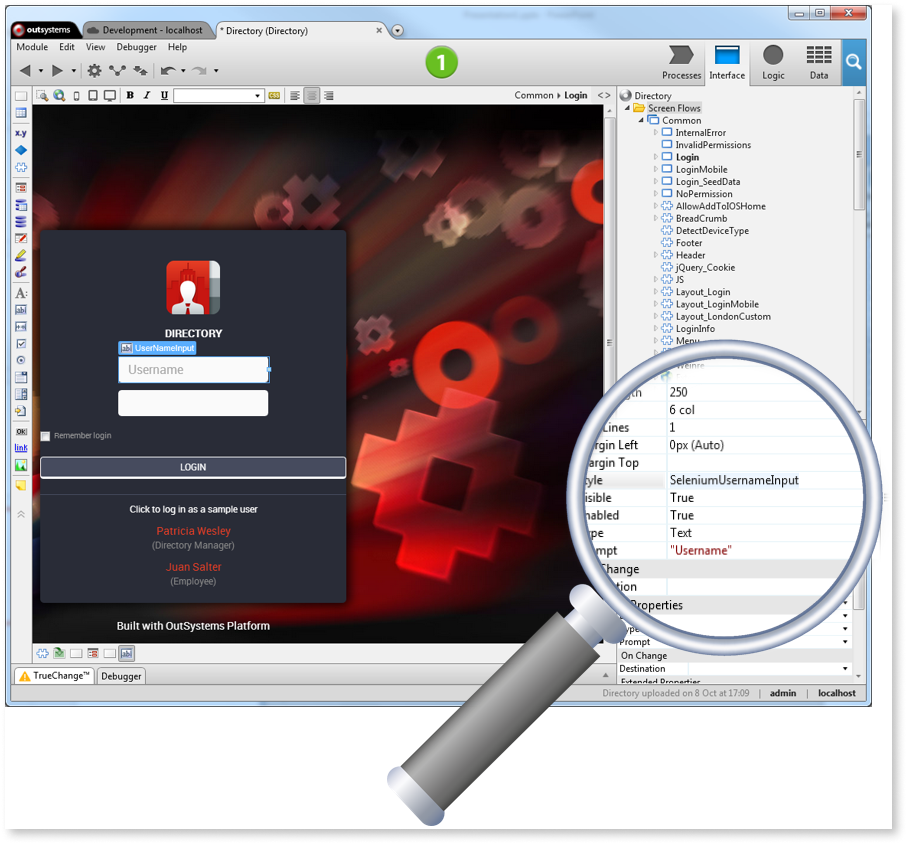
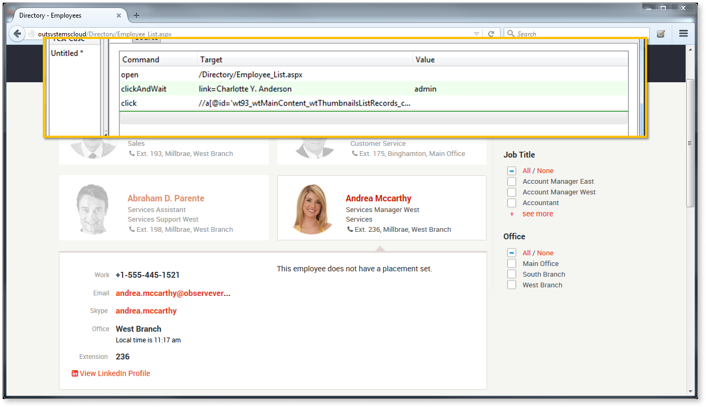
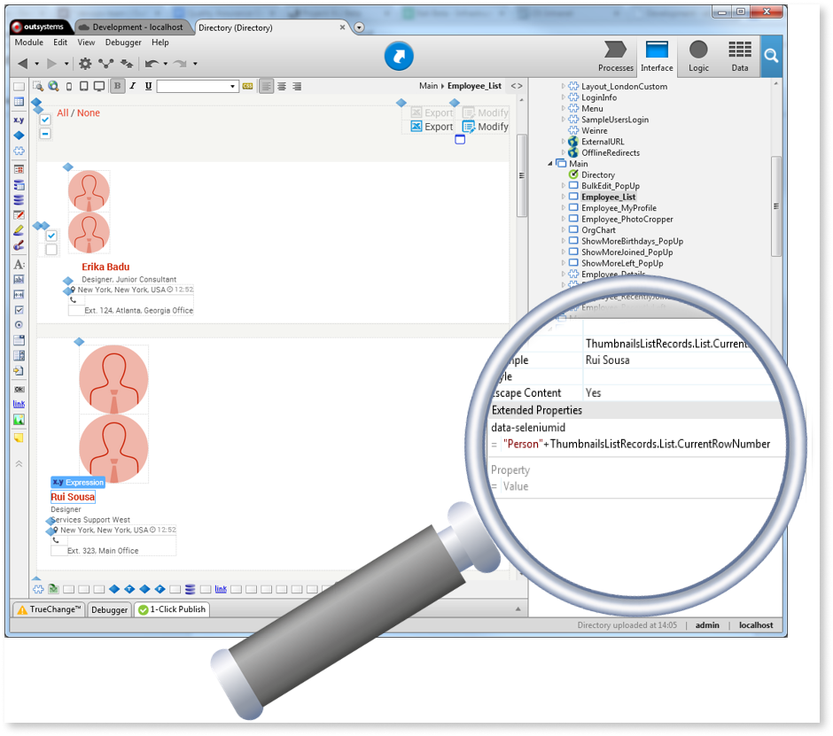
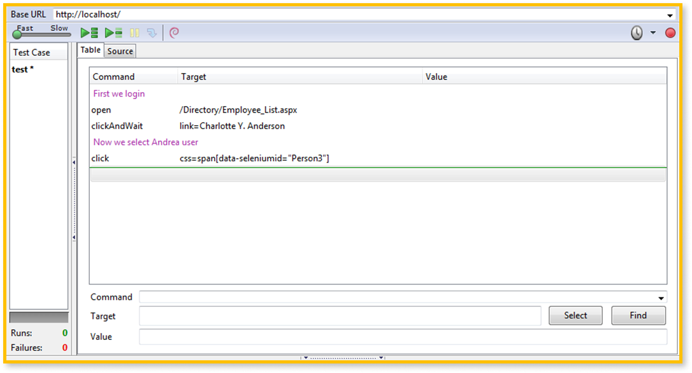

# How to do UI testing with Selenium

The goal of this article is to provide you with a broad view of UI testing web applications with Selenium and how it relates to OutSystems.

The first two sections cover the different testing options Selenium offers and how you can start getting acquainted with it.

The remainder of the article focuses on how to use Selenium with OutSystems applications effectively, more specifically on the topics of web-element locators and our own recommendations from our experience using this technology.

## Using Selenium for testing the UI of your apps

When there is a need for automated UI tests, developers tend to use Selenium. It's a great way for automating common interactions a user would perform through a browser over web applications.

As [SeleniumHQ’s website](http://www.seleniumhq.org/) states, there are two main sub-technologies to consider according to what you need.

[Selenium IDE](http://www.seleniumhq.org/projects/ide/) is an integrated development environment for Selenium, implemented as a Firefox extension that allows you to record, edit and replay HTML-encoded scripts that mimic user interactions with a web application. It's great for you to quickly develop and store common interactions that you wish to repeat in the future (for instance: to script frequent administration operations).

[Selenium WebDriver](http://www.seleniumhq.org/projects/webdriver/) allows you to address more complex scenarios when there is a need for fully automated UI tests (e.g. automated regression tests) and / or to parallelize their executions across different browsers ([Selenium Grid](http://www.seleniumhq.org/docs/07_selenium_grid.jsp)).

The WebDriver API enables the development of UI tests through common object-oriented programming languages such as Java, C#, JavaScript (Node), etc. The API overcomes some limitations of Selenium IDE’s script based testing, and provides a more effective instrumentation of the tested browsers.

Note that WebDriver is the successor of [Selenium RC](http://www.seleniumhq.org/projects/remote-control/), which allowed to run Selenium IDE style scripts for the same purpose and isn't recommended anymore.

Whether you use the IDE or WebDriver is entirely up to you and your particular automation needs. If you wish to obtain more in-depth information regarding these technologies, we recommend you to refer to the extensive [Selenium documentation](http://www.seleniumhq.org/docs/).

Here are some other resources you may also find useful:

* [Selenium Github Documentation](https://github.com/SeleniumHQ/seleniumhq.github.io/tree/trunk/website_and_docs/content/documentation)

* [Elemental Selenium](http://elementalselenium.com/)

* [Google Group - Selenium Users](https://groups.google.com/forum/#!forum/selenium-users)

## Creating a Selenium test

The easiest way to start looking into Selenium is by using the IDE. So, we will use it to illustrate what we've found to be the best ways to use this technology with OutSystems.

You can get the Selenium IDE Plugin for Firefox in the [respective download page](http://docs.seleniumhq.org/download/). Follow [this document](http://docs.seleniumhq.org/docs/02_selenium_ide.jsp) to install and configure the IDE and to learn the basics of the language.

While it's possible to write the test scripts manually using a text editor, this method is best left to make adjustments and additions to a recorded script. We've found that the easiest approach is usually to follow these next steps.

### 1. Record

Use the automated recorder from Selenium IDE to generate the script while you’re interacting with the web app as a user. This generates a series of commands that will be visible, editable and replayable in the Selenium IDE window.

### 2. Adjust locators

Adjust the locators generated by the IDE in the script editor. This is a very important step, whether you’re using the IDE or WebDriver. While the Selenium language supports several types of locators (to determine on which element a certain command is operating on), some are better than others when using OutSystems. The ones generated by the recorder are usually not very stable, because they can change as the application evolves.

This is the area where the specifics of the platform have a higher impact. The next main section of this article provides you with strategies to setup OutSystems Apps for locating web elements in Selenium.

### 3. Ensure synchronization

Add the necessary commands to ensure synchronization of the script with page elements.

UI interactions are often asynchronous. When executing Selenium tests, they can only proceed to the next step after making sure that the page has been updated with the previous commands. For instance: we can only press a button in a popup after the popup has been rendered in the screen.

In Selenium IDE this usually means changing "click" events that won’t wait for a page load to complete to “clickAndWait” events. You may also have to include “waitFor” commands that will pause the script until a specific element is visible, which is crucial for objects that are generated through javascript or an Ajax action after the page load has occurred. You can read more about these synchronization-related commands in the [Selenium documentation](http://www.seleniumhq.org/docs/02_selenium_ide.jsp#the-waitfor-commands-in-ajax-applications).

### 4. Add verifications

Verifications and asserts are essential in a test script. These validate that certain elements and values are presented in the web screen as you move along the interaction with your application.

The recorder doesn't know what you are looking for in a page to determine that the state is as expected, so you will need to include them in the script.

You can check the [Selenium documentation on the topic](http://docs.seleniumhq.org/docs/02_selenium_ide.jsp#adding-verifications-and-asserts-with-the-context-menu) for more info on what commands are available.

### 5. Export to WebDriver

If what you’re aiming at building WebDriver tests for automation, you may choose to export the script as a WebDriver code file (in C#, Java or Ruby) with the Selenium IDE export option. This provides you with a starting point to develop your WebDriver classes.

## Picking element locators

Whether you are using Selenium IDE or Web Driver, there are several locator strategies that you can use in Selenium, which are documented [here](http://www.seleniumhq.org/docs/02_selenium_ide.jsp#locating-elements).

Some are better than others when creating dynamic applications versus, for instance, static websites. You should make an effort to use selectors that make tests as future proof and low-maintenance as possible: this means avoiding those locators that are likely to change when you modify your screens.

The platform generates HTML _id_ attributes dynamically depending on the content that is determined to be sent to the client/browser on each request, based on your business rules or screen conditions. The **id** attributes are very prone to change: as you change your application, if you decide to refactor your UI (e.g. including it in a Block for re-usage in other screens), or as the platform changes its generated code (which can happen between new platform versions), so they're not a good fit for selenium test selectors.

When recording new test scripts, Selenium IDE’s defaults to the id selector. At this point, to increase tests' maintainability, you should **change the default locator** according to the following guidelines:

* **If your command operates on a link**, and there's only one link in the screen with that text use the **link** locator with the link text;

* **If your command operates on inputs** or other unique widgets in your web screen, use a **CSS selector** together with a custom style name in the widget;

* **In case you have repeated elements** in the same page (such as widgets inside table and list records) then use a **custom id** containing the row number in its value and locate it with a CSS selector;

The following sections will demonstrate the above guidelines with concrete scenarios.

### Simple locators

Let’s take a look at a simple example of a script in Selenium IDE while interacting with the an OutSystems Directory application.

Assume that our goal is to enter the Login page and press on one of the predefined user links, thus logging in the application with the user.

As you can see in the picture above, Selenium IDE has used the id of the link for "Charlotte Y Anderson" for locating the link during the recording session. This has several disadvantages as we have already outlined. We can use the **link** locator instead and use the link text, since it's unique in this particular screen.

This script would yield the same result while being completely independent from the id of the link. If later on we decide to change the location of the link in the page, the script would still work as long as the link text remained the same.

### CSS selectors

Let’s take the previous example and change the scenario: we now want to insert the credentials for the user "admin" and then press the Login button.

Once again, Selenium IDE outputted the ids of the inputs and Login button as locators. In this situation, when dealing with buttons and inputs, the "link" locator from the previous section can't be used.

This is a scenario where it becomes useful to use locators that are more attuned to the page structure. The two most popular ones are XPath and CSS and you may find several online discussions regarding which one is the best.

We prefer to use **CSS selectors** because our experience has showed us that they are not only easier to read but also also run faster when used across different browsers. There are several online sources where you can learn about using these standardized selectors such as the [CSS Selector Reference](http://www.w3schools.com/cssref/css_selectors.asp) and this [set of examples](http://seleniumeasy.com/selenium-tutorials/css-selectors-tutorial-for-selenium-with-examples) for Selenium.

These selectors are indeed very powerful and there is very little you can’t do with them. One particular advantage is the ability to locate web elements in a structured way; for instance: first you locate a specific table in the web screen and then you search for an input inside it. **We strongly advise you to become familiar with CSS locators** if you intend on performing a lot of browser testing.

Going back to the task at hand, we normally use "dummy" CSS styles in the inputs and buttons to be able to locate them easily. We can head over to Service Studio and add a custom “style” to each button and input.

As you can see in the above image, we added a "SeleniumUsernameInput" dummy style that doesn’t even need to be defined in the CSS stylesheet of the app. We just need it to be outputted in the HTML element of the input after we have published the eSpace (you can check it is there by using an inspector tool like [Firebug](http://getfirebug.com/)).

We can then use CSS selectors in our script to locate the inputs and button through the new dummy styles: `"**css=.<Name_Of_Dummy_Style>**"`:

This way, the locators are able to pinpoint the web elements using CSS styles that were specifically created for the purpose of testing (and are not expected to change unless we want them to), so the script becomes much more robust and future proof.

### Tables and Lists - using customized ids

One common situation when testing the UI of OutSystems Apps is to locate web elements that repeat themselves throughout the screen, by being included in tables and lists for instance. We normally address these cases by using customized ids in our application.

Going back to the Directory app example, let’s assume that, after logging in, we want the Selenium script to expand the details of the Andrea Mccarthy employee.

Selenium IDE recorder once again produces a locator for the link-click that is based on the web element’s id. Using a dummy CSS style in the link won’t work because there are several links throughout the list that would share the same style.

However, setting a customized id in Service Studio for the employee name will solve this.

We create the extended property called data-seleniumid which is then outputted as a custom tag with the same name in the HTML element in the page. The value is defined by an expression containing "Person" suffixed with the row number in the table records.

In the resulting web page we can use Firefox to inspect the element and verify that the element for Andrea Mccarthy contains a tag "seleniumid=’Person3’". All similar elements will have a different number in the value (we could have used something else as the value, for instance: the employee name).

At last, we correct the Selenium IDE script to use a CSS selector using the custom id.

The locator "css=span[seleniumid="Person3"]" will look for the span containing the custom selenium id. This way we are able to locate elements inside table and list records using identifiers completely controlled by us, thus being more future proof.

## Best practices and tips

Here are some extra assorted tips and best practices when developing tests for Selenium that we have found to be useful in our own dealings with the technology.

Always avoid "pauses". Sometimes we create a step in a browser test where we must wait for something to happen (e.g. a popup to appear).

Avoid at all costs the use of "pause" for these situations. Not only it makes the test slower for the default case, but also it makes your test flimsier - if your server is for some reason running slow, the wait time won’t be enough.

Use an active "wait" instead, like waitForTextPresent or waitForElementPresent (in Selenium IDE scripts). Remember you can always use custom CSS styles or ids to make it easy to locate a specific element you are waiting for.

### Fine tuning CSS selectors

As you become more experienced with CSS selectors for your Selenium tests, you will very likely begin to use more complex locators that are able to search elements in specific parts of the DOM structure of the web page under test.

We've found that a great way to debug CSS selectors and verify they're referencing what we need is to use the Developer Tools from the Google Chrome browser.

Just press **F12** to bring up the DevTools, open the Elements tab and press **CTRL+F** to search the HTML. You can use CSS selectors in your search and Chrome highlights what you are locating in the page.

### Search the page source code (Selenium IDE)

Sometimes it's useful to look into the generated web page source code, to check for example if a particular JavaScript code was included. Use the verifyNotEval command for this purpose.

### Use asserts to stop your tests on failure (Selenium IDE)

Sometimes we're running a script and wish that if one of the commands fail then the script run stops completely. You can use "assert" commands to achieve this. Here are some examples:

* When using "waitForTextPresent", place an "assertTextPresent" after it with the same condition. If the assert fails, the script will stop being processed.

* Instead of using "verifyTextPresent", use "assertTextPresent" instead for the same validation and stopping the script on failure.

### Using variables in your script (Selenium IDE)

To save a value into a variable inside a selenium script, you should use the **store** command.

Variables can then be retrieved using the form "${VariableName}" in normal command arguments, or using the object “storedVars[‘VariableName’]” in inline javascript arguments.

You can read more about this topic in [this online article](https://webigniter.wordpress.com/2011/04/07/storing-variables-in-selenium-ide/).

### Insert comments for readability (Selenium IDE)

When Selenium IDE scripts start to grow in size, they become hard to read. A great way of assuring that they will be better understood in the future is to include comments to provide info on what’s being done.

You can manually add comments to Selenium scripts directly in their source code through regular HTML comments. Just open the "Source" tab in Selenium IDE. Here’s an example:

