# Task 1: Create a Web App

Project Neo documentation is under construction. It's frequently updated and expanded. Leave your feedback and help us building the most useful content.

 
This tutorial walks you through creating three apps: a Web App called **Calendar** that will use **TaskList** to provide service actions. Additionally, you'll create a Library called **Timeline**.

Both TaskList and Timeline will contain reusable elements available to every app during development. 

The TaskList Web App provides service actions which, among other things, can expose a service to be reused by other applications inside the same OutSystems environment.

## Create the Web App

To create **TaskList**: 

1. Launch **Service Studio**, click **Create**, and select **Web App** and click **Next**.  

    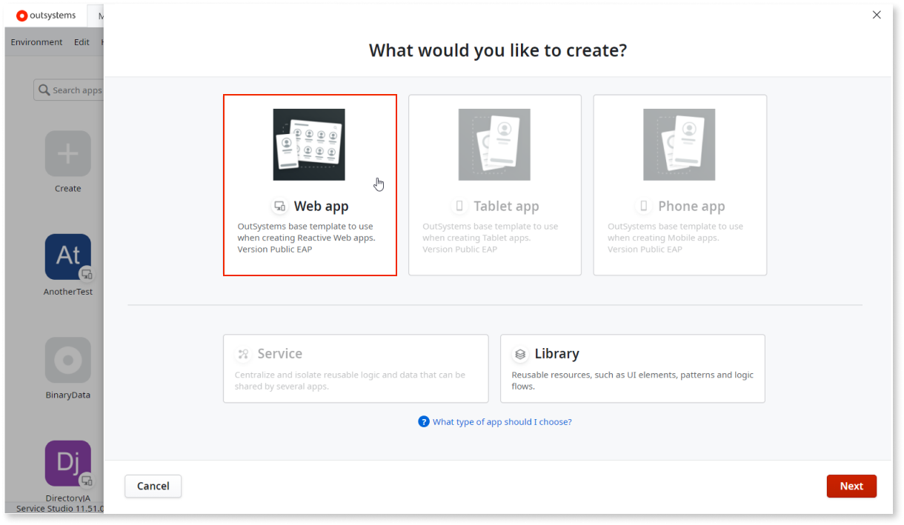 
 
1. In the next screen call the app **TaskList** and give it a short description. You may choose a color to customize the app’s interface and upload a customized icon. Then click **Create App**.  

    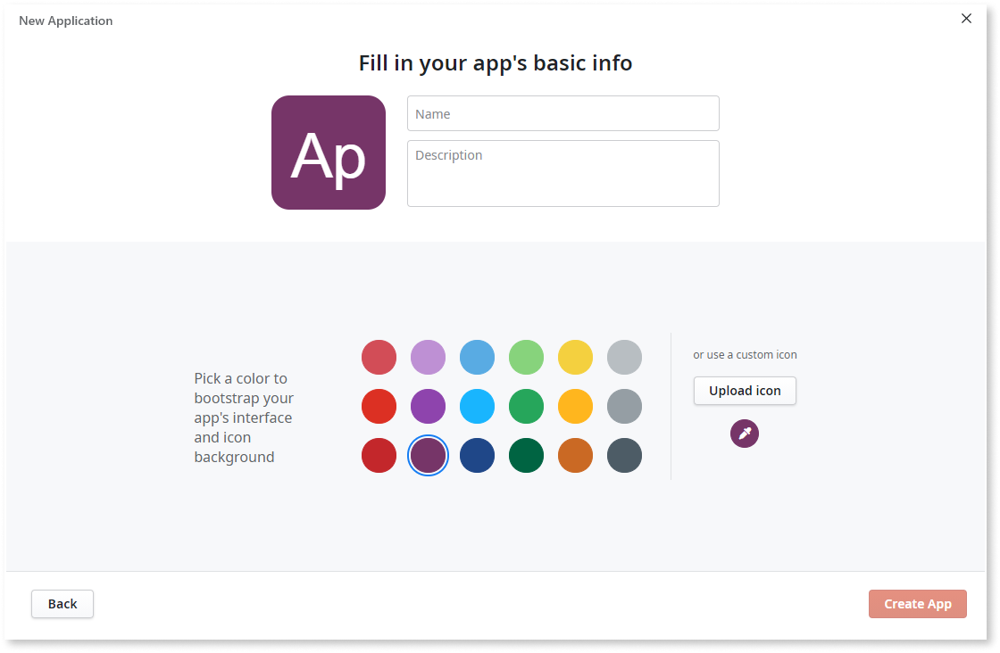

## Create data model

Entities are elements that allow you to persist information in the database and to implement your database model. Think of them as database tables or views. An Entity is defined through Entity Attributes that store the information related to it. Examples of entity attributes are Name, Address, Zip Code, City, among others.

Now we’re going to create an entity called **Task** with three attributes: **Description**, **DueDate**, and **IsCompleted**.

1. Go to the **Data** tab, right-click **Entities**, click **Add Entity to Database**, and name it **Task**. 

    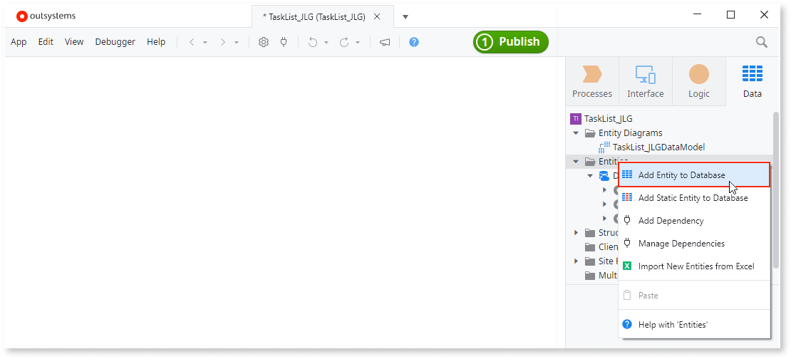 

1. Right-click the new **Task** entity, select **Add Entity Attribute**, and name it **Description**. 

    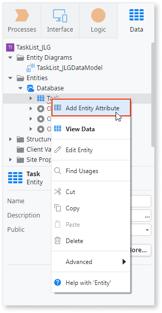 

1. Verify that OutSystems has correctly identified  **Data Type** of the new **Description** entity as **Text**. Change the entity **Length** to **100** and **Is Mandatory** to **Yes**. 

    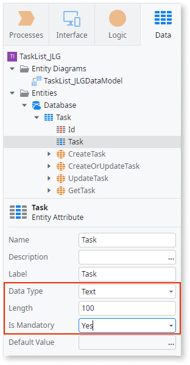 

1. In the same way add an **Entity Attribute** called **DueDate** to the **Task** entity. Verify that Service Studio has identified its **Data Type** as **Date**. As above, set **Is Mandatory** to **Yes**.
1. Add a third **Entity Attribute** called **IsComplete** to the **Task** entity. Verify that **Service Studio** has identified its **Data Type** as **Boolean** and that **Is Mandatory** is set to **No**. 

    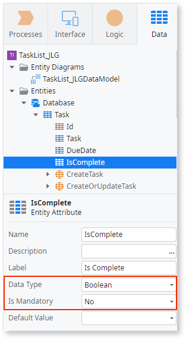 

## Create list and detail screens from **Task** entity

With the **Task** entity created, it's now time to give users a way to view and change items in the task list. 

1. Select the **Interface** tab, double-click **MainFlow**, and verify that **MainFlow** appears in the top right corner of the central working canvas. 

    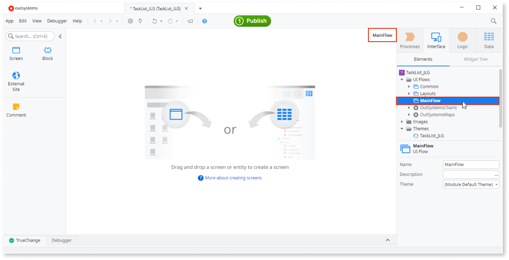 

1. Return to the **Data** tab and drag the **Task** entity onto the **MainFlow** canvas.  

    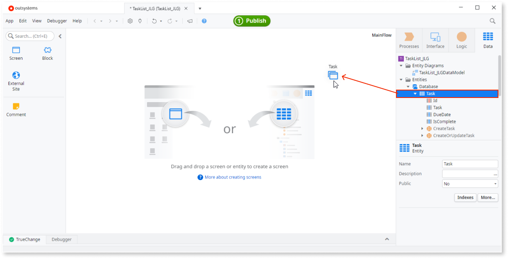 

1. OutSystems creates two interface screens, as seen below.

    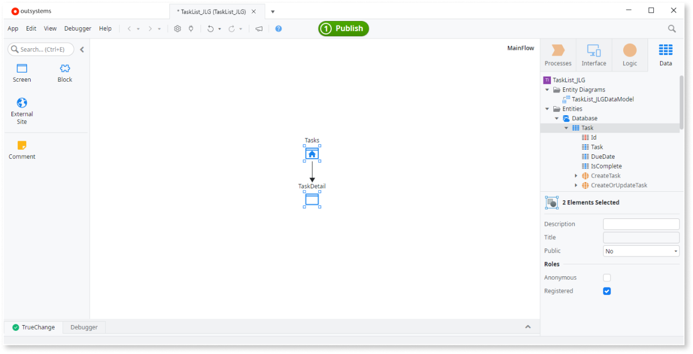 

    You may double-click either of the created screens to see how the entity has been expressed. The **Tasks** screen is shown below. 
    
    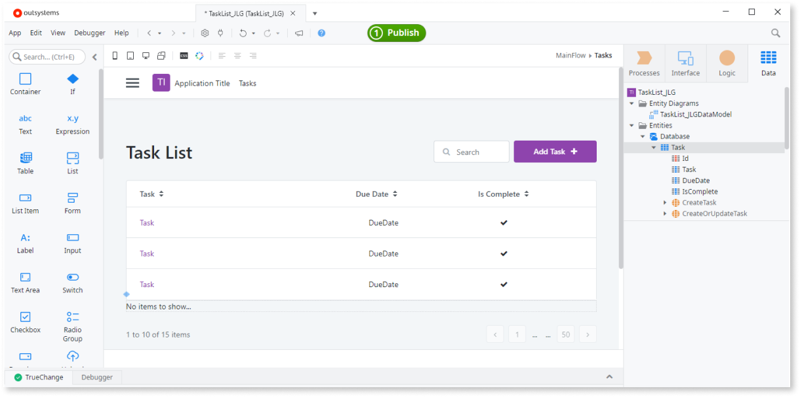 

1. Go to the **Interface** tab and select **Tasks** in the **MainFlow**. Click **Anonymous** in the **Roles** area to test the app during development.

    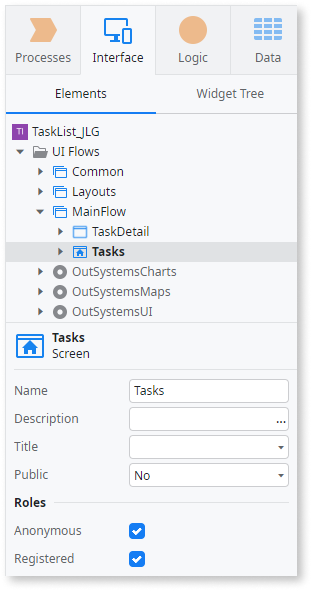 

1. In the same manner, select **TaskDetail** in the **MainFlow** and click **Anonymous** in the **Roles** area. 

    

    During the publish process you may receive the following security warning: "You're exposing a Server Action for public access and without authentication. Consider removing the Anonymous Role from this Screen."

    For most business apps, only registered users can access screens. Before deployment to the quality or production environments, set the users roles of screens by checking **Registered** and clearing the selection from **Anonymous**.

    

Click the green **1-Click-Publish** button in the top center of the workspace so you can test your app to see if it works as expected.

When the app is published click the blue **Open in browser** button. There you can add a task, set it to completed, and verify that it appears as expected in the task list.

## Expose **Task** entity for use in other applications

In order for other projects to use the functionality of **TaskList**, it must be exposed for consumption.

1. From the **Data** tab select the **Task** entity and change the **Public** property to **Yes** so it can be consumed, or added as a dependency, to other apps.

    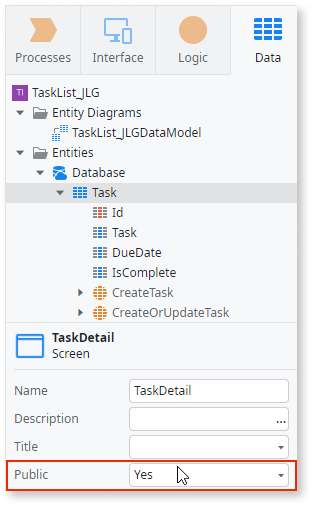 

1. In the **Logic** tab right-click **Service Actions** and click **Add Service Action** to create the **AddTask** service action.

    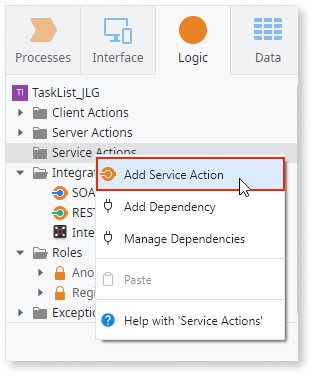 

1. Right-click the **AddTask** service action, select  **Add Input Parameter** and call it **DueDate**. Verify that OutSystems identifies its **Data Type** as **Date** and set **IsMandatory** to **Yes**.

    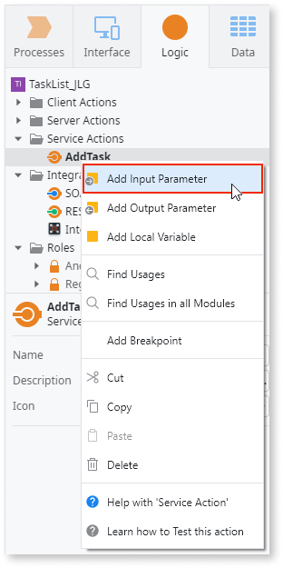 

1. In the same way, add a second input parameter to the **AddTask** service action and call it **Description**. Verify that OutSystems identifies its **Data Type** as **Text** and set **IsMandatory** to **Yes**.

    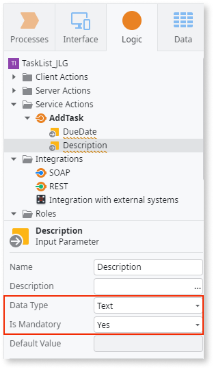 

1. Go to the **Data** tab and drag the **CreateTask** entity action to the flashing blue node in the **AddTask** logic flow.

     

1. Select the **CreateTask** entity action that you just dragged into the flow and expand the **Source** options in the property editor to view the required sources, **Description** and **DueDate**.

    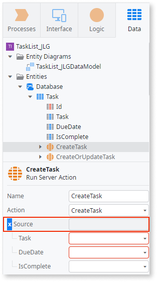 

1. Click the **Description** dropdown and accept the option suggested by OutSystems.

    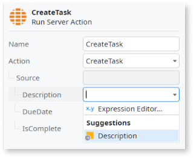 

1. In a like manner accept the option suggested by OutSystems in the **DueDate** dropdown.

    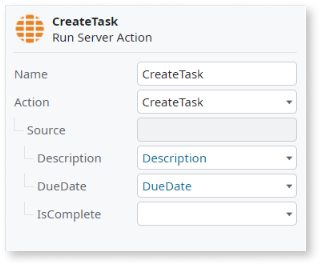 

Click the **1-Click Publish** button to make **TaskList** available for other projects.

## Next step

After following the steps above, go to [Task 2: Create a Library App](tutorial-2-create-library.md) and follow the steps to complete the tutorial.
