# Task 2: Create a Library

In Neo, apps can have strong dependencies to Libraries only. <!--Libraries are versioned and projects reuse elements from a specific Library version. -->For more information about reusing elements in Neo, see [Reuse elements across apps](reuse-elements.md).

This task walks you through creating a Library and exposing an element for reuse.

## Before you begin

Make sure you completed [Task 1: Create a Web App](tutorial-1-create-web-app.md) before continuing.

## Create a Library and a Block

Follow these steps

1. Close the TaskList app and create a new **Library** called `TimeLine`.

    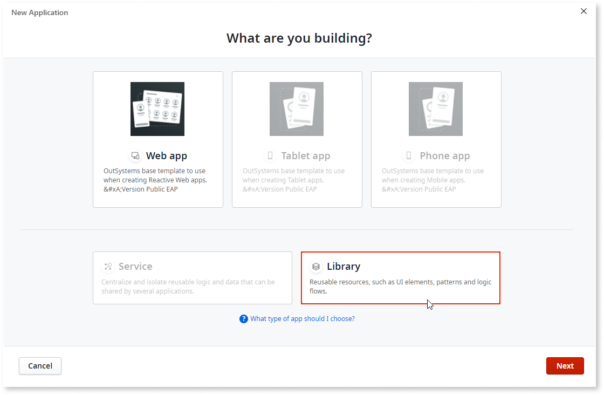 

1. Add OutSystems UI as a dependency to the **Timeline** Library. First search for `OutSystems` in other apps.

    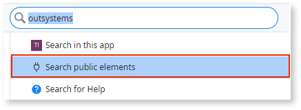 

    

    All procedures and screens from this point forward are taken from O11 and must be changed. 

    

    
1. Select **OutSystemsUI** and click **Add Dependency**.

    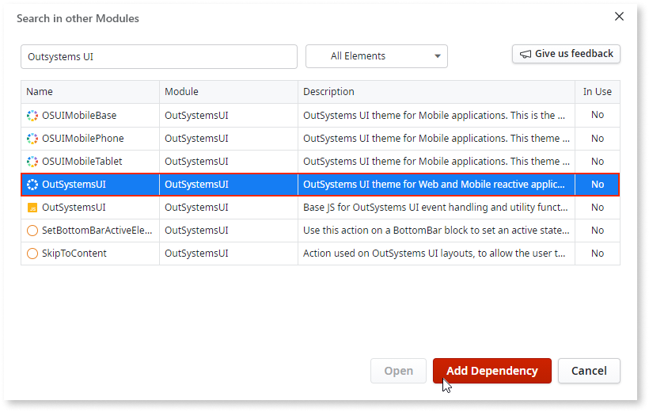 

1. In a like manner at the other three OutSystems UI themes:
    * **OSUIMobileBase**
    * **OSUIMobiliePhone**
    * **OSUIMobileTablet**

1. In the **Interface** tab right-click **UIFlow**, select **Add UI Flow** and give it the name **UIFlow1**. 

    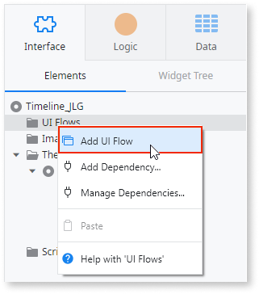 

1. Click the **Theme** dropdown and select **OutsystemsUI**.

    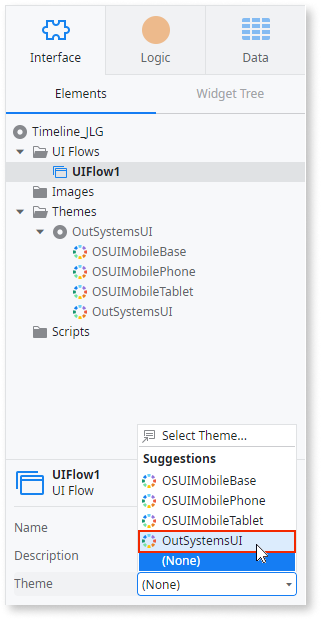 

1. Create a reusable UI that has a table widget. Right-click **UIFlow1**, select **Add Block**, and name it `Timeline`.

    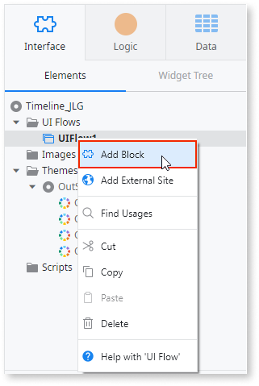 

1. Set the **Timeline** block **Public** property to **Yes** and then drag a **Table** widget to the canvas.  

    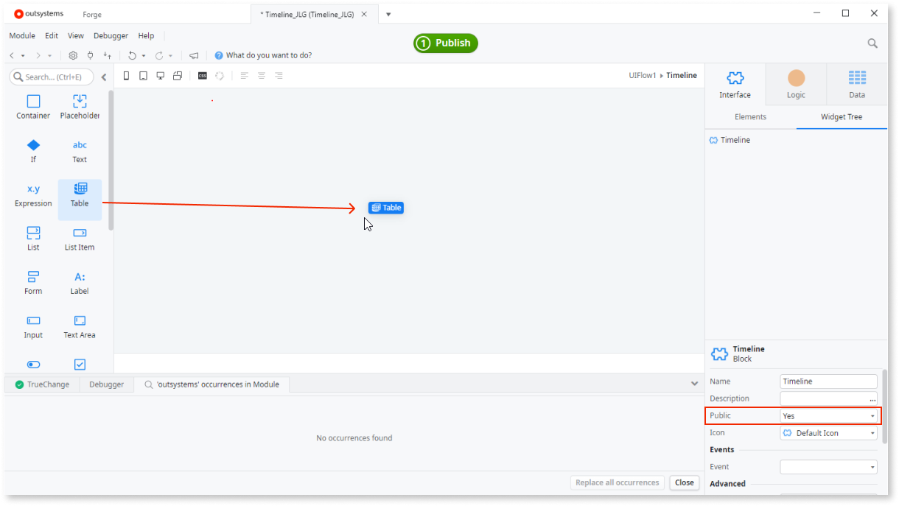 

## Create a source for the table

After you drag the table to the canvas, OutSystems warns you that it requires a source. Normally the source is an entity. However, entities are not available in libraries, and libraries must be stateless.

In this case the source is provided by input parameters and structures to receive data.

1. In the **Data** tab, right-click **Structures**, call it `TimelineEntry`, and set the **Public** attribute to **Yes**. 

     

1. Right-click the **TimelineEntry** structure, select **Add Structure Attribute**, call it `Description`, and set the **Is Mandatory** attribute to **Yes**. Verify that OutSystems identified its **Data Type** as **Text**.

    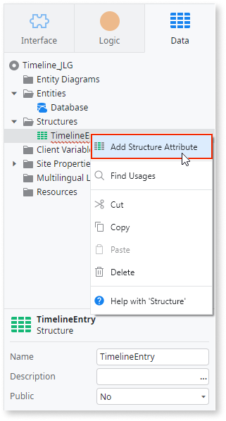 

1. In a similar manner, right-click the **TimelineEntry** structure, select **Add Structure Attribute**, and call it `Date`, and set the **Is Mandatory** attribute to **Yes**. Verify that OutSystems identified its **Data Type** as **Date**.

    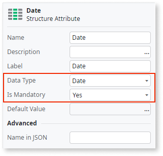 

1. In the **Interface** tab right-click **Add Input Parameter** and call it `Source`.

     

1. Select the **Source** input parameter, scroll down the **Data Type** options, and select **List…**.

    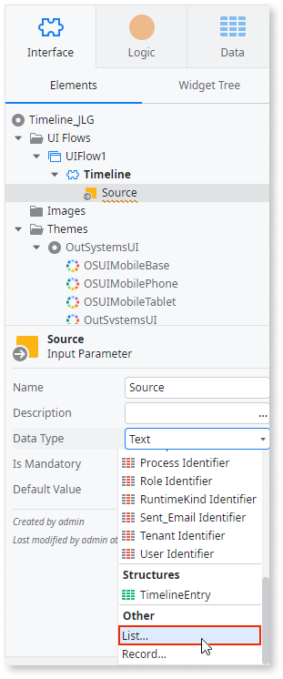 

1. In the **Element Type Window**, scroll down to the **Structures** folder, select the **TimelineEntry** structure you previously created, and click **Select**.

    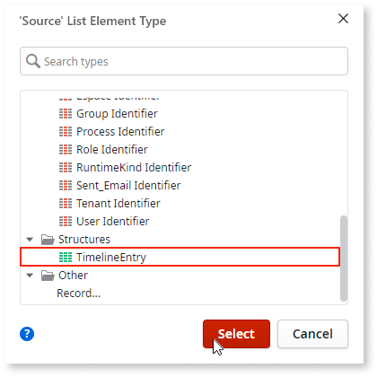 

1. Drag the **Source** input parameter of the **Timeline** block to add two columns to the table and set the source of the table to these input parameters.

    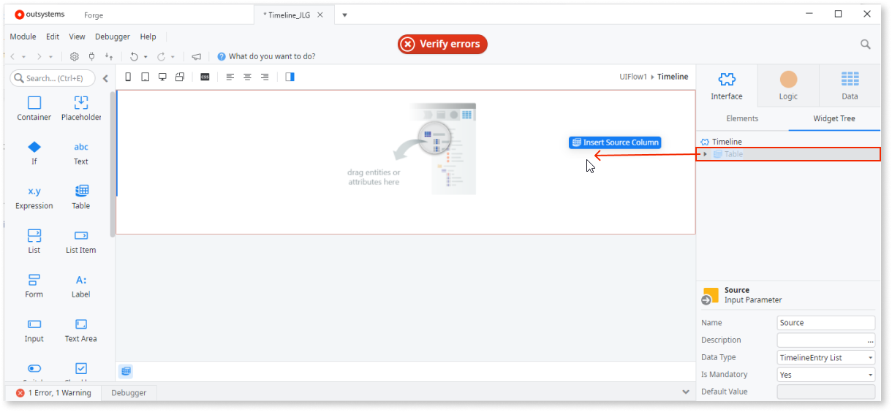 

1. Select the table in the canvas, click the **Event** dropdown, and select **onchange**.

    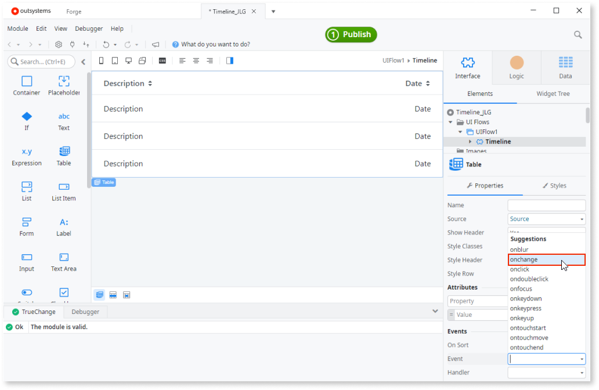  

    

    A **New on Sort** is only available for aggregates that cannot be used in a Library.

    

1. Right-click the **Timeline** block, select **Add Client Action**,  and call it `ListSort`.

    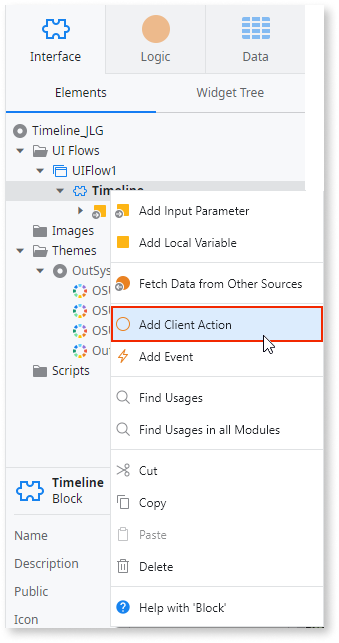 

1. Select the table in the canvas, click the **Handler** dropdown, and select **ListSort**.

    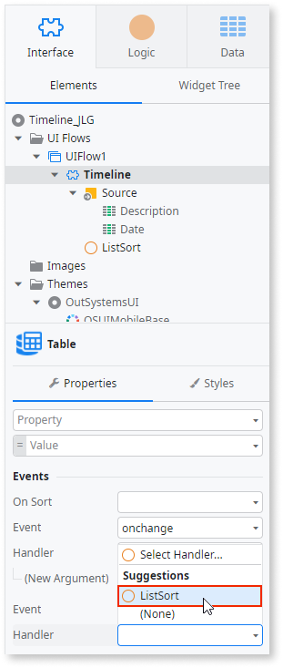  

1. Drag the **Run Client Action** widget from the toolbox to the flashing blue node in the logic flow on the canvas.

    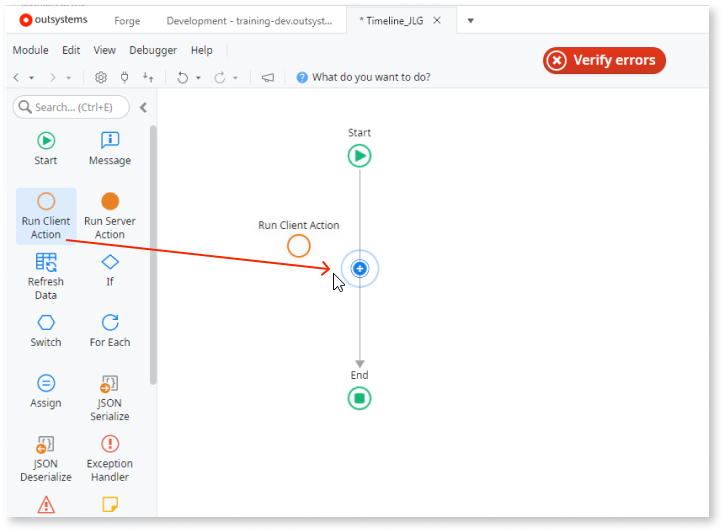 

1. Scroll down to the **ListSort** action in the **Select Action** window and click **Select**.

    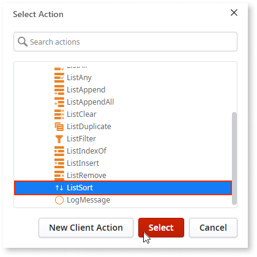 

1. With the **ListSort** action selected, click the **List** attribute dropdown and accept the OutSystems suggestion of **Source**.

    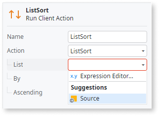 

1. In a like manner, select **Date** as the **By** attribute.

    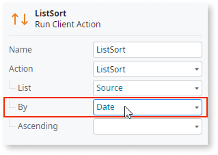 

At this point click the **1-Click Publish** button to make this Library available to other projects in your environment.

## Next step

After follow the steps above, go to [Task 3: Create a consumer Web App](tutorial-3-create-calendar.md) and follow the steps to complete the tutorial.
