# Task 3: Create a consumer Web App

Project Neo documentation is under construction. It's frequently updated and expanded. Leave your feedback and help us building the most useful content.

The calendar app will use the Library and app previously created. It will include:

* An onboarding screen
* Use the Timeline block of the Library
* Show data from the DataList app

## Before you begin

Make sure you completed [Task 2: Create a Library App](tutorial-2-create-library.md) before continuing.

## Create a Web App

To create the calendar app:

1. Return to the Applications
1. Create Web App and name it **Calendar**.

## Create onboarding screen

With the **Calendar** app created, begin with adding an onboarding screen:

1. Drag the **Screen** widget from the toolbox to the canvas. 

    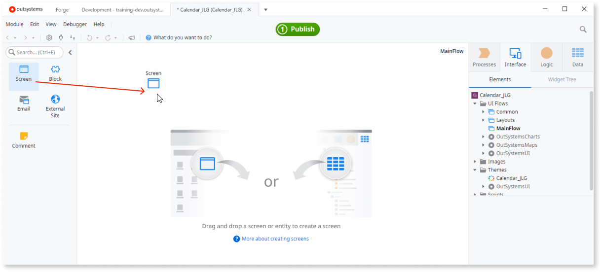 

1. In the **New Screen** window, choose the **Onboardings** category, select the **Onboarding** **with animation** template, and click **Create Screen**.

    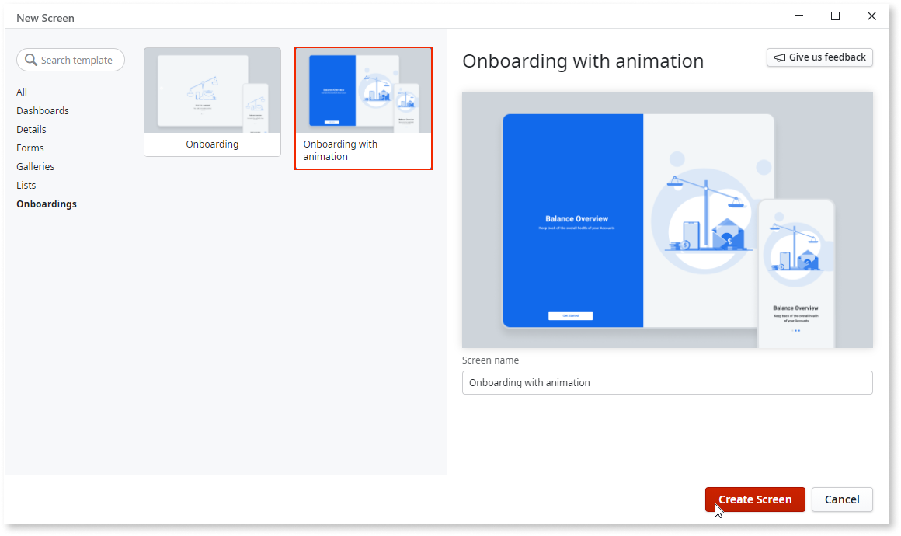 

1. Click the **Get Started** button and change the default **On Click** event to **New Screen**.

     

1. In the **New Screen** window, select the **Empty** template, call it **HomePage**, and click **Create Screen**.

     

## Add Dependencies

The **Calendar** app uses UI elements from the Library app and data from the service app. To use them they have to be added as dependencies, as follows:

1. Type **Timeline** in the search bar (in the upper right of the **Service Studio** workspace) and click **Search in other Modules**.

    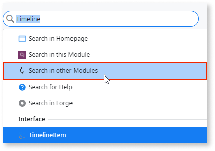 

1. In the **Search in other Modules** window filter the search results by **Block** and select the **Timeline** app you created earlier. Then click **Add Dependency**.

    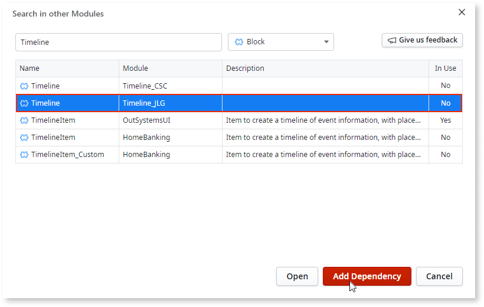 

1. The UI element brought in from the **Timeline** Library now needs a source for its data, which the app can consume from the **Task** entity you created in the **TasksList** app you created earlier. So as before, search for **Task** in the search bar, select **Search in other Modules,** sort by **Entity**, select the **Task** entity from the **TasksList** app, and click **Add Dependency**.

    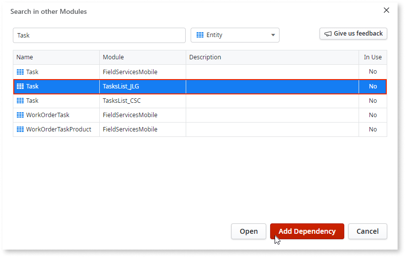 

1. Now add the functionality to add a task. Search for **AddTask**, as above, and then click **Add Dependency**.

    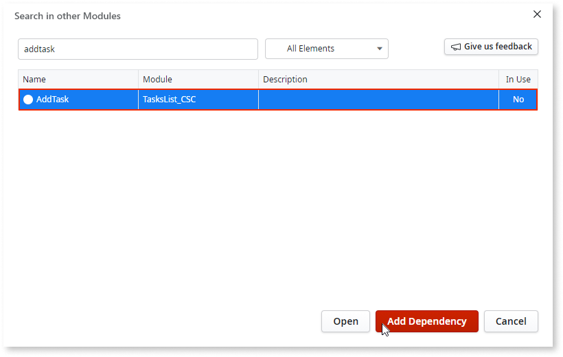 

## Use dependencies in Calendar

Follow these steps:

1. In the **Data** tab, drag the Data aggregate to the canvas. Then click **1-Click Publish**. 

    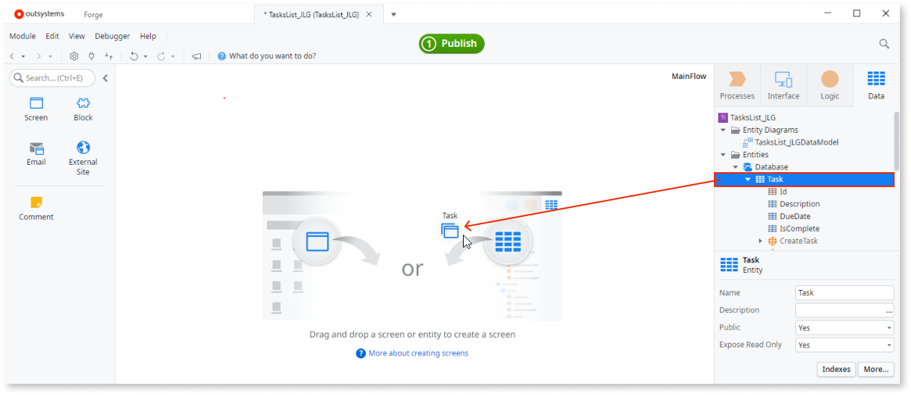 

1. Drag the **Timeline** block to the **MainContent** area in the **Homepage** canvas. 

    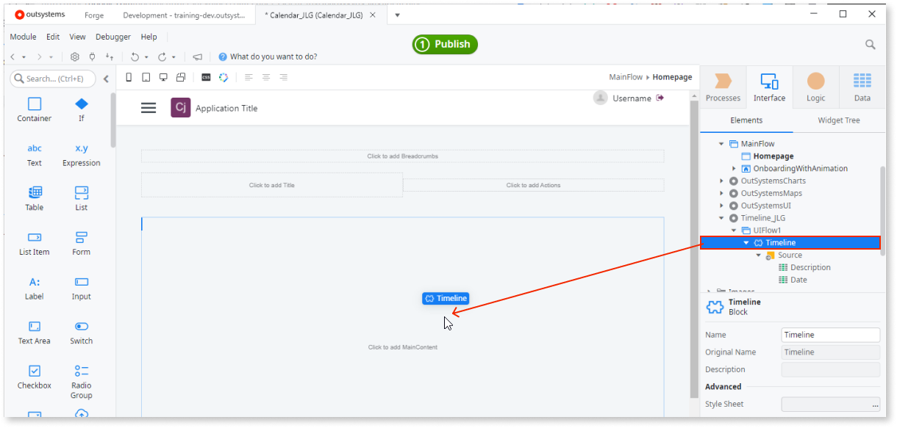 

    The resulting table, as can be seen, requires a source for data. 
    
    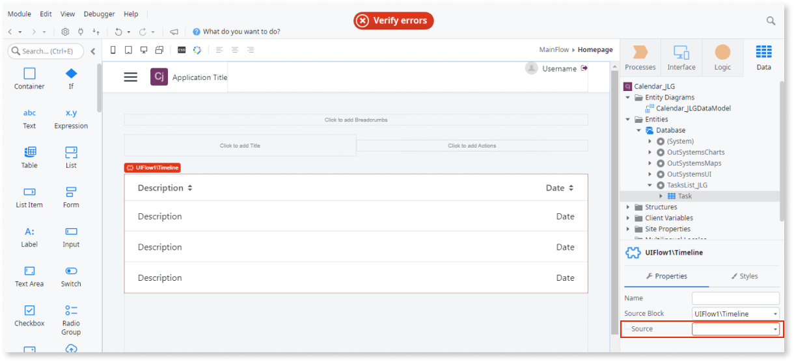 

1. In the **Interface** tab right click **Homepage** and select **Fetch Data from Database** and call it **GetTasks**. 

    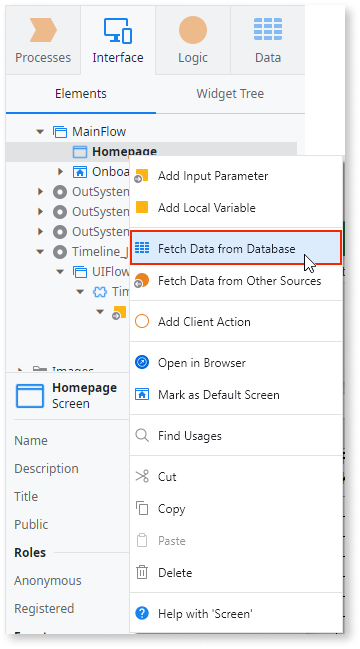 

1. With **Homepage** selected, click the table on the canvas and select **Expression Editor** from the **Source** dropdown. 

    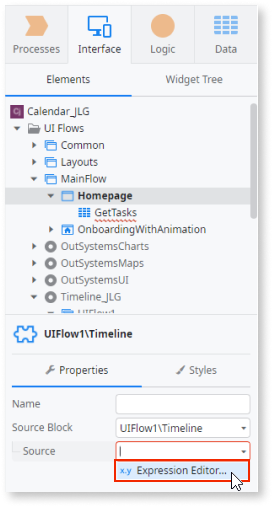 

1. In the **Expression Editor** window double-click **List** under the **GetTasks** folder to add the expression GetTasks.List. Then click **Close**. 

    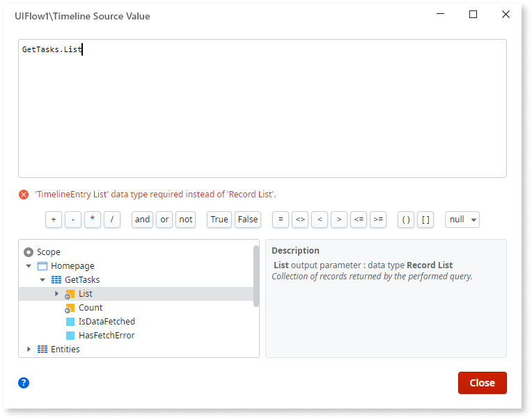 

1. Drag a **Button** widget to the **Click to add actions** area of the canvas change the button **Text** to **Add Tasks**. 

    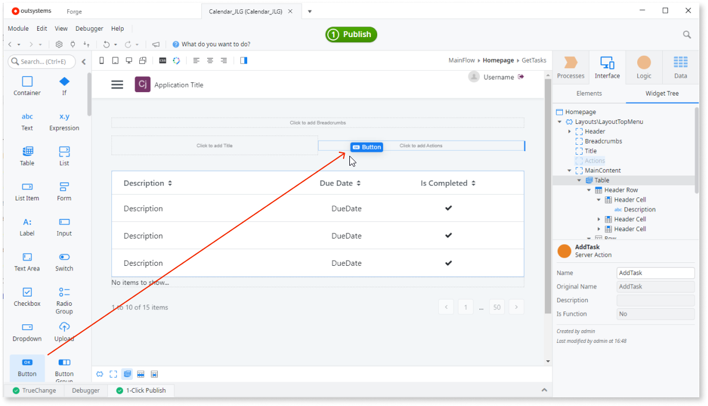 

1. Double-click the new **Add Tasks** button to see the **AddTaskonClick** action flow in the canvas. From the **Logic** tab drag the **AddTask** server action to the flashing blue node.

    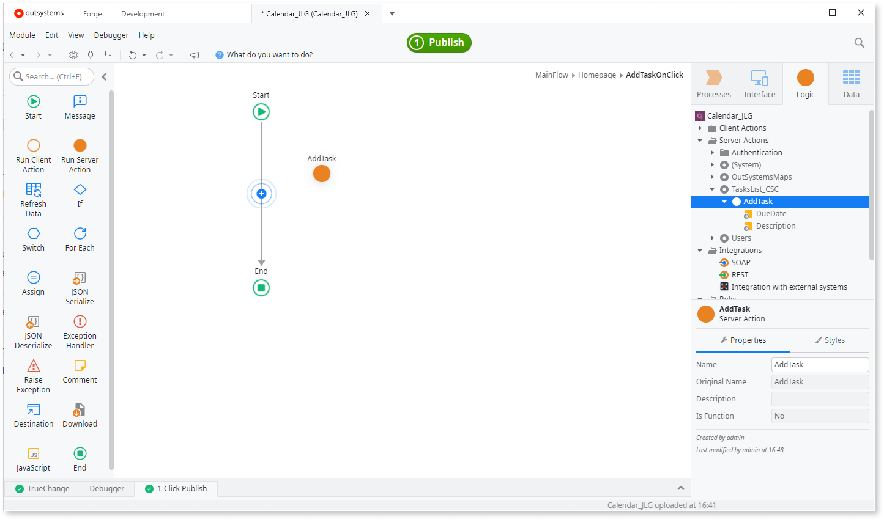 

1. Click the **DueDate** parameter dropdown and accept CurrDate(). In the **Description** parameter type an appropriate name such as **Calendar App**.

    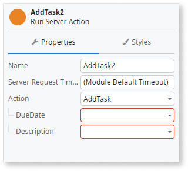 

Now click the **1-Click Publish** button to test the app.

## Next steps

Congratulations, you have finished this tutorial.
Learn more about [deploying your app to the next stage](deploy-apps.md).
